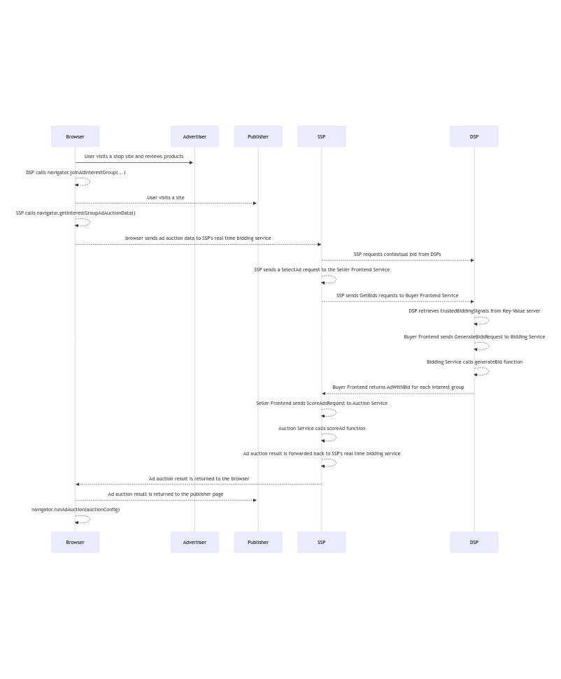

import Tabs from '@theme/Tabs'; import TabItem from '@theme/TabItem';

# Bidding & Auction Services for Protected Audience

<Tabs>
<TabItem value="overview" label="Overview" default>

## Overview

### Description

Bidding & Auction Services aim to provide open source infrastructure for executing Protected Audience auctions server-side. This demo will walk you
through how to set up a deployment of this infrastructure on your local machine.

### Privacy Sandbox APIs

- [Protected Audience](https://developers.google.com/privacy-sandbox/private-advertising/protected-audience)
- [Bidding & Auction Services](https://developers.google.com/privacy-sandbox/private-advertising/protected-audience/android/bidding-and-auction-services)

### Related parties

- SSP
- DSP
- Publisher

</TabItem>

<TabItem value="design" label="Design">

## Design

### Goals

In this demo, we assume SSPs and DSPs would like to improve performance of their Protected Audience auctions. Bidding & Auction services allows
Protected Audience bidding and scoring computation to take place on servers. This demo will provide a local environment where developers can explore
how Bidding & Auction components work before committing to a full production cloud deployment.

### Assumptions

This demo assumes that the reader has knowledge of how the Protected Audience API works. This demo will not provide details on the cloud deployment of
B&A at this time.

### Key Exclusions

- Cloud deployment
- Maximum of 2 B&A buyers
- Bidding inference service

### System Design

Below outlines the general system design for B&A. Please see the bullets below or the image for a chronological set of steps detailing how the
components of the system work together to complete an auction.

#### API Flow

- The user visits a shopping site and gets added to an interest group from the Protected Audience API. This interest group will have an
  [optimized payload](https://github.com/privacysandbox/protected-auction-services-docs/blob/main/bidding-auction-services-payload-optimization.md).
- Later, the user visits a news site. The publisher or seller will have the `navigator.getInterestGroupAdAuctionData()` call on the page to generate
  an encrypted auction blob. This blob will be sent to the seller's real time bidding service.
- The seller will initiate a `SelectAd` request from their real time bidding service to their B&A seller frontend service. This will initiate the B&A
  server-side auction flow.
- Once the seller frontend service receives a `SelectAd` request, it will initiate a `GetBids` request to all configured buyer frontend services.
- Each buyer frontend will then retrieve `trustedBiddingSignals` from their key/value service, then a `GenerateBids` request will be made from the
  buyer frontend to the bidding service.
- The bidding service will then handle the `generateBid` function with provided bidding logic. The bidding service will send a response containing the
  bids per interest group and the buyer frontend will forward this response to the seller frontend.
- The seller frontend will then initiate a `ScoreAdsRequest` to the auction service. The auction service will handle the `scoreAd` function with
  provided auction logic.
- The auction is then complete and the encrypted ad auction result is returned to the seller's real time bidding service.
- The seller's real time bidding service then forwards the encrypted ad auction result back to the publisher page. Then the
  `navigator.runAdAuction()`function runs on the page and displays the winning ad.


#### User Journey

#TODO FIX 

```bash
sequenceDiagram
    Browser->>+Advertiser: User visits a shop site and reviews products
    Browser-->>Browser: DSP calls navigator.joinAdInterestGroup(...)
    Browser-->>+Publisher: User visits a site
    Browser-->>Browser: SSP calls navigator.getInterestGroupAdAuctionData()
    Browser-->>SSP: browser sends ad auction data to SSP's real time bidding service
    SSP-->>DSP: SSP requests contextual bid from DSPs
    SSP-->>SSP: SSP sends a SelectAd request to the Seller Frontend Service
    SSP-->>DSP: SSP sends GetBids requests to Buyer Frontend Service
    DSP-->>DSP: DSP retrieves trustedBiddingSignals from Key-Value server
    DSP-->>DSP: Buyer Frontend sends GenerateBidsRequest to Bidding Service
    DSP-->>DSP: Bidding Service calls generateBid function
    DSP-->>SSP: Buyer Frontend returns AdWithBid for each interest group
    SSP-->>SSP: Seller Frontend sends ScoreAdsRequest to Auction Service
    SSP-->>SSP: Auction Service calls scoreAd function
    SSP-->>SSP: Ad auction result is forwarded back to SSP's real time bidding service
    SSP-->>Browser: Ad auction result is returned to the browser
    Browser-->>Publisher: Ad auction result is returned to the publisher page
    Browser-->>Browser: navigator.runAdAuction(auctionConfig)
```

</TabItem>

<TabItem value="demo" label="Demo">

## Demo

### Prerequisites

- Chrome > v107 (Open chrome://version to look up your current version)
- Enable Privacy Sandbox APIs (Open chrome://settings/privacySandbox to enable this setting)
- Clear your browsing history before you run one of the demo scenario below (Open chrome://settings/clearBrowserData to delete your browsing history)
- Install [Docker](https://docs.docker.com/engine/install/) according to your system's specifications

1. Open Chrome from the command line using the following command. This will enable Chrome to use test keys for attestation.

```bash
google-chrome --enable-privacy-sandbox-ads-apis --disable-features=EnforcePrivacySandboxAttestations,FledgeEnforceKAnonymity --enable-features=FledgeBiddingAndAuctionServerAPI,FledgeBiddingAndAuctionServer:FledgeBiddingAndAuctionKeyURL/https%3A%2F%2Fstorage.googleapis.com%2Fba-test-buyer%2Fcoordinator-test-key.json
```

2. Follow instructions listed in
   [Instructions for deploying and running the demos in your local environment with Docker](https://github.com/privacysandbox/privacy-sandbox-demos/blob/main/docs/deploy-to-linux-docker.md)
   to deploy Privacy Sandbox Demos locally.

3. Clone the `bidding-auction-servers` [GitHub repository](https://github.com/privacysandbox/bidding-auction-servers).

```bash
git clone https://github.com/privacysandbox/bidding-auction-servers.git
```

4. From the root folder of the bidding and auction services repository, build the bidding and auction services with the following command.

```bash
production/packaging/build_and_test_all_in_docker \
  --service-path bidding_service \
  --service-path auction_service \
  --service-path buyer_frontend_service \
  --service-path seller_frontend_service \
  --platform gcp \
  --instance local \
  --no-precommit \
  --no-tests \
  --build-flavor non_prod \
  --gcp-skip-image-upload
```

5. Once the packaging step has completed, start the services with the following commands. **Run each command in a separate terminal window or tab**.
   - _NOTE: Ensure step #2 is complete as this will create the docker network._

**DSP-X Services**

```bash
## DSP-X Bidding Service ##
DOCKER_RUN_ARGS_STRING="--ip=172.16.0.101 --network=privacy-sandbox-demos_adnetwork" \
BIDDING_JS_URL="http://privacy-sandbox-demos-dsp-x.dev:8080/js/dsp/usecase/bidding-and-auction/bidding-logic-dsp-x.js" \
PS_VERBOSITY=10 \
SKIP_TLS_VERIFICATION=true \
./tools/debug/start_bidding
```

```bash
## DSP-X Buyer Frontend Service ##
DOCKER_RUN_ARGS_STRING="--ip=172.16.0.102 --network=privacy-sandbox-demos_adnetwork" \
BUYER_KV_SERVER_ADDR="http://privacy-sandbox-demos-dsp-x.dev:8080/dsp/service/kv" \
BIDDING_SERVER_ADDR=172.16.0.101:50057 \
BIDDING_SIGNALS_FETCH_MODE="REQUIRED" \
PS_VERBOSITY=10 \
SKIP_TLS_VERIFICATION=true \
./tools/debug/start_bfe
```

**DSP-Y Services**

```bash
## DSP-Y Bidding Service ##
DOCKER_RUN_ARGS_STRING="--ip=172.16.0.201 --network=privacy-sandbox-demos_adnetwork" \
BIDDING_JS_URL="http://privacy-sandbox-demos-dsp-y.dev:8080/js/dsp/usecase/bidding-and-auction/bidding-logic-dsp-y.js" \
PS_VERBOSITY=10 \
SKIP_TLS_VERIFICATION=true \
./tools/debug/start_bidding
```

```bash
## DSP-Y Buyer Frontend Service ##
DOCKER_RUN_ARGS_STRING="--ip=172.16.0.202 --network=privacy-sandbox-demos_adnetwork" \
BUYER_KV_SERVER_ADDR="http://privacy-sandbox-demos-dsp-y.dev:8080/dsp/service/kv" \
BIDDING_SERVER_ADDR=172.16.0.201:50057 \
BIDDING_SIGNALS_FETCH_MODE="REQUIRED" \
PS_VERBOSITY=10 \
SKIP_TLS_VERIFICATION=true \
./tools/debug/start_bfe
```

**SSP-X Services**

```bash
## SSP-X Auction Service ##
DOCKER_RUN_ARGS_STRING="--ip=172.16.0.103 --network=privacy-sandbox-demos_adnetwork" \
AUCTION_JS_URL="http://privacy-sandbox-demos-ssp-x.dev:8080/js/ssp/usecase/bidding-and-auction/ssp-x/decision-logic.js" \
PS_VERBOSITY=10 \
SKIP_TLS_VERIFICATION=true \
./tools/debug/start_auction
```

```bash
## SSP-X Seller Frontend Service
DOCKER_RUN_ARGS_STRING="--ip=172.16.0.104  --network=privacy-sandbox-demos_adnetwork" \
SELLER_ORIGIN_DOMAIN="https://privacy-sandbox-demos-ssp-x.dev" \
AUCTION_SERVER_ADDR=172.16.0.103:50061 \
KEY_VALUE_SIGNALS_ADDR="http://privacy-sandbox-demos-ssp-x.dev:8080/ssp/usecase/bidding-and-auction/ssp-x/service/kv" \
BUYER_SERVER_ADDRS_JSON='{"https://privacy-sandbox-demos-dsp-x.dev":{"url":"172.16.0.102:50051","cloudPlatform":"LOCAL"},"https://privacy-sandbox-demos-dsp-y.dev":{"url":"172.16.0.202:50051","cloudPlatform":"LOCAL"}}' \
PS_VERBOSITY=10 \
SKIP_TLS_VERIFICATION=true \
./tools/debug/start_sfe
```

**SSP-Y Services**

```bash
## SSP-Y Auction Service ##
DOCKER_RUN_ARGS_STRING="--ip=172.16.0.203 --network=privacy-sandbox-demos_adnetwork" \
AUCTION_JS_URL="http://privacy-sandbox-demos-ssp-y.dev:8080/js/ssp/usecase/bidding-and-auction/ssp-y/decision-logic.js" \
PS_VERBOSITY=10 \
SKIP_TLS_VERIFICATION=true \
./tools/debug/start_auction
```

```bash
## SSP-Y Seller Frontend Service
DOCKER_RUN_ARGS_STRING="--ip=172.16.0.204  --network=privacy-sandbox-demos_adnetwork" \
SELLER_ORIGIN_DOMAIN="https://privacy-sandbox-demos-ssp-y.dev" \
AUCTION_SERVER_ADDR=172.16.0.203:50061 \
KEY_VALUE_SIGNALS_ADDR="http://privacy-sandbox-demos-ssp-y.dev:8080/ssp/usecase/bidding-and-auction/ssp-y/service/kv" \
BUYER_SERVER_ADDRS_JSON='{"https://privacy-sandbox-demos-dsp-x.dev":{"url":"172.16.0.102:50051","cloudPlatform":"LOCAL"},"https://privacy-sandbox-demos-dsp-y.dev":{"url":"172.16.0.202:50051","cloudPlatform":"LOCAL"}}' \
PS_VERBOSITY=10 \
SKIP_TLS_VERIFICATION=true \
./tools/debug/start_sfe
```

6. Validate all services are running properly by ensuring the following logs are printed on each service.

```bash
## Bidding Service ##
bidding_main.cc:627] privacy_sandbox_system_log: Server listening on 0.0.0.0:50057

## Buyer Frontend Service ##
buyer_frontend_main.cc:397] privacy_sandbox_system_log: Server listening on 0.0.0.0:50051

## Auction Service ##
auction_main.cc:374] privacy_sandbox_system_log: Server listening on 0.0.0.0:50061

## Seller Frontend Service ##
seller_frontend_main.cc:364] privacy_sandbox_system_log: Server listening on 0.0.0.0:50053

```

#### Do not proceed until services are running and validated properly.

### Steps

1. Navigate to the Advertiser's shop site [privacy-sandbox-demos-shop.dev](https://privacy-sandbox-demos-shop.dev).
2. Click on any item in the shop.
   - The advertiser assumes the user is interested in this type of product. The advertiser uses a demand-side provider (DSP) to handle advertising
     needs. The DSP has a tag on this page that will add the user to an interest group for this product category.
3. Once on the product page, add the `?usecase=bidding-and-auction` query parameter to the query string to enable this demo.

   - **NOTE**: In a production deployment, this query parameter would **not** be required. This is for demo purposes only.
   - Example: `https://privacy-sandbox-demos-shop.dev/items/1f45f?usecase=bidding-and-auction`

4. Open the Chrome Developer Tools console and view the `Console` tab. Here you can see console logs of the user being added to an interest group.
5. Navigate to the `Application` tab. Select `Interest Groups` under the `Storage` section.
   - **NOTE**: If this tab has no events, refresh the page.
6. Select the `privacy-sandbox-demos-shop.dev-bidding-and-auction` interest group. This shows a `joinAdInterestGroup` call for a DSP without
   [payload optimization](https://github.com/privacysandbox/protected-auction-services-docs/blob/main/bidding-auction-services-payload-optimization.md).
7. Select the `dsp-x-ig` interest group. This shows a `joinAdInterestGroup` call for a DSP with
   [payload optimization](https://github.com/privacysandbox/protected-auction-services-docs/blob/main/bidding-auction-services-payload-optimization.md).
   - Within the `ads` field, note the `adRenderId` field. This is an optimization to retrieve the `renderURL` from a Key-Value server.
   - Note the field `auctionServerRequestFlags: ["omit-ads","omit-user-bidding-signals"]`. This field notifies the browser to allow for ommission of
     the `ads` and `userBiddingSignals` fields as these can cause larger payloads.
   - Note the field `trustedBiddingSignalsKeys`. This field will notify the Buyer Frontend Service to retrieve these real time bidding signals from
     their Key-Value server before generating a bid.
8. Navigate to the news site [https://privacy-sandbox-demos-news.dev](https://privacy-sandbox-demos-news.dev/) with the Chrome Developers Tool window
   open.
9. Once on the news site, add the `bidding-and-auction` query parameter to the query string.
   - **NOTE**: In a production deployment, this query parameter would **not** be required. This is for demo purposes only.
   - Query string: `https://privacy-sandbox-demos-news.dev/bidding-and-auction`
10. Open the Chrome Developer Tools console and view the `Console` tab. Here you can see console logs of the auction configurations from each
    component auction, as well as the final multi-seller auction.

- Expanding the log for the `SSP-A` auction will show the auction config for an on-device auction.
- Expanding the log for the `SSP-X` auction will show the auction config for a B&A only auction.
- Expanding the log for the `SSP-Y` auction will show the auction config for a mixed-mode auction. Within the mixed mode auction you will see two
  component auctions, one being an on-device auction and the other being a B&A auction.
- Expanding the log for the `TLS SSP` will show four component auctions.
  - On-device only with `SSP-A`
  - B&A only with `SSP-X`
  - On-device component of mixed mode with `SSP-Y`
  - B&A component of mixed mode with `SSP-Y`

### Implementation details

#### Buyer Implementation

1. The shop has multiple DSP tags on the page for each item. When the user clicks on an item, the DSP tags from the locals will be inserted into the
   embedded Javascript template for the item when rendered. Below code can be found in the
   [index.ts for the shop](https://github.com/privacysandbox/privacy-sandbox-demos/blob/0558610e4712de7a5861bf2f2fa61126f1ffcdda/services/shop/src/index.ts#L151).

```javascript
app.locals = {
  title: SHOP_DETAIL,
  displayCategory,
  DSP_TAG_URL: new URL(
    `https://${DSP_HOST}:${EXTERNAL_PORT}/js/dsp/dsp-tag.js`,
  ),
  DSP_A_TAG_URL: new URL(
    `https://${DSP_A_HOST}:${EXTERNAL_PORT}/js/dsp/dsp-tag.js`,
  ),
  DSP_B_TAG_URL: new URL(
    `https://${DSP_B_HOST}:${EXTERNAL_PORT}/js/dsp/dsp-tag.js`,
  ),
  DSP_X_TAG_URL: new URL(
    `https://${DSP_X_HOST}:${EXTERNAL_PORT}/js/dsp/dsp-tag.js`,
  ),
  DSP_Y_TAG_URL: new URL(
    `https://${DSP_Y_HOST}:${EXTERNAL_PORT}/js/dsp/dsp-tag.js`,
  ),
  MTA_CONVERSION_TAG_URL: new URL(
    `https://${DSP_HOST}:${EXTERNAL_PORT}/js/dsp/usecase/multi-touch-attribution/mta-conversion-tag.js`,
  ).toString(),
  getCartTotal,
  getConversionTriggerUrls: (order: Order) =>
    AD_TECHS_TO_TAG_FOR_CONVERSIONS.map((host) =>
      constructConversionTriggerUrl(host, order),
    ),
  getEventTriggerUrl,
};
```

2. These locals will be injected as template variables into the
   [item embedded Javascript file](https://github.com/privacysandbox/privacy-sandbox-demos/blob/0558610e4712de7a5861bf2f2fa61126f1ffcdda/services/shop/src/views/item.ejs#L119)
   when the item is being rendered. When rendering, these variables are injected and the scripts referencing the DSP tags are executed. The bidding
   and auction variables will only be injected if the `?usecase=bidding-and-auction` query parameter is provided.

```javascript
</script>
     function buildDspScriptTag(tagUrl) {
        const scriptEl = document.createElement('script')
        scriptEl.className = 'dsp_tag'
        scriptEl.src = tagUrl
        scriptEl.dataset.advertiser = '<%= SHOP_HOST %>'
        scriptEl.dataset.itemId = '<%= item.id %>'
        return scriptEl
      }
      switch ('<%= usecase %>'){
        case 'bidding-and-auction':
          document.body.appendChild(buildDspScriptTag('<%= DSP_X_TAG_URL %>'));
          document.body.appendChild(buildDspScriptTag('<%= DSP_Y_TAG_URL %>'));
        default:
          document.body.appendChild(buildDspScriptTag('<%= DSP_A_TAG_URL %>'));
          document.body.appendChild(buildDspScriptTag('<%= DSP_B_TAG_URL %>'));
          document.body.appendChild(buildDspScriptTag('<%= DSP_TAG_URL %>'));
      }
    </script>
```

3. The [dsp-tag.js]
   (<https://github.com/privacysandbox/privacy-sandbox-demos/blob/0558610e4712de7a5861bf2f2fa61126f1ffcdda/services/ad-tech/src/public/js/dsp/dsp-tag.js#L97>)
   will be executed for all DSPs. Within the tag, this DSP will inject an iframe to initiate the `joinAdInterestGroup` call.

```javascript
   injectIframe(
      /* src= */ getServerUrlWithPageContext(
        /* pathname= */ 'dsp/join-ad-interest-group.html',
      ),
      /* options= */ {
        allow: 'join-ad-interest-group',
        browsingTopics: '',
      },
    );
```

4. The
   [buyer router](https://github.com/privacysandbox/privacy-sandbox-demos/blob/0558610e4712de7a5861bf2f2fa61126f1ffcdda/services/ad-tech/src/routes/dsp/buyer-router.ts#L41)
   will catch this request to`dsp/join-ad-interest-group.html` and will render the corresponding embedded Javascript file.

5. Within the iframe, it will only include a script to execute the `join-ad-interest-group.js` file.

```html
  <%/* Script to add user to an interest group. */%>
  <script src="<%= `https://${HOSTNAME}:${EXTERNAL_PORT}/js/dsp/usecase/bidding-and-auction/join-ad-interest-group.js` %>">
  </script>
```

6. This
   [join-ad-interest-group.js](https://github.com/privacysandbox/privacy-sandbox-demos/blob/8d7effd11f4d4e51065208ef4af92d5f2d921706/services/ad-tech/src/public/js/dsp/join-ad-interest-group.js#L32)
   file will make a request to the route `/dsp/interest-group.json` to fetch the interest group configuration.

```javascript
 getInterestGroupFromServer = async () => {
    const currentUrl = new URL(location.href);
    const interestGroupUrl = new URL(location.origin);
    interestGroupUrl.pathname = '/dsp/interest-group.json';
    // Copy query params from current context.
    for (const [key, value] of currentUrl.searchParams) {
      interestGroupUrl.searchParams.append(key, value);
    }
    if (res.ok) {
      return res.json();
    }
```

7. This call from the client to the server will be caught by the
   [buyer router](https://github.com/privacysandbox/privacy-sandbox-demos/blob/8d7effd11f4d4e51065208ef4af92d5f2d921706/services/ad-tech/src/routes/dsp/buyer-router.ts#L94).
   If the usecase query parameter from the targeting context matches `bidding-and-auction` and the caller is a B&A enabled buyer, the payload
   optimized interest group will be used by calling the `getInterestGroupBiddingAndAuction` function.

```typescript
BuyerRouter.get('/interest-group.json', async (req: Request, res: Response) => {
  const targetingContext = assembleTargetingContext(req.query);
  const baseUrl = `${req.protocol}://${req.get('host')}${req.path}`;
  if (
    'bidding-and-auction' === targetingContext.usecase &&
    (baseUrl.includes('dsp-x') || baseUrl.includes('dsp-y'))
  ) {
    res.json(getInterestGroupBiddingAndAuction(targetingContext));
  } else {
    res.json(getInterestGroup(targetingContext));
  }
});
```

8. The
   [interest-group-helper.ts](https://github.com/privacysandbox/privacy-sandbox-demos/blob/8d7effd11f4d4e51065208ef4af92d5f2d921706/services/ad-tech/src/lib/interest-group-helper.ts#L333)
   file contains the call to get the interest group configuration. This anonymous function will return a
   [payload optimized](https://github.com/privacysandbox/protected-auction-services-docs/blob/main/bidding-auction-services-payload-optimization.md)
   interest group. The notable differences in the interest group are:
   - `auctionServerRequestFlags` indicates to the browser that the `userBiddingSignals` and `ads` fields can be omitted.
   - `adRenderId` within the `ads` list provides a lookup key to identify and pull the creative during generateBid

```typescript
export const getInterestGroupBiddingAndAuction = (
  targetingContext: TargetingContext,
): InterestGroup => {
  const hostString: string = HOSTNAME ?? 'dsp-x';
  const dspName: string = extractDspName(hostString);
  const creative: string = buildCreativeURL(hostString);
  return {
    name: `${dspName}-ig`,
    owner: CURRENT_ORIGIN,
    biddingLogicURL: new URL(
      `https://${HOSTNAME}:${EXTERNAL_PORT}/js/dsp/usecase/bidding-and-auction/auction-bidding-logic.js`,
    ).toString(),
    trustedBiddingSignalsKeys: getBiddingSignalKeys(targetingContext),
    updateURL: constructInterestGroupUpdateUrl(targetingContext),
    ads: [
      {
        adRenderId: '1234',
        renderURL: creative,
      },
    ],
    adSizes: {
      'medium-rectangle-default': {'width': '300px', 'height': '250px'},
    },
    sizeGroups: {
      'medium-rectangle': ['medium-rectangle-default'],
    },
    auctionServerRequestFlags: [
      AuctionServerRequestFlags.OMIT_ADS,
      AuctionServerRequestFlags.OMIT_USER_BIDDING_SIGNALS,
    ],
  };
};
```

#### Seller Details

1. When the user visits the news website using the `/bidding-and-auction` query parameter, the router will render the bidding and auction EJS file and
   inject the following variables. This logic is handled in the index.ts file.

```javascript
app.get('/bidding-and-auction', async (req: Request, res: Response) => {
  res.render('bidding-and-auction', {
    TITLE: NEWS_DETAIL,
    TEXT_LOREM,
    BIDDING_AND_AUCTION_SSP_TAG_URL: new URL(
      `https://${SSP_HOST}:${EXTERNAL_PORT}/js/ssp/usecase/bidding-and-auction/ad-tag.js`,
    ).toString(),
  });
});
```

2. When the EJS file renders, it will inject `BIDDING_AND_AUCTION_SSP_TAG_URL` and this URL will be executed as a script.

```html
<ins class="ads"><script class="ssp_tag" src="<%= BIDDING_AND_AUCTION_SSP_TAG_URL %>"></script></ins>
```

3. The script that's executed includes logic to create an iframe. This will send a request to this path
   `/ssp/usecase/bidding-and-auction/ad-tag.html`.

```javascript
(async () => {
  const containerEl = document.querySelector('ins.ads');
  const tagEl = document.querySelector('.ssp_tag');

  const src = new URL(tagEl.src);
  src.pathname = '/ssp/usecase/bidding-and-auction/ad-tag.html';

  const iframeEl = document.createElement('iframe');
  iframeEl.width = 300;
  iframeEl.height = 250;
  iframeEl.src = src;
  iframeEl.setAttribute('scrolling', 'no');
  iframeEl.setAttribute('style', 'border: none');
  iframeEl.setAttribute('allow', 'attribution-reporting; run-ad-auction');
  containerEl.appendChild(iframeEl);
})();
```

4. Before rendering, this request is caught by the router. This handler will render the`ad-tag` EJS file and insert the following variables. These
   variables are the tags that will be used to initiate the execution of component auctions for SSP-A, SSP-X, and SSP-Y.
   - **NOTE**: Each of these tags will execute a component auction. This demo will follow the flow of `SSP-Y` to show how mixed mode is implemented.

```javascript

/** Full route: /ssp/usecase/bidding-and-auction/ad-tag.html */
tlsRouter.get('/ad-tag.html', async (req, res) => {
  res.render('ssp/usecase/bidding-and-auction/ad-tag', {
    BIDDING_AND_AUCTION_SSP_A_TAG_URL: new URL(
      '/ssp/usecase/bidding-and-auction/ssp-a/construct-component-auction.js',
      SSP_A_ORIGIN,
    ),
    BIDDING_AND_AUCTION_SSP_X_TAG_URL: new URL(
      '/ssp/usecase/bidding-and-auction/ssp-x/construct-component-auction.js',
      SSP_X_ORIGIN,
    ),
    BIDDING_AND_AUCTION_SSP_Y_TAG_URL: new URL(
      '/ssp/usecase/bidding-and-auction/ssp-y/construct-component-auction.js',
      SSP_Y_ORIGIN,
    ),
  });
});
```

5. Once this variable is injected and the EJS file renders, it will execute the URL as a script. It will be caught by the router for `SSP-Y` and will
   generate the
   [construct-component-auction.js](https://privacy-sandbox-demos-dsp.dev/js/ssp/usecase/bidding-and-auction/ssp-y/construct-component-auction.ts)
   file.

```javascript
sspYRouter.get('/construct-component-auction.js', async (req, res) => {
  let filePath;
  filePath = path.join(
    path.resolve(),
    '/build/public/js/ssp/usecase/bidding-and-auction/ssp-y/construct-component-auction.js',
  );
  const file = await readFile(filePath, {encoding: 'utf8'});
  const compiledFile = await ejs.compile(file);
  const fileContent = compiledFile({SSP_Y_ORIGIN});

  res.set('content-type', 'text/javascript');

  res.send(fileContent);
});
```

6. The entrypoint to this file is the `runComponentAuction` function call. This function will first create a new `AdAuction` object. Then the function
   will call the method to retreive the auction info for SSP-Y.

```typescript
async function runComponentAuction() {
  const componentAuction = new AdAuction();
  const componentAuctionInfo = await componentAuction.getAuctionInfo();

  console.log('[SSP-Y] Component auction config ', componentAuctionInfo);

  window.auctionInfoCollector.push(componentAuctionInfo);
}
```

7. Within the `componentAuction.getAuctionInfo()` call, there are many requests to retrieve information. First, the ad auction config is defined as a
   static variable. This includes the `perBuyerConfig`, **this map must match the one provided to the Seller Frontend Service in B&A.** If it does
   not, it will not be able to recognize the seller.

```typescript
 const adAuctionDataConfig = {
      seller: SSP_Y_ORIGIN,
      requestSize: 51200,
      perBuyerConfig: {
        [DSP_X_ORIGIN]: {targetSize: 8192},
        [DSP_Y_ORIGIN]: {targetSize: 8192},
      },
    };
```

</TabItem>
</Tabs>
