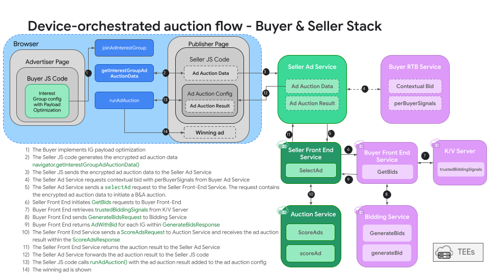

import Tabs from '@theme/Tabs'; import TabItem from '@theme/TabItem';

# **Bidding & Auction Services for Protected Audience**

\<Tabs\>  
\<TabItem value="overview" label="Overview" default\>

# **Overview**

## **Description**

Bidding & Auction Services aim to provide open source infrastructure for executing Protected Audience auctions server-side opposed to on-device. This use case will walk you through how to set up a deployment of this infrastructure and how to assess the key differences that B&A introduces. 

## **Privacy Sandbox APIs**

- [Protected Audience](https://developers.google.com/privacy-sandbox/private-advertising/protected-audience)  
- [Bidding & Auction Services](https://developers.google.com/privacy-sandbox/private-advertising/protected-audience/android/bidding-and-auction-services)

## **Related parties**

- SSP
- DSP

\</TabItem\>

\<TabItem value="scope" label="Scope"\>

# **Scope**

## **Goals**


In this demo, we assume SSPs and DSPs would like to reduce latency in Protected Audience auctions. Bidding & Auction services allows Protected Audience computation to take place on servers opposed to running on a user's device. This demo will provide a local environment where adtechs can explore how Bidding & Auction components work before committing to a full production cloud deployment.

## **Assumptions**

This use case assumes that the seller has integrated with their real time bidding sservice. This use case will not provide details on the cloud deployment of B&A at this time. 

## **Key Exclusions**

*list of activities or technical elements that are scoped-out of the demo*
- Cloud deployment 
- Maximum of 2 buyers


## **System Design**

### API Flow 
Using the Protected Audience API, the user visits a shopping site and gets added to an interest group. Later, the user visits a news site. The seller will have the `navigator.getInterestGroupAdAuctionData()` call on the page to generate an encrypted auction blob. This blob will be sent to the seller's real time bidding service. The seller will initiate a `SelectAd` request to their seller frontend service, this will initiate the server-side auction flow. Once the seller frontend service receives a `SelectAd` request, it will initiate a `GetBids` request to all configured buyer frontend services. Each buyer frontend will then retrieve `trustedBiddingSignals` from their KV service, then a `GenerateBids` request will be made from the buyer frontend to the bidding service. This will handle the `generateBid` function with provided bidding logic. The bidding service will send a response containing the bids per interest group and the buyer frontend will forward this response to the seller frontend. At this point, the seller frontend will initiate a `ScoreAdsRequest` to the auction service. The auction service will handle the `scoreAd` function with provided auction logic. The auction is then complete, the encrypted ad auction result is returned to the seller ad service, and forwarded back to the publisher page. Then the `navigator.runAdAuction(auctionConfig)` function runs on the page and displays the winning ad.




### User Journey

```
sequenceDiagram
    Browser->>+Advertiser: User visits a shop site and reviews products
    Browser-->>Browser: DSP calls navigator.joinAdInterestGroup(...)
    Browser-->>+Publisher: User visits a site 
    Browser-->>Browser: SSP calls navigator.getInterestGroupAdAuctionData()
    Browser-->>SSP: browser sends ad auction data to SSP's real time bidding service
    SSP-->>DSP: SSP requests contextual bid from DSPs
    SSP-->>SSP: SSP sends a SelectAd request to the Seller Frontend Service
    SSP-->>DSP: SSP sends GetBids requests to Buyer Frontend Service 
    DSP-->>DSP: DSP retrieves trustedBiddingSignals from Key-Value server
    DSP-->>DSP: Buyer Frontend sends GenerateBidsRequest to Bidding Service
    DSP-->>DSP: Bidding Service calls generateBid function
    DSP-->>SSP: Buyer Frontend returns AdWithBid for each interest group
    SSP-->>SSP: Seller Frontend sends ScoreAdsRequest to Auction Service
    SSP-->>SSP: Auction Service calls scoreAd function
    SSP-->>SSP: Ad auction result is forwarded back to SSP's real time bidding service
    SSP-->>Browser: Ad auction result is returned to the browser
    Browser-->>Publisher: Ad auction result is returned to the publisher page
    Browser-->>Browser: navigator.runAdAuction(auctionConfig)
```

\</TabItem\>

\<TabItem value="demo" label="Demo"\>

# **Demo**

## **Prerequisites**

- Chrome > v107 (Open chrome://version to look up your current version)
- Enable Privacy Sandbox APIs (Open chrome://settings/privacySandbox to enable this setting)
- Clear your browsing history before you run one of the demo scenario below (Open chrome://settings/clearBrowserData to delete your browsing history)
- Install [Docker](https://docs.docker.com/engine/install/) according to your system's specifications

1. Follow instructions listed in [Instructions for deploying and running the demos in your local environment with Docker](https://github.com/privacysandbox/privacy-sandbox-demos/blob/main/docs/deploy-to-linux-docker.md) to deploy Privacy Sandbox Demos locally. 

2. Clone the `bidding-auction-servers` [GitHub repository](https://github.com/privacysandbox/bidding-auction-servers). 
```
git clone https://github.com/privacysandbox/bidding-auction-servers.git
```
3. From the root folder of the bidding and auction services repository, build the bidding and auction services with the following command. 

```bash
production/packaging/build_and_test_all_in_docker \
  --service-path bidding_service \
  --service-path auction_service \
  --service-path buyer_frontend_service \
  --service-path seller_frontend_service \
  --platform gcp \
  --instance local \
  --no-precommit \
  --no-tests \
  --build-flavor non_prod \
  --gcp-skip-image-upload
```


4. Once the packaging step has completed, start the services with the following commands. Run each command in a separate terminal window. 

```bash
## Bidding Service ## 
DOCKER_RUN_ARGS_STRING="--ip=172.18.0.101 --network=sandcastle-network" BIDDING_JS_URL="http://privacy-sandbox-demos-dsp-x.dev:8080/uc-ba/js/bidding-logic.js" SKIP_TLS_VERIFICATION=true ./tools/debug/start_bidding

```
```bash
## Buyer Frontend Service ## 
DOCKER_RUN_ARGS_STRING="--ip=172.18.0.103 --network=sandcastle-network" BUYER_KV_SERVER_ADDR="http://privacy-sandbox-demos-dsp-x.dev:8080/uc-ba/service/kv" SKIP_TLS_VERIFICATION=true ./tools/debug/start_bfe

```
```bash
## Auction Service ##
DOCKER_RUN_ARGS_STRING="--ip=172.18.0.102 --network=sandcastle-network" \
AUCTION_JS_URL="http://privacy-sandbox-demos-ssp-x.dev:8080/uc-ba/js/decision-logic.js" \ 
SKIP_TLS_VERIFICATION=true \
./tools/debug/start_auction

```
```bash
## Seller Frontend Service
DOCKER_RUN_ARGS_STRING="--ip=172.18.0.104 --network=sandcastle-network" \
SELLER_ORIGIN_DOMAIN="https://privacy-sandbox-demos-ssp-x.dev" \
AUCTION_SERVER_ADDR=”172.18.0.102” \
KEY_VALUE_SIGNALS_ADDR="http://privacy-sandbox-demos-ssp-x.dev:8080/uc-ba/service/kv" \
BUYER_SERVER_ADDRS_JSON='{"http://privacy-sandbox-demos-dsp-x.dev:8080":{"url":"172.18.0.103:50051","cloudPlatform":"LOCAL"}}' \
SKIP_TLS_VERIFICATION=true \
./tools/debug/start_sfe
```

5. Validate all services are running properly by ensuring the following logs are printed per service. 

```bash
## Bidding Service ##
bidding_main.cc:627] privacy_sandbox_system_log: Server listening on 0.0.0.0:50057

## Buyer Frontend Service ##
buyer_frontend_main.cc:397] privacy_sandbox_system_log: Server listening on 0.0.0.0:50051

## Auction Service ##
auction_main.cc:374] privacy_sandbox_system_log: Server listening on 0.0.0.0:50061

## Seller Frontend Service ##
seller_frontend_main.cc:364] privacy_sandbox_system_log: Server listening on 0.0.0.0:50053

```


**Do not proceed until services are running and validated properly.**
 
## **Steps**

1. Navigate to the Advertiser's shop site [privacy-sandbox-demos-shop.dev](privacy-sandbox-demos-shop.dev).
2. Click on any item in the shop. 
    - The advertiser assumes the user is interested in this type of product. The advertiser uses a demand-side provider (DSP) to handle advertising needs. The DSP has a tag on this page that will add the user to an interest group for this product category. 
3. Once on the product page, add the `?auctionType=ba` query parameter to the query string to enable this demo. 
    - **NOTE**: In a production deployment, this query parameter would **not** be required. This is for demo purposes only.
    - Example: `https://privacy-sandbox-demos-shop.dev/items/1f45f?auctionType=ba`

4. Open the Chrome Developer Tools console and view the `Console` tab. Here you can see console logs of the user being added to an interest group. 
5. Navigate to the `Application` tab. Select `Interest Groups` under the `Storage` section. 
    - **NOTE**: If this tab has no events, refresh the page. 
6. Select the `dsp-a-ba-test` event. This shows a `joinAdInterestGroup` call for a DSP without [payload optimization](https://github.com/privacysandbox/protected-auction-services-docs/blob/main/bidding-auction-services-payload-optimization.md). 
7. Select the `dsp-x-ba-test` event. This shows a `joinAdInterestGroup` call for a DSP with [payload optimization](https://github.com/privacysandbox/protected-auction-services-docs/blob/main/bidding-auction-services-payload-optimization.md). 
    - Within the `ads` field, note the `adRenderId` field. This is an optimization to retrieve the `renderURL` from a Key-Value server. 
    -  Note the field `auctionServerRequestFlags: ["omit-ads","omit-user-bidding-signals"]`. This field notifies the browser to allow for ommission of the `ads` and `userBiddingSignals` fields as these can cause larger payloads. 
    - Note the field `trustedBiddingSignalsKeys`. This field will notify the Buyer Frontend Service to retrieve these real time bidding signals from their Key-Value server before generating a bid. 
8. Navigate to the news site [https://privacy-sandbox-demos-news.dev](https://privacy-sandbox-demos-news.dev/) with the Chrome Developers Tool window open.
9. Once on the news site, add the `uc-ba?demo=true` query parameter to the query string.
    - **NOTE**: In a production deployment, this query parameter would **not** be required. This is for demo purposes only.
    - Query string: `https://privacy-sandbox-demos-news.dev/uc-ba?demo=true`


## **Implementation details**

Lorem ipsum dolor sit amet, consectetur adipiscing elit. Morbi lobortis efficitur mauris nec ullamcorper. Donec rutrum libero vel augue finibus eleifend. Suspendisse potenti. Sed nec dapibus ipsum. Proin non tellus vitae augue lacinia semper sed sed dolor. Maecenas mattis libero mi, in imperdiet nisl pulvinar ac. Suspendisse tincidunt, justo sed consequat rhoncus, odio lacus vestibulum quam, non placerat ex dolor non velit.


