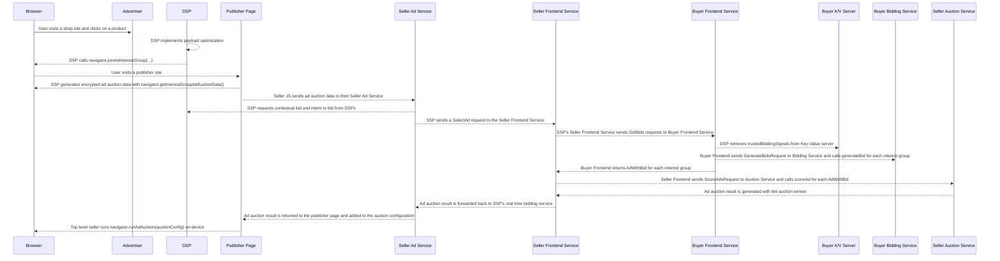

import Tabs from '@theme/Tabs'; import TabItem from '@theme/TabItem';

# Bidding & Auction Services for Protected Audience

<Tabs>
<TabItem value="overview" label="Overview" default>

## Overview

### Description

Bidding & Auction Services aim to provide open source infrastructure for executing Protected Audience auctions server-side. This demo will walk you
through how to set up a deployment of this infrastructure on your local machine.

### Privacy Sandbox APIs

- [Protected Audience](https://developers.google.com/privacy-sandbox/private-advertising/protected-audience)
- [Bidding & Auction Services](https://developers.google.com/privacy-sandbox/private-advertising/protected-audience/android/bidding-and-auction-services)

### Related parties

- SSP
- DSP
- Publisher

</TabItem>

<TabItem value="design" label="Design">

## Design

### Goals

This demo aims to showcase how sellers and buyers can enhance the performance of their Protected Audience auctions using server-side Bidding & Auction
services. By providing a local development environment, we enable developers to explore the functionality of these components before committing to a
full production cloud deployment.

### Assumptions

This demo assumes that the reader has knowledge of how the
[Protected Audience API](https://privacysandbox.google.com/private-advertising/protected-audience) works. This demo will not provide details on the
cloud deployment of B&A at this time.

### Key Exclusions

- Cloud deployment
- Maximum of 2 B&A buyers per seller
- Bidding inference service

### System Design

Below outlines the general system design for B&A. Please see the bullets below or the image for a chronological set of steps detailing how the
components of the system work together to complete an auction.

#### API Flow

- The user visits a shopping site and gets added to an interest group from the Protected Audience API. This interest group will have an
  [optimized payload](https://github.com/privacysandbox/protected-auction-services-docs/blob/main/bidding-auction-services-payload-optimization.md).
- Later, the user visits a news site. The publisher or seller will have the `navigator.getInterestGroupAdAuctionData()` call on the page to generate
  an encrypted auction blob. This blob will be sent to the seller's real time bidding service.
- The seller will initiate a `SelectAd` request from their real time bidding service to their B&A seller frontend service. This will initiate the B&A
  server-side auction flow.
- Once the seller frontend service receives a `SelectAd` request, it will initiate a `GetBids` request to all configured buyer frontend services.
- Each buyer frontend will then retrieve `trustedBiddingSignals` from their key/value service, then a `GenerateBids` request will be made from the
  buyer frontend to the bidding service.
- The bidding service will then handle the `generateBid` function with provided bidding logic. The bidding service will send a response containing the
  bids per interest group and the buyer frontend will forward this response to the seller frontend.
- The seller frontend will then initiate a `ScoreAdsRequest` to the auction service. The auction service will handle the `scoreAd` function with
  provided auction logic.
- The auction is then complete and the encrypted ad auction result is returned to the seller's real time bidding service.
- The seller's real time bidding service then forwards the encrypted ad auction result back to the publisher page. Then the
  `navigator.runAdAuction()`function runs on the page and displays the winning ad.


#### User Journey



[Full-sized diagram](./img/bidding-and-auction-flow.png)

</TabItem>

<TabItem value="demo" label="Demo">

## Demo

### Prerequisites

- Chrome > v107 (Open chrome://version to look up your current version)
- Enable Privacy Sandbox APIs (Open chrome://settings/privacySandbox to enable this setting)
- Clear your browsing history before you run one of the demo scenario below (Open chrome://settings/clearBrowserData to delete your browsing history)
- Install [Docker](https://docs.docker.com/engine/install/) according to your system's specifications

1. Open Chrome from the command line using the following command. This will enable Chrome to use test keys for attestation.

```bash
google-chrome --enable-privacy-sandbox-ads-apis --disable-features=EnforcePrivacySandboxAttestations,FledgeEnforceKAnonymity --enable-features=FledgeBiddingAndAuctionServerAPI,FledgeBiddingAndAuctionServer:FledgeBiddingAndAuctionKeyURL/https%3A%2F%2Fstorage.googleapis.com%2Fba-test-buyer%2Fcoordinator-test-key.json
```

2. Follow instructions listed in
   [Instructions for deploying and running the demos in your local environment with Docker](https://github.com/privacysandbox/privacy-sandbox-demos/blob/main/docs/deploy-to-linux-docker.md)
   to deploy Privacy Sandbox Demos locally.
   - If you have run Privacy Sandbox Demos previously, it is recommended to delete the docker network with the below docker commands before running
     `npm run start`.

```bash
docker-compose down
docker network rm privacy-sandbox-demos_adnetwork
```

3. Clone the `bidding-auction-servers` [GitHub repository](https://github.com/privacysandbox/bidding-auction-servers).

```bash
git clone https://github.com/privacysandbox/bidding-auction-servers.git
```

4. From the root folder of the bidding and auction services repository, build the bidding and auction services with the following command.

```bash
production/packaging/build_and_test_all_in_docker \
  --service-path bidding_service \
  --service-path auction_service \
  --service-path buyer_frontend_service \
  --service-path seller_frontend_service \
  --platform gcp \
  --instance local \
  --no-precommit \
  --no-tests \
  --build-flavor non_prod \
  --gcp-skip-image-upload
```

5. Once the packaging step has completed, start the services with the following commands. **Run each command in a separate terminal window or tab**.
   - _NOTE: Ensure step #2 is complete as this will create the docker network._

**DSP-X Services**

```bash
## DSP-X Bidding Service ##
DOCKER_RUN_ARGS_STRING="--ip=172.16.0.101 --network=privacy-sandbox-demos_adnetwork" \
BIDDING_JS_URL="http://privacy-sandbox-demos-dsp-x.dev:8080/js/dsp/usecase/bidding-and-auction/bidding-logic-dsp-x.js" \
PS_VERBOSITY=10 \
SKIP_TLS_VERIFICATION=true \
./tools/debug/start_bidding
```

```bash
## DSP-X Buyer Frontend Service ##
DOCKER_RUN_ARGS_STRING="--ip=172.16.0.102 --network=privacy-sandbox-demos_adnetwork" \
BUYER_KV_SERVER_ADDR="http://privacy-sandbox-demos-dsp-x.dev:8080/dsp/service/kv" \
BIDDING_SERVER_ADDR=172.16.0.101:50057 \
PS_VERBOSITY=10 \
SKIP_TLS_VERIFICATION=true \
./tools/debug/start_bfe
```

**DSP-Y Services**

```bash
## DSP-Y Bidding Service ##
DOCKER_RUN_ARGS_STRING="--ip=172.16.0.201 --network=privacy-sandbox-demos_adnetwork" \
BIDDING_JS_URL="http://privacy-sandbox-demos-dsp-y.dev:8080/js/dsp/usecase/bidding-and-auction/bidding-logic-dsp-y.js" \
PS_VERBOSITY=10 \
SKIP_TLS_VERIFICATION=true \
./tools/debug/start_bidding
```

```bash
## DSP-Y Buyer Frontend Service ##
DOCKER_RUN_ARGS_STRING="--ip=172.16.0.202 --network=privacy-sandbox-demos_adnetwork" \
BUYER_KV_SERVER_ADDR="http://privacy-sandbox-demos-dsp-y.dev:8080/dsp/service/kv" \
BIDDING_SERVER_ADDR=172.16.0.201:50057 \
PS_VERBOSITY=10 \
SKIP_TLS_VERIFICATION=true \
./tools/debug/start_bfe
```

**SSP-X Services**

```bash
## SSP-X Auction Service ##
DOCKER_RUN_ARGS_STRING="--ip=172.16.0.103 --network=privacy-sandbox-demos_adnetwork" \
AUCTION_JS_URL="http://privacy-sandbox-demos-ssp-x.dev:8080/js/ssp/usecase/bidding-and-auction/ssp-x/decision-logic.js" \
PS_VERBOSITY=10 \
SKIP_TLS_VERIFICATION=true \
./tools/debug/start_auction
```

```bash
## SSP-X Seller Frontend Service
DOCKER_RUN_ARGS_STRING="--ip=172.16.0.104  --network=privacy-sandbox-demos_adnetwork" \
SELLER_ORIGIN_DOMAIN="https://privacy-sandbox-demos-ssp-x.dev" \
AUCTION_SERVER_ADDR=172.16.0.103:50061 \
KEY_VALUE_SIGNALS_ADDR="http://privacy-sandbox-demos-ssp-x.dev:8080/ssp/usecase/bidding-and-auction/ssp-x/service/kv" \
BUYER_SERVER_ADDRS_JSON='{"https://privacy-sandbox-demos-dsp-x.dev":{"url":"172.16.0.102:50051","cloudPlatform":"LOCAL"},"https://privacy-sandbox-demos-dsp-y.dev":{"url":"172.16.0.202:50051","cloudPlatform":"LOCAL"}}' \
PS_VERBOSITY=10 \
SKIP_TLS_VERIFICATION=true \
./tools/debug/start_sfe
```

**SSP-Y Services**

```bash
## SSP-Y Auction Service ##
DOCKER_RUN_ARGS_STRING="--ip=172.16.0.203 --network=privacy-sandbox-demos_adnetwork" \
AUCTION_JS_URL="http://privacy-sandbox-demos-ssp-y.dev:8080/js/ssp/usecase/bidding-and-auction/ssp-y/decision-logic.js" \
PS_VERBOSITY=10 \
SKIP_TLS_VERIFICATION=true \
./tools/debug/start_auction
```

```bash
## SSP-Y Seller Frontend Service
DOCKER_RUN_ARGS_STRING="--ip=172.16.0.204  --network=privacy-sandbox-demos_adnetwork" \
SELLER_ORIGIN_DOMAIN="https://privacy-sandbox-demos-ssp-y.dev" \
AUCTION_SERVER_ADDR=172.16.0.203:50061 \
KEY_VALUE_SIGNALS_ADDR="http://privacy-sandbox-demos-ssp-y.dev:8080/ssp/usecase/bidding-and-auction/ssp-y/service/kv" \
BUYER_SERVER_ADDRS_JSON='{"https://privacy-sandbox-demos-dsp-x.dev":{"url":"172.16.0.102:50051","cloudPlatform":"LOCAL"},"https://privacy-sandbox-demos-dsp-y.dev":{"url":"172.16.0.202:50051","cloudPlatform":"LOCAL"}}' \
PS_VERBOSITY=10 \
SKIP_TLS_VERIFICATION=true \
./tools/debug/start_sfe
```

6. Validate all services are running properly by ensuring the following logs are printed on each service.

```bash
## Bidding Service ##
bidding_main.cc:627] privacy_sandbox_system_log: Server listening on 0.0.0.0:50057

## Buyer Frontend Service ##
buyer_frontend_main.cc:397] privacy_sandbox_system_log: Server listening on 0.0.0.0:50051

## Auction Service ##
auction_main.cc:374] privacy_sandbox_system_log: Server listening on 0.0.0.0:50061

## Seller Frontend Service ##
seller_frontend_main.cc:364] privacy_sandbox_system_log: Server listening on 0.0.0.0:50053

```

#### Do not proceed until services are running and validated properly.

### Steps

1. Navigate to the Advertiser's shop site `privacy-sandbox-demos-shop.dev/items/1f45e?usecase=bidding-and-auction`.

   - The advertiser assumes the user is interested in this type of product. The advertiser uses a demand-side platform (DSP) to handle advertising
     needs. The DSP has a tag on this page that will add the user to an interest group for this product category.
   - **NOTE**: In a production deployment, this query parameter would **not** be required. This is for demo purposes only.

2. Open the Chrome Developer Tools console and view the `Console` tab. Here you can see console logs of the user being added to an interest group.
3. Navigate to the `Application` tab. Select `Interest Groups` under the `Storage` section.
   - **NOTE**: If this tab has no events, refresh the page.
4. Select one of the `privacy-sandbox-demos-shop.dev-bidding-and-auction` events. This shows a `joinAdInterestGroup` call for a DSP without
   [payload optimization](https://github.com/privacysandbox/protected-auction-services-docs/blob/main/bidding-auction-services-payload-optimization.md).
5. Select the `dsp-x-ig` event. This shows a `joinAdInterestGroup` call for a DSP with
   [payload optimization](https://github.com/privacysandbox/protected-auction-services-docs/blob/main/bidding-auction-services-payload-optimization.md).
   - Within the `ads` field, note the `adRenderId` field. This is an optimization to retrieve the `renderURL` from a Key-Value server.
   - Note the field `auctionServerRequestFlags: ["omit-ads","omit-user-bidding-signals"]`. This field notifies the browser to allow for omission of
     the `ads` and `userBiddingSignals` fields as these can cause larger payloads.
   - Note the field `trustedBiddingSignalsKeys`. This field will notify the Buyer Frontend Service to retrieve these real time bidding signals from
     their Key-Value server before generating a bid.
6. Navigate to the news site with the query parameter to follow the bidding and auction flow.
   [https://privacy-sandbox-demos-news.dev/bidding-and-auction](https://privacy-sandbox-demos-news.dev/bidding-and-auction) with the Chrome Developers
   Tool window open.
   - **NOTE**: In a production deployment, this query parameter would **not** be required. This is for demo purposes only.
7. Open the Chrome Developer Tools console and view the `Console` tab. Here you can see console logs of the auction configurations from each component
   auction, as well as the final multi-seller auction.

   - Expanding the log for the `SSP-A` auction will show the auction config for an on-device auction.
   - Expanding the log for the `SSP-X` auction will show the auction config for a B&A only auction.
   - Expanding the log for the `SSP-Y` auction will show the auction config for a mixed-mode auction. Within the mixed mode auction you will see two
     component auctions, one being an on-device auction and the other being a B&A auction.
   - Expanding the log for the `TLS SSP` will show all four component auctions.
     - On-device only with `SSP-A`
     - B&A only with `SSP-X`
     - On-device component of mixed mode with `SSP-Y`
     - B&A component of mixed mode with `SSP-Y`

8. Within the `SSP-Y` sub-component auction for B&A, there are a few differences in the specification. The following code block shows an example of
   what is different.
   - The `requestId` field is a unique identifier for the browser to ensure this is a valid ad auction.
   - The `serverResponse` field is the ad auction response from the auction service.

```json
adAuctionHeaders: true
requestId: "b9f96e9b-3fee-4a2a-87c1-1121d76eff0f"
resolveToConfig: true
seller: "https://privacy-sandbox-demos-ssp-y.dev"
serverResponse: Uint8Array(560) [110, 76, 79...]
```

### Implementation details

#### Buyer Implementation

1. The shop has multiple DSP tags on the page for each item. When the user clicks on an item, the DSP tags from the locals will be inserted into the
   embedded Javascript template for the item when rendered. Below code can be found in the
   [index.ts for the shop](https://github.com/privacysandbox/privacy-sandbox-demos/blob/0558610e4712de7a5861bf2f2fa61126f1ffcdda/services/shop/src/index.ts#L151).

```javascript
app.locals = {
  title: SHOP_DETAIL,
  displayCategory,
  DSP_TAG_URL: new URL(
    `https://${DSP_HOST}:${EXTERNAL_PORT}/js/dsp/dsp-tag.js`,
  ),
  DSP_A_TAG_URL: new URL(
    `https://${DSP_A_HOST}:${EXTERNAL_PORT}/js/dsp/dsp-tag.js`,
  ),
  DSP_B_TAG_URL: new URL(
    `https://${DSP_B_HOST}:${EXTERNAL_PORT}/js/dsp/dsp-tag.js`,
  ),
  DSP_X_TAG_URL: new URL(
    `https://${DSP_X_HOST}:${EXTERNAL_PORT}/js/dsp/dsp-tag.js`,
  ),
  DSP_Y_TAG_URL: new URL(
    `https://${DSP_Y_HOST}:${EXTERNAL_PORT}/js/dsp/dsp-tag.js`,
  ),
  MTA_CONVERSION_TAG_URL: new URL(
    `https://${DSP_HOST}:${EXTERNAL_PORT}/js/dsp/usecase/multi-touch-attribution/mta-conversion-tag.js`,
  ).toString(),
  getCartTotal,
  getConversionTriggerUrls: (order: Order) =>
    AD_TECHS_TO_TAG_FOR_CONVERSIONS.map((host) =>
      constructConversionTriggerUrl(host, order),
    ),
  getEventTriggerUrl,
};
```

2. These locals will be injected as template variables into the
   [item embedded Javascript file](https://github.com/privacysandbox/privacy-sandbox-demos/blob/0558610e4712de7a5861bf2f2fa61126f1ffcdda/services/shop/src/views/item.ejs#L119)
   when the item is being rendered. When rendering, these variables are injected and the scripts referencing the DSP tags are executed. The bidding
   and auction variables will only be injected if the `?usecase=bidding-and-auction` query parameter is provided.

```javascript
</script>
     function buildDspScriptTag(tagUrl) {
        const scriptEl = document.createElement('script')
        scriptEl.className = 'dsp_tag'
        scriptEl.src = tagUrl
        scriptEl.dataset.advertiser = '<%= SHOP_HOST %>'
        scriptEl.dataset.itemId = '<%= item.id %>'
        return scriptEl
      }
      switch ('<%= usecase %>'){
        case 'bidding-and-auction':
          document.body.appendChild(buildDspScriptTag('<%= DSP_X_TAG_URL %>'));
          document.body.appendChild(buildDspScriptTag('<%= DSP_Y_TAG_URL %>'));
        default:
          document.body.appendChild(buildDspScriptTag('<%= DSP_A_TAG_URL %>'));
          document.body.appendChild(buildDspScriptTag('<%= DSP_B_TAG_URL %>'));
          document.body.appendChild(buildDspScriptTag('<%= DSP_TAG_URL %>'));
      }
    </script>
```

3. The
   [dsp-tag.js](https://github.com/privacysandbox/privacy-sandbox-demos/blob/0558610e4712de7a5861bf2f2fa61126f1ffcdda/services/ad-tech/src/public/js/dsp/dsp-tag.js#L97)
   will be executed for all DSPs. Within the tag, this DSP will inject an iframe to initiate the `joinAdInterestGroup` call.

```javascript
   injectIframe(
      /* src= */ getServerUrlWithPageContext(
        /* pathname= */ 'dsp/join-ad-interest-group.html',
      ),
      /* options= */ {
        allow: 'join-ad-interest-group',
        browsingTopics: '',
      },
    );
```

4. The
   [buyer router](https://github.com/privacysandbox/privacy-sandbox-demos/blob/0558610e4712de7a5861bf2f2fa61126f1ffcdda/services/ad-tech/src/routes/dsp/buyer-router.ts#L41)
   will catch this request to`dsp/join-ad-interest-group.html` and will render the corresponding embedded Javascript file.

5. Within the iframe, it will only include a script to execute the `join-ad-interest-group.js` file.

```html
  <%/* Script to add user to an interest group. */%>
  <script src="<%= `https://${HOSTNAME}:${EXTERNAL_PORT}/js/dsp/usecase/bidding-and-auction/join-ad-interest-group.js` %>">
  </script>
```

6. This
   [join-ad-interest-group.js](https://github.com/privacysandbox/privacy-sandbox-demos/blob/8d7effd11f4d4e51065208ef4af92d5f2d921706/services/ad-tech/src/public/js/dsp/join-ad-interest-group.js#L32)
   file will make a request to the route `/dsp/interest-group.json` to fetch the interest group configuration.

```javascript
 getInterestGroupFromServer = async () => {
    const currentUrl = new URL(location.href);
    const interestGroupUrl = new URL(location.origin);
    interestGroupUrl.pathname = '/dsp/interest-group.json';
    // Copy query params from current context.
    for (const [key, value] of currentUrl.searchParams) {
      interestGroupUrl.searchParams.append(key, value);
    }
    if (res.ok) {
      return res.json();
    }
```

7. This call from the client to the server will be caught by the
   [buyer router](https://github.com/privacysandbox/privacy-sandbox-demos/blob/8d7effd11f4d4e51065208ef4af92d5f2d921706/services/ad-tech/src/routes/dsp/buyer-router.ts#L94).
   If the usecase query parameter from the targeting context matches `bidding-and-auction` and the caller is a B&A enabled buyer, the payload
   optimized interest group will be used by calling the `getInterestGroupBiddingAndAuction` function.

```typescript
BuyerRouter.get('/interest-group.json', async (req: Request, res: Response) => {
  const targetingContext = assembleTargetingContext(req.query);
  const baseUrl = `${req.protocol}://${req.get('host')}${req.path}`;
  if (
    'bidding-and-auction' === targetingContext.usecase &&
    (baseUrl.includes('dsp-x') || baseUrl.includes('dsp-y'))
  ) {
    res.json(getInterestGroupBiddingAndAuction(targetingContext));
  } else {
    res.json(getInterestGroup(targetingContext));
  }
});
```

8. The
   [interest-group-helper.ts](https://github.com/privacysandbox/privacy-sandbox-demos/blob/8d7effd11f4d4e51065208ef4af92d5f2d921706/services/ad-tech/src/lib/interest-group-helper.ts#L333)
   file contains the call to get the interest group configuration. This anonymous function will return a
   [payload optimized](https://github.com/privacysandbox/protected-auction-services-docs/blob/main/bidding-auction-services-payload-optimization.md)
   interest group. The notable differences in the interest group are:
   - `auctionServerRequestFlags` indicates to the browser that the `userBiddingSignals` and `ads` fields can be omitted.
   - `adRenderId` within the `ads` list provides a lookup key to identify and pull the creative during generateBid

```typescript
export const getInterestGroupBiddingAndAuction = (
  targetingContext: TargetingContext,
): InterestGroup => {
  const hostString: string = HOSTNAME ?? 'dsp-x';
  const dspName: string = extractDspName(hostString);
  const creative: string = buildCreativeURL(hostString);
  return {
    name: `${dspName}-ig`,
    owner: CURRENT_ORIGIN,
    biddingLogicURL: new URL(
      `https://${HOSTNAME}:${EXTERNAL_PORT}/js/dsp/usecase/bidding-and-auction/auction-bidding-logic.js`,
    ).toString(),
    trustedBiddingSignalsKeys: getBiddingSignalKeys(targetingContext),
    updateURL: constructInterestGroupUpdateUrl(targetingContext),
    ads: [
      {
        adRenderId: '1234',
        renderURL: creative,
      },
    ],
    adSizes: {
      'medium-rectangle-default': {'width': '300px', 'height': '250px'},
    },
    sizeGroups: {
      'medium-rectangle': ['medium-rectangle-default'],
    },
    auctionServerRequestFlags: [
      AuctionServerRequestFlags.OMIT_ADS,
      AuctionServerRequestFlags.OMIT_USER_BIDDING_SIGNALS,
    ],
  };
};
```

#### Seller Details

1. When the user visits the news website using the `/bidding-and-auction` query parameter, the
   [news router](https://github.com/privacysandbox/privacy-sandbox-demos/blob/745c641c8d40170d53e5cda5e834cdbe7f3ea033/services/news/src/index.ts#L54)
   will render the bidding and auction EJS file and inject the following variables.

```javascript
app.get('/bidding-and-auction', async (req: Request, res: Response) => {
  res.render('bidding-and-auction', {
    TITLE: NEWS_DETAIL,
    TEXT_LOREM,
    BIDDING_AND_AUCTION_SSP_TAG_URL: new URL(
      `https://${SSP_HOST}:${EXTERNAL_PORT}/js/ssp/usecase/bidding-and-auction/ad-tag.js`,
    ).toString(),
  });
});
```

2. When the
   [embedded Javascript file](https://github.com/privacysandbox/privacy-sandbox-demos/blob/745c641c8d40170d53e5cda5e834cdbe7f3ea033/services/news/src/views/bidding-and-auction.ejs#L31)
   renders, it will inject `BIDDING_AND_AUCTION_SSP_TAG_URL` and this URL will be executed as a script.

```html
<ins class="ads"><script class="ssp_tag" src="<%= BIDDING_AND_AUCTION_SSP_TAG_URL %>"></script></ins>
```

3. The script that's executed includes logic to create an iframe and execute a script. This will send a request to this path
   `/ssp/usecase/bidding-and-auction/ad-tag.html`.

```javascript
(async () => {
  const containerEl = document.querySelector('ins.ads');
  const tagEl = document.querySelector('.ssp_tag');

  const src = new URL(tagEl.src);
  src.pathname = '/ssp/usecase/bidding-and-auction/ad-tag.html';

  const iframeEl = document.createElement('iframe');
  iframeEl.width = 300;
  iframeEl.height = 250;
  iframeEl.src = src;
  iframeEl.setAttribute('scrolling', 'no');
  iframeEl.setAttribute('style', 'border: none');
  iframeEl.setAttribute('allow', 'attribution-reporting; run-ad-auction');
  containerEl.appendChild(iframeEl);
})();
```

4. Before rendering, this request is caught by the
   [seller router’s html handler](https://github.com/privacysandbox/privacy-sandbox-demos/blob/d358ea882c2aa8b9d6f56390321f024dae9b8261/services/ad-tech/src/routes/ssp/seller-router.ts#L47).
   This handler will render the`ad-tag` embedded Javascript file and insert the following variables from the
   [common-utils.ts file](https://github.com/privacysandbox/privacy-sandbox-demos/blob/df01c883ba73f54609f3c75889c7320d36a917b7/services/ad-tech/src/lib/common-utils.ts#L32C1-L43C3).
   These variables are the tags that will be used to initiate the execution of component auctions for SSP-A, SSP-X, and SSP-Y.
   - **NOTE**: Each of these tags will execute a component auction. This implementation will follow the flow of `SSP-Y` to show how mixed mode is
     implemented.

```typescript
const SSP_A_ORIGIN = new URL(`https://${SSP_A_HOST}:${EXTERNAL_PORT}`).origin;
const SSP_X_ORIGIN = new URL(`https://${SSP_X_HOST}:${EXTERNAL_PORT}`).origin;
const SSP_Y_ORIGIN = new URL(`https://${SSP_Y_HOST}:${EXTERNAL_PORT}`).origin;
const BIDDING_AND_AUCTION_SSP_A_TAG_URL = new URL(
  '/ssp/usecase/bidding-and-auction/ssp-a/construct-component-auction.js',
  SSP_A_ORIGIN,
);
const BIDDING_AND_AUCTION_SSP_X_TAG_URL = new URL(
  '/ssp/usecase/bidding-and-auction/ssp-x/construct-component-auction.js',
  SSP_X_ORIGIN,
);
const BIDDING_AND_AUCTION_SSP_Y_TAG_URL = new URL(
  '/ssp/usecase/bidding-and-auction/ssp-y/construct-component-auction.js',
  SSP_Y_ORIGIN,
);

/** Returns EJS template variables for EJS files. */
export const getEjsTemplateVariables = (
  titleMessage: string = '',
  additionalTemplateVariables: {[key: string]: string} = {},
) => {
  const hostDetails = {
    BIDDING_AND_AUCTION_SSP_A_TAG_URL,
    BIDDING_AND_AUCTION_SSP_X_TAG_URL,
    BIDDING_AND_AUCTION_SSP_Y_TAG_URL,
    HOSTNAME,
    EXTERNAL_PORT,
    PORT,
    SHOP_HOST,
    TITLE: `${HOSTNAME} - ${titleMessage}`,
    ...additionalTemplateVariables,
  };
  console.log('Built template context: ', hostDetails);
  return hostDetails;
};

```

5. The
   [ad-tag.ejs file](https://github.com/privacysandbox/privacy-sandbox-demos/blob/df01c883ba73f54609f3c75889c7320d36a917b7/services/ad-tech/src/views/ssp/usecase/bidding-and-auction/ad-tag.ejs#L28-L31)
   will be rendered, insert the variables, and execute each URL as a script or fetch call. Each component auction will run and be collected in a
   window function to be passed to a top seller that runs on-page.

```html
  <script>
    window.auctionInfoCollector = []
  </script>
  <script type="module" src="/js/ssp/usecase/bidding-and-auction/ssp/run-ad-auction.js"></script>
  <script type="module" defer src="<%= BIDDING_AND_AUCTION_SSP_A_TAG_URL %>"></script>
  <script type="module" defer src="<%= BIDDING_AND_AUCTION_SSP_X_TAG_URL %>"></script>
  <script type="module" defer src="<%= BIDDING_AND_AUCTION_SSP_Y_TAG_URL %>"></script>

```

6. This fetch call will be caught and handled by the
   [bidding-and-auction-router.ts](https://github.com/privacysandbox/privacy-sandbox-demos/blob/df01c883ba73f54609f3c75889c7320d36a917b7/services/ad-tech/src/routes/ssp/usecase/bidding-and-auction/bidding-and-auction-router.ts#L223-L236)
   and will compile the file to construct the component auction.

```typescript
sspYRouter.get('/construct-component-auction.js', async (req, res) => {
  let filePath;
  filePath = path.join(
    path.resolve(),
    '/build/public/js/ssp/usecase/bidding-and-auction/ssp-y/construct-component-auction.js',
  );
  const file = await readFile(filePath, {encoding: 'utf8'});
  const compiledFile = await ejs.compile(file);
  const fileContent = compiledFile({SSP_Y_ORIGIN, DSP_X_ORIGIN, DSP_Y_ORIGIN});

  res.set('content-type', 'text/javascript');

  res.send(fileContent);
});
```

7. The
   [construct-component-auction.ts](https://github.com/privacysandbox/privacy-sandbox-demos/blob/ff68148e0987979ecdac2f0183b9ca2a1b847bcc/services/ad-tech/src/public/js/ssp/usecase/bidding-and-auction/ssp-y/construct-component-auction.ts#L35)
   file will first build the auction config.

```typescript
   const adAuctionDataConfig = {
      seller: SSP_Y_ORIGIN,
      requestSize: 51200,
      perBuyerConfig: {
        [DSP_X_ORIGIN]: {targetSize: 8192},
        [DSP_Y_ORIGIN]: {targetSize: 8192},
      },
    };
```

8. Then, it will use the auction data config to make a call to the browser to generate an encrypted ad auction blob. This blob is generated using the
   `navigator.getInterestGroupAdAuctionData()` call with the auction config as input. This function returns a requestId and a request. `requestId`
   must be retained to provide back to the browser after the auction result is generated. This is a check by the browser to ensure the client-server
   interaction was not tampered with. `request` is the encrypted ad auction blob that will be sent to the Seller Front End service.

```typescript
   const {requestId, request} =
      await navigator.getInterestGroupAdAuctionData(adAuctionDataConfig);
```

9. The `request` object, ad auction blob, is then passed to the function that will run the component auction and return the auction result, contextual
   auction winner, and on-device auction config.

```typescript
   const {
      protectedAudienceAuctionResult,
      contextualAuctionWinner,
      onDeviceAuctionConfig,
    }: ComponentAuctionResult = await this.#runComponentAdAuction(request);
```

10. The component auction will be run by building a request to create a _unified-auction_. First, the auction request is encoded with base64. Then,
    this auction request is sent to the unified auction endpoint located in
    [ad-service.ts](https://github.com/privacysandbox/privacy-sandbox-demos/blob/df01c883ba73f54609f3c75889c7320d36a917b7/services/ad-tech/src/routes/ssp/usecase/bidding-and-auction/ad-service.ts#L219).

```typescript
async #runComponentAdAuction(request: number[]) {
    const auctionRequest = btoa(String.fromCharCode.apply(null, request));
    const unifiedAuctionUrl = new URL(
      '/ssp/usecase/bidding-and-auction/service/ad/unified-auction',
      SSP_Y_ORIGIN,
    );
    const {buyers} = await this.#fetchContextualAuctionBuyers();

    const response = await fetch(unifiedAuctionUrl, {
      method: 'POST',
      adAuctionHeaders: true,
      headers: {
        'Content-Type': 'application/json',
      },
      body: JSON.stringify({
        contextual: {buyers},
        protectedAudience: {auctionRequest},
      }),
    });
```

11. This request is handled by the
    [unified auction route](https://github.com/privacysandbox/privacy-sandbox-demos/blob/df01c883ba73f54609f3c75889c7320d36a917b7/services/ad-tech/src/routes/ssp/usecase/bidding-and-auction/ad-service.ts#L219).
    First, metadata from the client must be collected to ensure this request is a real Chrome request. Then, the contextual auction will run to
    determine _perBuyerSignals_ to pass to the Protected Audience B&A auction. Finally, the Protected Audience auction begins by passing the request
    body, contextual result, client metadata and host.

```typescript
 const {contextual, protectedAudience} = req.body;
  const host = req.headers.host;

  const metadata = new grpc.Metadata();
  metadata.add('X-Accept-Language', req.header('Accept-Language') || '');
  metadata.add('X-User-Agent', req.header('User-Agent') || '');
  metadata.add('X-BnA-Client-IP', req.ip || '');

  const contextualAuctionResult = await runContextualAuction(contextual);
  runProtectedAudienceAuction(
    protectedAudience,
    contextualAuctionResult,
    metadata,
    host,
    res,
  );
```

12. The
    [runProtectedAudienceAuction](https://github.com/privacysandbox/privacy-sandbox-demos/blob/e9b604243b99c4629b78a578844d054770f9d660/services/ad-tech/src/routes/ssp/usecase/bidding-and-auction/ad-service.ts#L109)
    function will build the `selectAd` request to be sent to the Seller Front End. The `selectAd` request will kick off the Protected Audience flow on
    B&A. The perBuyerSignals will be sourced from the contextual auction. **NOTE**: For B&A to work properly, the buyer list defined in the selectAd
    request must match the buyer list provided to the seller front end service at startup.

```typescript
 const selectAdRequest = {
    auction_config: {
      top_level_seller: SSP_ORIGIN,
      seller: SELLER_HOST,
      seller_signals: '{"testKey":"someValue"}',
      auction_signals: `{"bidFloor": 0}`,
      buyer_list: [DSP_X_ORIGIN, DSP_Y_ORIGIN],
      per_buyer_config: {
        [DSP_X_ORIGIN]: {
          buyer_signals: JSON.stringify(
            perBuyerConfigs[DSP_X_ORIGIN].buyer_signals,
          ),
        },
        [DSP_Y_ORIGIN]: {
          buyer_signals: JSON.stringify(
            perBuyerConfigs[DSP_Y_ORIGIN].buyer_signals,
          ),
        },
      },
    },
    client_type: 'CLIENT_TYPE_BROWSER',
    protected_auction_ciphertext: decodeRequest(auctionRequest),
  };
```

13. The selectAd request will then be sent to the seller front end service through a
    [gRPC client](https://github.com/privacysandbox/privacy-sandbox-demos/blob/e9b604243b99c4629b78a578844d054770f9d660/services/ad-tech/src/routes/ssp/usecase/bidding-and-auction/server/ssp-x-sfe-client.ts#L38-L41).
    The selectAd request can also be sent with a REST API call. This
    [proto file](https://github.com/privacysandbox/privacy-sandbox-demos/blob/e9b604243b99c4629b78a578844d054770f9d660/services/ad-tech/src/routes/ssp/usecase/bidding-and-auction/server/proto/sfe-client.proto#L3)
    defines the interface for interacting with the seller frontend service. The `ciphertextShaHash` uses the response from the seller front end and
    generates a SHA-256 hash with base64 encoding. This is to ensure payload security between the seller ad service and the browser. The ciphertext is
    then set as the value for the `Ad-Auction-Result` header to be passed back to the browser. The `onDeviceAuctionConfig` field is set to define the
    auction configuration for the on-device component of mixed mode. This will be passed to the browser along with the bidding and auction result, but
    it will appear as a separate component auction in the browser.

```typescript
   mixedModeClientSFE.selectAd(
      selectAdRequest,
      metadata,
      (error: any, response: any) => {
        if (!response) {
          console.log(`No response received from SFE.  Error=${error}`);
          return;
        }
        const ciphertextShaHash = createHash('sha256')
          .update(response.auction_result_ciphertext, 'base64')
          .digest('base64url');

        res.set('Ad-Auction-Result', ciphertextShaHash);
        res.json({
          contextualAuctionWinner,
          protectedAudienceAuctionCiphertext: encodeResponse(
            response.auction_result_ciphertext,
          ),
          onDeviceAuctionConfig: {
            trustedScoringSignalsURL: SSP_Y_KV_URL,
            decisionLogicURL: SSP_Y_DECISION_LOGIC_URL,
            buyers: [DSP_A_ORIGIN, DSP_B_ORIGIN],
            perBuyerSignals: {
              [DSP_A_ORIGIN]: perBuyerConfigs[DSP_A_ORIGIN],
              [DSP_B_ORIGIN]: perBuyerConfigs[DSP_B_ORIGIN],
            },
          },
        });
      },
    );
```

14. The component auction for SSP-Y is now complete. The auction configs are passed back to the
    [ad-tag.ejs](https://github.com/privacysandbox/privacy-sandbox-demos/blob/e9b604243b99c4629b78a578844d054770f9d660/services/ad-tech/src/views/ssp/usecase/bidding-and-auction/ad-tag.ejs#L26)
    file’s `window.auctionInfoCollector` function. This will collect all auction configs to be passed to the top level seller.

15. The top level auction will run the `runAdAuction` call on-device with the
    [run-ad-auction.js](https://github.com/privacysandbox/privacy-sandbox-demos/blob/e9b604243b99c4629b78a578844d054770f9d660/services/ad-tech/src/public/js/ssp/usecase/bidding-and-auction/ssp/run-ad-auction.js#L36-L55)
    file. This is a device-orchestrated bidding & auction services auction. Once this runs, the ad will be rendered with the winner of the auction.

```typescript
 async run(componentAuctionInfo) {
    this.auctionConfig.componentAuctions =
      this.#getComponentAuctionConfigs(componentAuctionInfo);
    console.log(
      '[TLS SSP] Top Protected Audience auction config ',
      this.auctionConfig,
    );
    const adAuctionResult = await navigator.runAdAuction(this.auctionConfig);
    console.log('[TLS SSP] Auction result generated, runAdAuction complete.');

    if (adAuctionResult) {
      this.#renderProtectedAudienceAd(adAuctionResult);
    } else {
      const contextualAuctionWinner =
        this.#findContextualAuctionWinner(componentAuctionInfo);
      console.log({contextualAuctionWinner});

      this.#renderContextualAd(contextualAuctionWinner);
    }
  }
```

</TabItem>
</Tabs>
