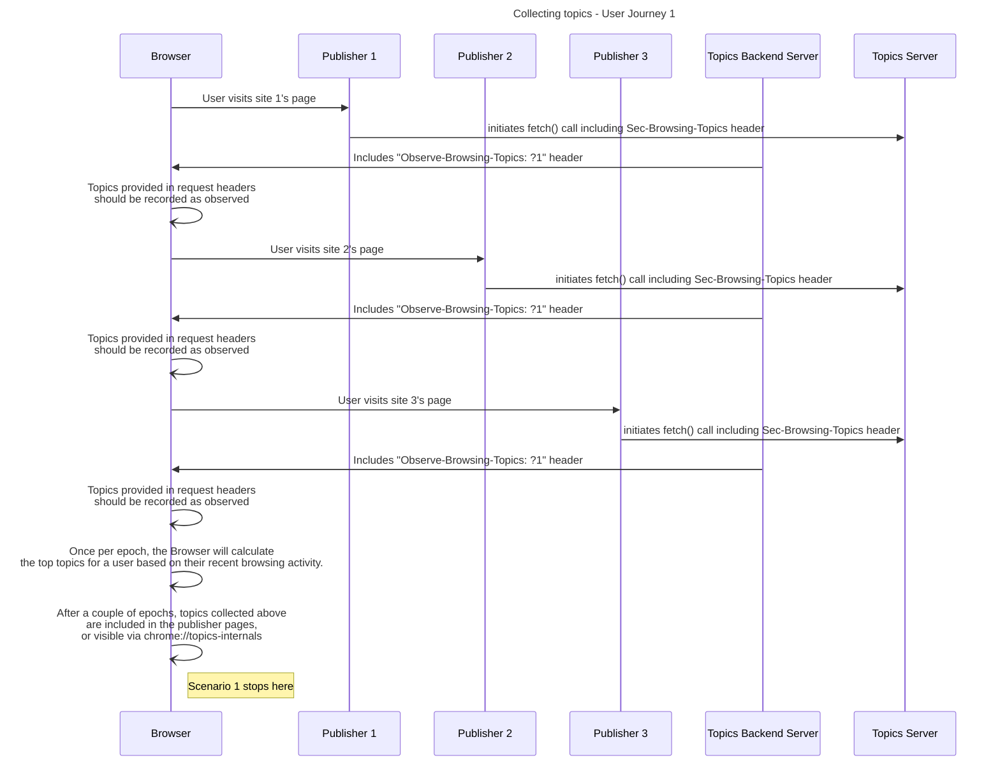

import Tabs from '@theme/Tabs';
import TabItem from '@theme/TabItem';

# Understand user’s interests via Topics API

<Tabs>
<TabItem value="overview" label="Overview" default>

## Overview

### Description

The Topics API is a Privacy Sandbox mechanism designed to preserve privacy while allowing a browser to share information with third parties about a user's interests.

### Privacy Sandbox APIs

- [Topics API](https://developer.chrome.com/en/docs/privacy-sandbox/topics/)

### Related parties

- Publisher
- Topics server

</TabItem>
<TabItem value="scope" label="Scope">

## Scope

### Goals

In this demo, we assume a dsp is retrieving the topics for a user that has been browsing across different websites where the dsp was calling the Topics API.

### Key Exclusions

The demo only includes the topics collection and is not adding any decision logic based on the topics collected.

### System Design

Using Topics API, when a user visits different publisher/news pages (e.g.: motorcycles, gardening, soccer) their browser will associate them with the corresponding topics. Later, these topics can be retrieved via request headers.

#### Topics API Flow

The diagram below shows a simplified example to demonstrate how the Topics API might help an ad tech platform select an appropriate ad. The example assumes that the user's browser already has a model to map website hostnames to topics.


#### User Journey #1



</TabItem>
<TabItem value="demo" label="Demo">

## Demo

### Prerequisites

- Chrome/Chrome dev > v111 (Open chrome://version to look up your current version)
- Start chrome from cmd and add the following flags:
  `--enable-features=BrowsingTopics,BrowsingTopicsParameters:time_period_per_epoch/15s/browsing_topics_max_epoch_introduction_delay/3s,PrivacySandboxAdsAPIsOverride,PrivacySandboxSettings3,OverridePrivacySandboxSettingsLocalTesting`

### User Journey #1

1. Navigate to the different publisher sites:

- https://motorcycles.privacy-sandbox-demos-news.dev
- https://soccer.privacy-sandbox-demos-news.dev
- https://gardening.privacy-sandbox-demos-news.dev
  NOTE: On these pages there is a fetch() request to https://topics-server.privacy-sandbox-demos-news.dev

2. Observe the request/response headers included for the request to the topics-server:
   Request headers will include a Sec-Browsing-Topics header
   Response headers will include a Observe-Browsing-Topics header set by the server
3. After a few epochs (one epoch set to 15s through the flags above) you will be able to observe the topics collected by checking chrome://topics-internals and they will also be added on the publisher pages.

### Implementation details

#### How are topics collected for a user

On the publisher pages, there is a fetch() call with `browsingTopics:true` which will include a `Sec-Brwosing-Topics` header.

```js
fetch(topics_server, { browsingTopics: true })
```

The server is providing `Observe-Browsing-Topics:?1` in the response which will mark the topics provided by request headers as observed. The browser will then use those topics included in the request header to calculate topics of interest for a user.

```js
res.setHeader("Observe-Browsing-Topics", "?1")
```

After a couple of epochs, the topics inferred form the 3 publisher pages should be added on the advertiser pages, but also visible when checking `chrome://topics-internals`

### Related API documentation

- [Topics API Integration guide - Chrome Developers](https://developer.chrome.com/docs/privacy-sandbox/topics/integration-guide/)

</TabItem>
</Tabs>
