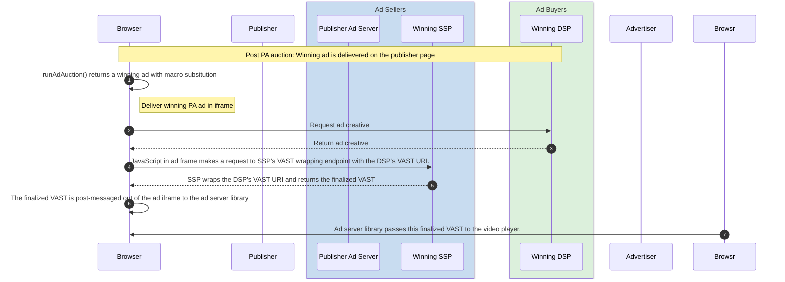

import Tabs from '@theme/Tabs'; import TabItem from '@theme/TabItem';

# Instream video ads with Protected Audience

:::info

This demo is a proof of concept created for illustrative purposes only, and should not be taken as a recommendation or standardized implementation of
this use case.

:::

<Tabs>
<TabItem value="overview" label="Overview" default>

## Overview

### Description

This demo expands on the demo for the [sequential setup of Protected Audience with contextual auction](sequential-auction-setup) to showcase how video
ads may be served with Protected Audience. The demo uses the industry-standard Video Ads Serving Template (VAST) XMLs to deliver video ads in iframes.
Additionally, note that the technique shown in this demo does not work with
[Fenced Frames](https://developers.google.com/privacy-sandbox/relevance/fenced-frame), but Protected Audience allows iframe usage
[until at least 2026](https://developers.google.com/privacy-sandbox/relevance/protected-audience-api/feature-status#fenced_frames).

### Privacy Sandbox APIs and related documentation

- [Protected Audience Overview - Google Developers :arrow_upper_right:](https://developers.google.com/privacy-sandbox/private-advertising/protected-audience)
- [Protected Audience Developer Guide - Google Developers :arrow_upper_right:](https://developers.google.com/privacy-sandbox/private-advertising/protected-audience-api)
- [Sequential setup of Protected Audience with contextual ad auction - Google Developers :arrow_upper_right:](https://developers.google.com/privacy-sandbox/private-advertising/auction/sequential-auction)

### Related parties

- Publisher (News site)
- Publisher Ad Server
- Supply Side Platform (SSP)
- Advertiser (Shop site)
- Demand Side Platform (DSP)

</TabItem>
<TabItem value="design" label="Design">

## Design

### Goals

- Render a pre-roll video ad that plays before the publisher's video content
- The final VAST of the pre-roll ad contains contributions from both the SSP and the DSP

### Assumptions

This demo and the accompanying documentation assumes that the reader is familiar with the basics of the Protected Audience API, its sequential setup
with the contextual auctions, and the VAST XML standard for serving video ads.

### Key Exclusions

This demo doesn't aim to replicate the real-world integration patterns between the multiple entities involved in the ad delivery process, but rather
focuses on the data flows necessary to enable video ads with the Protected Audience API. As instance, the demo shows the ad buyer assembling the final
VAST XML inclusive of contents from both the ad buyer and the ad seller, although it is the seller's responsibility in the real-world impressions.

This demo shows the use of VAST XML to deliver a video ad, but doesn't go into details of the structure of the VAST XML itself. Additionally, while
this demo only shows a pre-roll video ad, the same mechanism can be used to render other video ad types that use the VAST XML standard, such as
mid-roll and post-roll instream video ads.

Finally, to focus on the data flow within Protected Audience for video ads, the demo ad buyers don't place any contextual bids for video ads. The only
video ad bids generated are within the Protected Audience auction.

### System Design

Identical to the [sequential auction setup demo](sequential-auction-setup), the user visiting an advertiser page is added to interest groups by
multiple DSPs. The auction orchestration on the news publisher page is also similar at a high-level. The incremental difference is in the post-auction
rendering phase where the output of the Protected Audience auction needs to be consumed by a video player.

### User Journey

#### Summary

- The DSP includes a video ad in its interest group. The `renderURL` for this video ad includes a macro string (`${SSP_VAST}`) representing the SSP's
  endpoint to wrap the DSP VAST with additional contributions from the SSP.
- SSPs can include the value for this macro in their component auction configurations with the `deprecatedRenderURLReplacements` field.
- With this setup, the browser will replace the macro in the winning DSP's renderURL with the value coming from the corresponding SSP's component
  auction configuration.
- When the winning Protected Audience ad is rendered in an iframe, JavaScript running inside the ad frame retrieves and makes a request to the SSP's
  VAST wrapping endpoint with the DSP's VAST URI.
- The SSP's server wraps it's own VAST around the DSP's VAST URI and returns the finalized VAST back to the creative iframe, which in turn
  post-messages it to the ad server library code on the publisher's page.
- Finally, this ad server library passes the VAST XML to the video player

Since the overall auction orchestration for this use-case identical to that in the [sequential auction setup demo](sequential-auction-setup), we will
skip ahead to the ad rendering phase.



</TabItem>
<TabItem value="demo" label="Demo">

## Demo

### Prerequisites

- Latest stable version of Chrome (Open `chrome://version` to check your current version)
- Enable Privacy Sandbox APIs (Open `chrome://settings/adPrivacy` to enable _Site-suggested ads_)
- Clear your browsing history before you run one of the demo scenario below (Open `chrome://settings/clearBrowserData` to delete your browsing
  history)

### User Journey

1. [Navigate to the news site :arrow_upper_right:](https://privacy-sandbox-demos-news.dev/iframe-video-ad) (publisher)
   - Observe that this page contains some video content served by the publisher. When you click on the play button, the video content plays without
     ads.
   - The participating ad buyers or DSPs don't generate any contextual bids for video ads. And since we just cleared all data, there are no interest
     groups to generate bids for video ads.
2. [Navigate to shop site :arrow_upper_right:](https://privacy-sandbox-demos-shop.dev/) (advertiser)
   - Click on any "shoe" product item on the shop site. DSP tags on this product detail page will leverage the Protected Audience API to join an ad
     interest group.
3. [Navigate to the news site again :arrow_upper_right:](https://privacy-sandbox-demos-news.dev/iframe-video-ad) (publisher)
   - Observe that this time when you click the play button, a pre-roll ad is played before the content. This ad was delivered using a VAST XML
     delivered via Protected Audience.

### Implementation Details

The user is added to interest groups by ad buyers or DSPs using the same high-level flow as described in the
[basic remarketing / retargeting use-case demo](retargeting-remarketing). These interest groups contain both display and video ads, with the DSPs
filtering for the ad type corresponding to that signalled by ad sellers or SSPs via `auctionSignals`.

#### How is the video ad structured as an interest group ad?

The `renderURL` video ad in the DSP's interest group includes a macro representing the SSP's VAST wrapping endpoint. The DSP constructs and retrieves
the interest group configurations from its server, specifically assembling the video ad in
[`interest-group-helper.ts` :arrow_upper_right:](https://github.com/privacysandbox/privacy-sandbox-demos/blob/main/services/ad-tech/src/lib/interest-group-helper.ts).

```js title="DSP adds user to interest group on advertiser page: https://privacy-sandbox-demos-shop.dev/items/1f45e"
const interestGroup = {
  // ...
  ads: [{
    renderUrl: 'https://privacy-sandbox-demos-dsp-a.dev/ads/video-ads?sspVast=${SSP_VAST}&sspVastAlt=%%SSP_VAST%%'
  }],
  // ...
}
```

While the above `renderURL` shows both styles of declaring macros -- `${MACRO}` and `%%MACRO%%` -- only one is actually used in the demo.

#### How do ad sellers specify the macro values to be substituted in the `renderURL`?

Ad sellers or SSPs can use the `auctionConfig.deprecatedRenderURLReplacements` field. Similar to DSPs, SSPs also construct their auction
configurations on the server-side, specifically in
[`auction-config-helper.ts` :arrow_upper_right:](https://github.com/privacysandbox/privacy-sandbox-demos/blob/main/services/ad-tech/src/lib/auction-config-helper.ts).

```js title="SSP specifies renderURL macro substitutions in auction config"
const componentAuctionConfig = {
  seller: '...',
  // ...
  deprecatedRenderURLReplacements: {
    '${SSP_VAST}': 'https://privacy-sandbox-demos-ssp-a.dev/ssp/vast.xml'
    '%%SSP_VAST%%': 'https://privacy-sandbox-demos-ssp-a.dev/ssp/vast.xml',
  }
  // ...
}
```

At the end of the auction, the browser will take the macro values specified in the winning SSP's `auctionConfig` and replace it in the winning DSP's
`renderURL`.

#### How do SSPs and DSPs coordinate on the requested ad type for the opportunity?

The DSP includes all supported ad types in its interest group along with some metadata to indicate the ad type. The interest group object is assembled
on the server-side in
[`interest-group-helper.ts` :arrow_upper_right:](https://github.com/privacysandbox/privacy-sandbox-demos/blob/main/services/ad-tech/src/lib/interest-group-helper.ts),
and the final interest group is structured as shown below.

```js title="Structure of interest group ad metadata to indicate ad type"
const interestGroup = {
  // ...
  ads: [{
    renderURL: 'https://privacy-sandbox-demos-dsp-a.dev/ads/display-ads',
    metadata: '{"adType":"DISPLAY"}',
  }, {
    renderURL: 'https://privacy-sandbox-demos-dsp-a.dev/ads/video-ads?spVast=${SSP_VAST}',
    metadata: '{"adType":"VIDEO"}',
  }],
  // ...
}
```

SSPs indicate the supported ad type in `auctionConfig.auctionSignals` which is made available to the DSP's `generateBid()` method at auction time.
Using this information, DSPs can filter for the appropriate ad types in their
[bidding logic :arrow_upper_right:](https://github.com/privacysandbox/privacy-sandbox-demos/blob/dev/services/ad-tech/src/public/js/dsp/default/auction-bidding-logic.js#L261-264);

#### What does the interest group ad creative do?

Since the final ad is delivered in the video player on the page, the winning Protected Audience ad is essentially a transparent iframe that is
responsible for handling the data flow surrounding the ad delivery. More specifically, this ad frame enables the wrapping of the VAST XML by multiple
entities before delivering it to the video player. In real-world deployments today, SSPs are responsible for this wrapping process. Focusing on the
data flow, this demo shows the DSP as the entity responsible for wrapping with the idea that the same technique may be reversed to achieve the same
outcome.

The
[`ads-router.ts` :arrow_upper_right:](https://github.com/privacysandbox/privacy-sandbox-demos/blob/main/services/ad-tech/src/routes/common/ads-router.ts#L51-54)
module delivers the document rendered in the transparent iframe. This
[document :arrow_upper_right:](https://github.com/privacysandbox/privacy-sandbox-demos/blob/main/services/ad-tech/src/views/video-ad-frame.ejs)
includes a single
[script :arrow_upper_right:](https://github.com/privacysandbox/privacy-sandbox-demos/blob/main/services/ad-tech/src/public/js/video-ad-frame.js)
wrapping the VAST XML.

This script starts by
[parsing :arrow_upper_right:](https://github.com/privacysandbox/privacy-sandbox-demos/blob/main/services/ad-tech/src/public/js/video-ad-frame.js#L38-48)
the SSP's VAST wrapping endpoint including in the URL. Then the scripts proceeds to
[fetch the finalized VAST XML from this SSP endpoint :arrow_upper_right:](https://github.com/privacysandbox/privacy-sandbox-demos/blob/main/services/ad-tech/src/public/js/video-ad-frame.js#L51-69)
before
[post-messaging the XML content to the top frame :arrow_upper_right:](https://github.com/privacysandbox/privacy-sandbox-demos/blob/dev/services/ad-tech/src/public/js/video-ad-frame.js#L107-115).

```js title="Winning PA ad iframe assembles and post-messages the finalized VAST to the top frame"
// ...
const sspVast = getSspVastQueryFromCurrentUrl();
const vastXmlText = await fetchFinalizedVastXmlFromSsp(sspVast);
// The finalized VAST XML is messaged to the top-most frame that will pass the
// VAST XML to the video player.
const {0: containerFrame} = window.top.frames;
containerFrame.top.postMessage(
  /* message= */JSON.stringify({
    vastXml: vastXmlText.toString(),
  }),
  /* targetOrigin= */'*',
);
// ...
```

#### How does the SSP's endpoint transform the DSP's VAST?

The
[SSP's VAST wrapping endpoint :arrow_upper_right:](https://github.com/privacysandbox/privacy-sandbox-demos/blob/main/services/ad-tech/src/routes/ssp/seller-router.ts#L64-80)
adds its own tracking events to the DSP's VAST and returns the
[finalized VAST XML :arrow_upper_right:](https://github.com/privacysandbox/privacy-sandbox-demos/blob/main/services/ad-tech/src/views/ssp/vast-preroll.ejs)
back to the client-side.

#### How is the finalized VAST XML delivered to the video player?

The publisher ad server, anticipating the post-message from the Protected Audience ad frame,
[sets up an event listener :arrow_upper_right:](https://github.com/privacysandbox/privacy-sandbox-demos/blob/main/services/ad-tech/src/public/js/ssp/ad-server-tag.js#L79-98)
in advance of kicking off the auction. In this demo, the video player is provided by the publisher who also includes a
[helper library to integrate ads :arrow_upper_right:](https://github.com/privacysandbox/privacy-sandbox-demos/blob/main/services/news/src/public/js/video-ad-helper.js).
This helper library exports a single method as `window.PSDemo.VideoAdHelper.setUpIMA(..)` which is used by the publisher ad server event listener.

```js title="Publier ad server receives the post-message and sets up the video ad"
window.addEventListener('message', async (event) => {
  const {vastXml} = JSON.parse(event.data);
  if (vastXml) {
    window.PSDemo.VideoAdHelper.setUpIMA(vastXml);
  }
});
```

</TabItem>
</Tabs>
