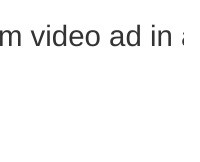

import Tabs from '@theme/Tabs'; import TabItem from '@theme/TabItem';

# Instream video ad in a Protected Audience multi-seller auction

**_ work-in-progress _**

<Tabs>
<TabItem value="overview" label="Overview" default>

## Overview

### Description

_placeholder_

### Privacy Sandbox APIs

- [Protected Audience API](https://developers.google.com/privacy-sandbox/relevance/protected-audience)

### Related parties

- Publisher (News site)
- Ad Server / Top-Level seller (ad-server)
- Component Seller A (ssp-a)
- Component Seller B (ssp-b)
- Advertiser (Shoping site)
- Demand Side Platform A (dsp-a)
- Demand Side Platform B (dsp-b)

- Advertiser 2 (Travel site)

</TabItem>
<TabItem value="scope" label="Scope">

## Scope

### Goals

_placeholder_

### Assumptions

_placeholder_

### Key Exclusions

_placeholder_

### System Design

_placeholder_

#### User Journey #1

<!--

-->

</TabItem>
<TabItem value="demo" label="Demo">

## Demo

### Prerequisites

- Chrome > v120 (Open chrome://version to look up your current version)
- Enable Privacy Sandbox APIs (Open chrome://settings/privacySandbox to enable this setting)
- Clear your browsing history before you run one of the demo scenario below (Open chrome://settings/clearBrowserData to delete your browsing history)

### User Journey

_placeholder_

### Implementation details

#### How do we xxx ?

_placeholder_

#### How do we xxx ?

_placeholder_

### Related API documentation

- [Sequential auction setup](https://developers.google.com/privacy-sandbox/relevance/protected-audience-api/sequential-auction-setup)
- [Protected Audience API](https://developers.google.com/privacy-sandbox/relevance/protected-audience)
- [Protected Audience API: developers guide](https://developers.google.com/privacy-sandbox/relevance/protected-audience-api)

</TabItem>
</Tabs>
