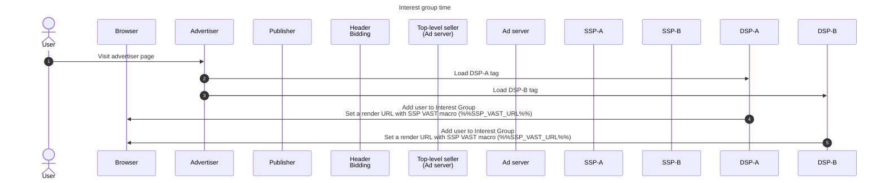
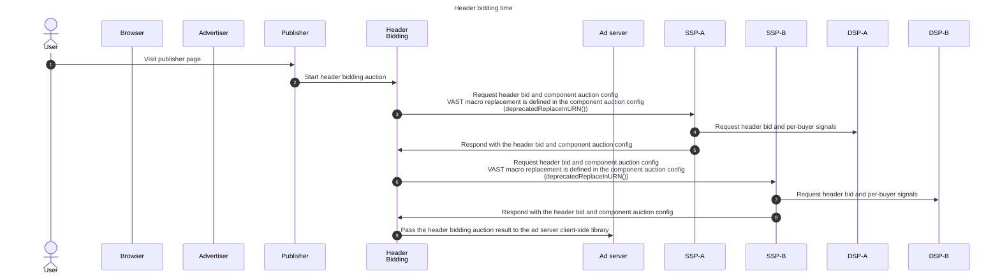
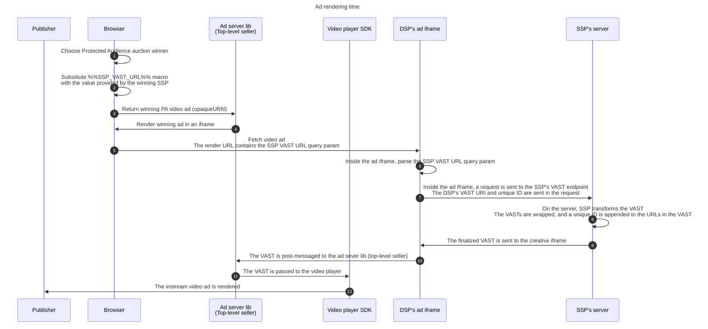

import Tabs from '@theme/Tabs'; import TabItem from '@theme/TabItem';

# Instream video ad in a Protected Audience sequential auction setup

:::info

This demo is a proof of concept created for illustrative purposes only, and should not be taken as a recommendation or standardized implementation of
this use case.

:::

<Tabs>
<TabItem value="overview" label="Overview" default>

☝️ Use the tabs to navigate to other sections in this document

If you have any questions and comments for this instream video ad demo, use
[the instream video ad demo post](https://github.com/privacysandbox/privacy-sandbox-demos/discussions/254) in the Discussions tab.

## Overview

### Description

This demo shows one of the ways that VAST XMLs can be handled in a Protected Audience
[sequential auction setup](https://developers.google.com/privacy-sandbox/relevance/protected-audience-api/sequential-auction-setup) when the ad is
rendered in an iframe. In this demo, a pre-roll video ad has been implemented, but the same mechanism can be used to render other video ad types that
use the VAST XML standard, such as mid-roll and post-roll instream video ads.

The following features have been implemented:

- The SSP's VAST XML wraps around the DSP's VAST URI
- A unique ID is appended to the reporting URLs in the VAST XML
  - This unique ID is also propagated to the header bidding auction, ad server auction, and every Protected Audience auction worklet
- The finalized VAST is messaged out of the creative iframe to the video player

Note that this mechanism does not work with [Fenced Frames](https://developers.google.com/privacy-sandbox/relevance/fenced-frame), but Protected
Audience allows iframe usage
[until at least 2026](https://developers.google.com/privacy-sandbox/relevance/protected-audience-api/feature-status#fenced_frames).

### Quickstart

#### Prerequisites

- Chrome > v120 (Open chrome://version to look up your current version)
- Enable Privacy Sandbox APIs (Open `chrome://settings/privacySandbox` to enable this setting)

We are in the process of enrolling the new endpoints. Until then, visit `chrome://flags/#privacy-sandbox-enrollment-overrides` and add the following
origins to the
[Privacy Sandbox Overrides textbox](https://github.com/privacysandbox/attestation/blob/main/how-to-enroll.md#5-do-i-need-to-enroll-to-test-against-local-development-environments).

Origins for the enrollment override:

```text
https://privacy-sandbox-demos-dsp-a.dev,
https://privacy-sandbox-demos-dsp-b.dev,
https://privacy-sandbox-demos-ssp-a.dev,
https://privacy-sandbox-demos-ssp-b.dev,
https://privacy-sandbox-demos-ad-server.dev
```

#### Demo

The query param that enables the video ad demo on the advertiser and publisher sites is `?auctionType=multi`.

1. Navigate to advertiser site:
   [https://privacy-sandbox-demos-shop.dev/items/1f45e?auctionType=multi](https://privacy-sandbox-demos-shop.dev/items/1f45e?auctionType=multi)
1. Navigate to publisher site: [https://privacy-sandbox-demos-news.dev/?auctionType=multi](https://privacy-sandbox-demos-news.dev/?auctionType=multi)
1. Click ‘Play video’ when the button is ready

### Explanation

The finalized VAST XML is messaged out of the iframe to the publisher page, and that VAST is passed to the video player. The finalized VAST contains
the DSP+SSP wrapped VAST and a unique ID appended to URLs in VAST. The server-side VAST transformation is conducted by the SSP.

When the DSP adds the render URL, a query param macro is added that specifies the SSP's VAST serving endpoint (i.e.
`https://DSP-A.com/ad.html?sspVastUrl=%%SSP_VAST_URL%%`). When the SSP constrcuts the component auction config, the macro replacement is defined
(`deprecatedReplaceInURN: { '%%SSP_VAST_URL%%': 'https://SSP-A.com/vast' }`). When the ad is rendered, the macro is replaced by the value defined by
the seller in the component auction config.

When the ad is rendered, the creative code parses the SSP's VAST URL from the query params, and makes a request to that endpoint, with the DSP VAST
URI and the unique ID set as query params. On the server, the SSP wraps its own VAST XML around the DSP's VAST URI, and appends the unique ID to the
URLs in the VAST. The SSP's server responds to the creative's request with the finalized VAST. The finalized VAST is post-messaged from the iframe to
the publisher page, and that VAST is passed to the video player.

### Macro substitution for component sellers

The `deprecatedReplaceInURN()` function allows macros to be replaced in the winning ad's render URL.

Example:

```js
deprecatedReplaceInURN('%%SOME_MACRO%%', 'some-value')
```

- [Description](https://github.com/WICG/turtledove/issues/286#issuecomment-1108831413)
- [Support until 2026](https://github.com/WICG/turtledove/issues/286#issuecomment-1682842636)
- [Component seller support in M123](https://github.com/WICG/turtledove/issues/286#issuecomment-1682842636)

This mechanism can be used to pass information into the creative iframe, like the winning SSP's VAST URL. However, since this feature will become
available M123, this demo adds a render URL for each SSP, then filter the render URLs when generating bids, as a temporary mechanism for passing the
SSP VAST URL to the creative.

### Privacy Sandbox APIs involved

- [Protected Audience API](https://developers.google.com/privacy-sandbox/relevance/protected-audience)

### Related parties

- Publisher (News site)
- Advertiser (Shoping site)
- Ad Server / Top-Level seller (Ad server)
- Component Seller A (SSP-A)
- Component Seller B (SSP-B)
- Demand Side Platform A (DSP-A)
- Demand Side Platform B (DSP-B)

</TabItem>
<TabItem value="design" label="Design">

## Design

### Goals

- Render a pre-roll video ad that plays before the publisher's video plays
- The VAST of the pre-roll ad contains the SSP's VAST and DSP's VAST
- A unique ID is appened to the reporting URLs in the VAST

### Assumptions

This documentation and demo assume that the reader is familiar with the
[sequential auction setup](https://developers.google.com/privacy-sandbox/relevance/protected-audience-api/sequential-auction-setup) that combines
contextual auctions (header bidding and ad server auctions) and a Protected Audience auction.

### System Design

#### Summary

- Buyer adds the render URL of the video creative in the interest group
  - The render URL includes a macro for the VAST location of the winning component SSP (`%%SSP_VAST_URL%%`)
- Seller adds the macro replacement configuration in the component auction config
  - Uses `deprecatedReplaceInURN()` function which will become
    [available for component sellers in M123](https://github.com/WICG/turtledove/issues/286#issuecomment-1910551260)
  - Until M123, as a temporary mechanism, in this demo, the buyer adds a render URL for each SSP in the interest group
- On an auction win, the browser replaces the `%%SSP_VAST_URL%%` macro with the SSP's VAST reporting endpoint
- When the ad is rendered in an iframe, the creative code parses SSP's VAST URL, and makes a request with the DSP's VAST URI and the unique ID
- On the server, the SSP wraps its own VAST around the DSP's VAST URI and appends the unique ID to the URLs in the VAST
- The creative receives the response from the SSP's server that contains the finalized VAST XML, and post-messages it to the ad server library code on
  the publisher's page
- The ad server lib passes the VAST XML to the video player

#### Interest group time

This is the time period when the DSP configures the interest group, and sets the SSP VAST macro in the render URL.



[Full-sized diagram](./img/instream-video-ad-ig-time.png)

#### Header bidding time

This is the time period when the seller defines the macro substitution in the component auction config



[Full-sized diagram](./img/instream-video-ad-hb-time.png)

### Ad rendering time

This is the time period when the VAST is transformed and passed to the creative.

We will skip the ad server auction and the Protected Audience auction since they are irrelevant to the video ad rendering flow. To learn more about
the rest of the auctions, see the
[sequential auctions setup](https://developers.google.com/privacy-sandbox/relevance/protected-audience-api/sequential-auction-setup) article.

The following sequence begins after a video ad winner has been chosen from the Protected Audience auction. Also, only the winning DSP and SSP are
shown in the diagram, since other multi-seller auction DSPs/SSPs are no longer part of the auction.



[Full-sized diagram](.//img/instream-video-ad-render-time.png)

## Alternative approach

In another approach, the SSP can provide the render URL. The DSP sets the following render URL in the IG:

```js
const interestGroup = {
  // ...
  ads: [
    {
      renderUrl: 'https://privacy-sandbox-demos-ssp-a.dev/video-ad.html?dspVastUri=https://privacy-sandbox-demos-dsp-a.dev/preroll.xml',
      metadata: {
        seller: 'ssp-a'
      }
    },
    {
      renderUrl: 'https://privacy-sandbox-demos-ssp-b.dev/video-ad.html?dspVastUri=https://privacy-sandbox-demos-dsp-a.dev/preroll.xml',
      metadata: {
        seller: 'ssp-b'
      }
    },
  ]
}
```

- The render URL points to the SSP’s video ad serving endpoint, and the DSP’s VAST URI is added as query params.
  - The SSP is now responsible for serving the actual ad that is rendered inside the iframe, and it contains the SSP VAST XML that wraps the DSP VAST
    URI.
  - To support multiple SSPs, the buyer adds a render URL for each SSP. During the bid generation time, the buyer can filter the ads object and return
    a render URL for the matching seller.
- When that ad wins the auction, the browser makes a request to the render URL which is the SSP's ad serving endpoint `/video-ad.html` with the DSP's
  VAST URI set in the query params
- SSP’s HTML document is rendered in the ad iframe and parses the DSP's VAST URI from the query params
- The code inside SSP's video-ad.html wraps the DSP's VAST URI with its own VAST
- The finalized VAST XML is post-messaged out of the creative frame to the video player

</TabItem>
<TabItem value="implementation" label="Implementation">

### Implementation details

#### Buyer adds the user to an interest group

```js
const interestGroup = {
  // ...
  ads: [{
    renderUrl: 'https://privacy-sandbox-demos-dsp-a.dev/html/video-ad-creative.html?sspVastUrl=%%SSP_VAST_URL%%'
  }]
}
```

During render time, the browser replaces the `%%SSP_VAST_URL%%` macro defined in the render URL with the value that the winning SSP provides in the
component auction config.

##### Temporary mechanism until `deprecatedReplaceInURN()` becomes availble for component sellers

Since the component seller support for `deprecatedReplaceInURN()` won't be available until M123, we are using a temporary mechanism to pass the SSP's
VAST URL to the creative iframe.

In the interest group config, the buyer adds the render URL for each seller, and also note the seller in metadata.

```js
const interestGroup = {
  // ...
  ads: [
    {
      renderUrl: 'https://privacy-sandbox-demos-dsp-a.dev/html/video-ad-creative.html?sspVastUrl=https://privacy-sandbox-demos-ssp-a.dev/vast',
      metadata: {
        adType: 'video',
        seller: 'https://privacy-sandbox-demos-ssp-a.dev/'
      }
    },
    {
      renderUrl: 'https://privacy-sandbox-demos-dsp-a.dev/html/video-ad-creative.html?sspVastUrl=https://privacy-sandbox-demos-ssp-b.dev/vast',
      metadata: {
        adType: 'video',
        seller: 'https://privacy-sandbox-demos-ssp-b.dev/'
      }
    },
  ]
}
```

- Code: [Interest group config generation](https://github.com/privacysandbox/privacy-sandbox-demos/blob/main/services/dsp-a/src/index.ts#L187)

Then during bid generation the buyer filters out the render URLs that are not for the component auction seller:

```js
function generateBid(browserSignals) {
  const {seller} = browserSignals;

  return {
    render: ads.find(ad => ad.metadata.seller.includes(seller))
  }
}
```

- Code: [Bid generation](https://github.com/privacysandbox/privacy-sandbox-demos/blob/main/services/dsp-a/src/public/js/bidding-logic.js#L33)

This is a temporary mechanism that will be replaced by `deprecatedReplaceInURN()` in M123.

#### Seller defines the macro substitution in the component auction config

In a sequential auction setup, the header bidding is executed first, and the sellers have the opportunity to respond to the header bidding request
with the component auction config if they want to partcipate in the subsequent Protected Audience auction.

In the component auction config, the SSP defines the macro substitution:

```js
const componentAuctionConfig = {
  // ...
  deprecatedReplaceInURN: {
    '%%SSP_VAST_URI%%': 'https://privacy-sandbox-demos-ssp-a.dev/vast',
  }
}
```

- Code: [SSP component auction config](https://github.com/privacysandbox/privacy-sandbox-demos/blob/main/services/ssp-a/src/index.js#L142)

#### From the creative iframe, a request is sent to the SSP's VAST endpoint

When the ad is rendered in an iframe, the creative code parses the query params, and sends a request to the SSP's VAST URL.

```js
function parseSspVastUrl() {
  const url = new URL(window.location.href);
  return url.searchParams.get('sspVastUrl');
}

async function fetchVastFromSsp(sspVastUrl, auctionId) {
  const requestUrl = new URL(sspVastUrl);
  requestUrl.searchParams.append(AUCTION_ID_QUERY_PARAM, auctionId);
  requestUrl.searchParams.append(DSP_VAST_URI_QUERY_PARAM, encodeURIComponent(dspVastUri));

  const response = await fetch(requestUrl);
  const vastXml = await response.text();

  return vastXml;
}
```

- Code:
  [Sending a request to the SSP's VAST endpoint](https://github.com/privacysandbox/privacy-sandbox-demos/blob/main/services/dsp-a/src/public/js/video-ad-creative.js#L19)

#### SSP's server transforms the VAST

On the server, the SSP wraps its own VAST around the DSP's VAST URI and appends the unique ID to the URLs in the VAST

```js
function transformVast(sspVast, dspVastUri, auctionId) {
  const vastWithDspUri = sspVast.replace('%%DSP_VAST_URI%%', decodeURIComponent(dspVastUri));
  const vastWithAuctionId = vastWithDspUri.replaceAll('%%AUCTION_ID%%', auctionId);

  return vastWithAuctionId;
}

app.get('/vast', async (req, res) => {
  const {dspVastUri, auctionId} = req.query;

  const sspVast = await readFile(path.resolve(__dirname + '/public/vast/preroll.xml'), 'utf8');
  const finalizedVast = transformVast(sspVast, dspVastUri, auctionId);

  res.type('application/xml');
  res.send(finalizedVast);
});
```

- Code: [SSP server-side transformation](https://github.com/privacysandbox/privacy-sandbox-demos/blob/main/services/ssp-a/src/index.js#L184)
- Code: [SSP's VAST wrapper](https://github.com/privacysandbox/privacy-sandbox-demos/blob/main/services/ssp-a/src/public/vast/preroll.xml)

#### Finalized VAST is messaged to the top frame

Once the creative receives the finalized VAST from the SSP, it is post-messaged out of the frame to the top-level frame:

```js
function sendVastToParentFrame(vastText) {
  const {0: containerFrame} = window.top.frames;
  containerFrame.top.postMessage(vastText, '*');
}
```

- Code:
  [Post-message from the creative iframe](https://github.com/privacysandbox/privacy-sandbox-demos/blob/main/services/dsp-a/src/public/js/video-ad-creative.js#L37)

#### VAST message is received by the top frame and passed to the video player

The ad server client-side library sets up an event-listener for a message from the frame, and passes the received VAST to the video player.

```js
window.addEventListener('message', ({ data }) => {{
  setUpVideoPlayer(data);
});
```

Code:
[Ad server lib code (top-level seller)](https://github.com/privacysandbox/privacy-sandbox-demos/blob/main/services/ad-server/src/public/js/ad-server-lib.js#L105)

### Related API documentation

- [Sequential auction setup](https://developers.google.com/privacy-sandbox/relevance/protected-audience-api/sequential-auction-setup)
- [Protected Audience API](https://developers.google.com/privacy-sandbox/relevance/protected-audience)
- [Protected Audience API: developers guide](https://developers.google.com/privacy-sandbox/relevance/protected-audience-api)

</TabItem>
</Tabs>
