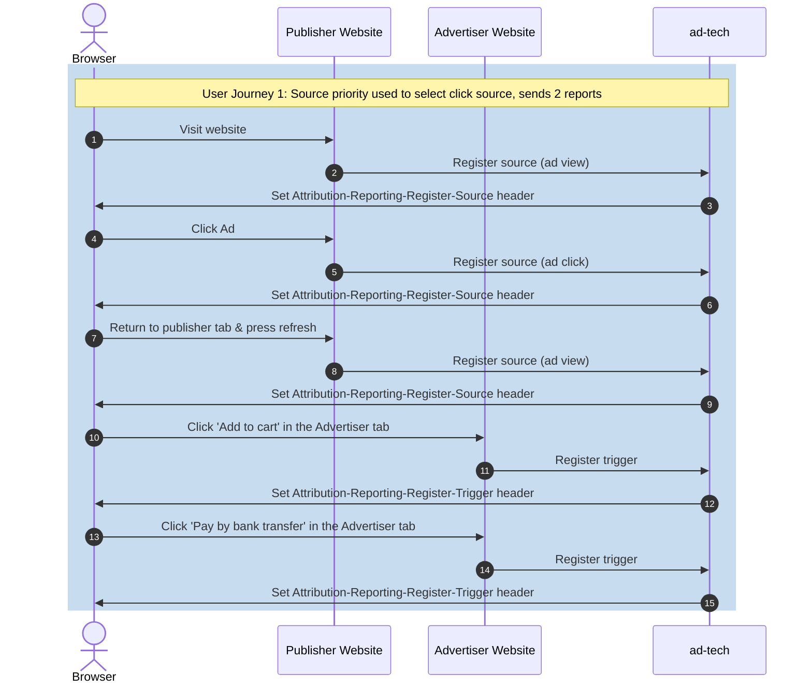
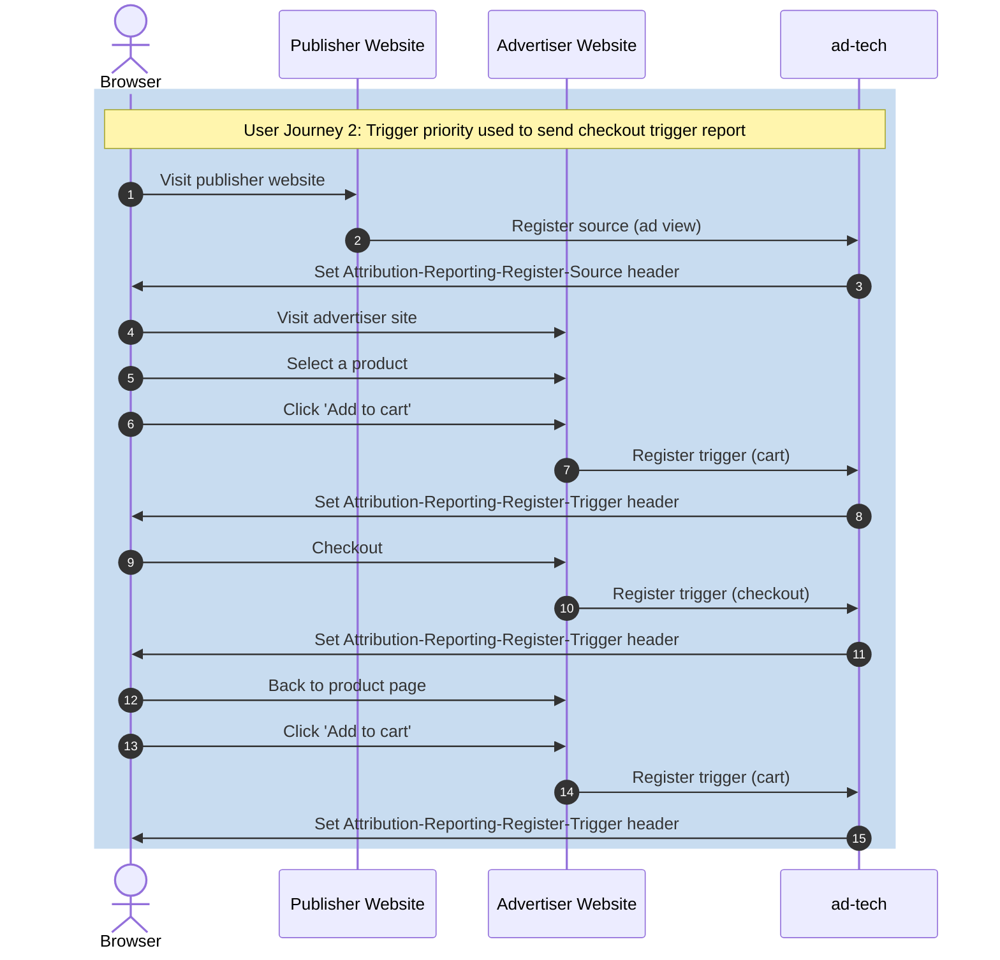
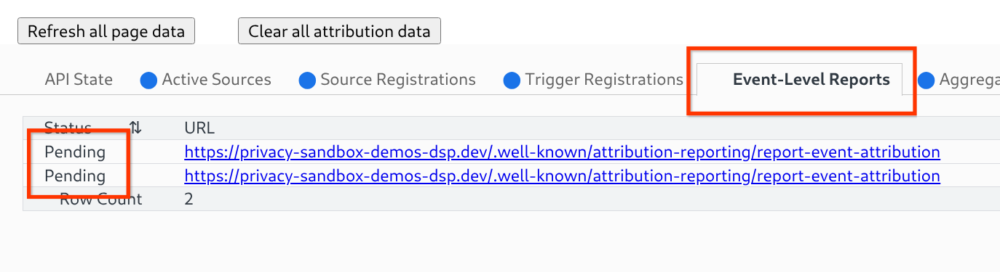
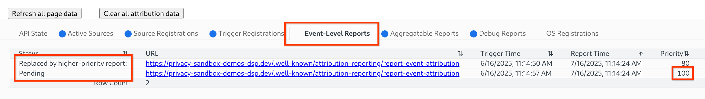

import Tabs from '@theme/Tabs'; import TabItem from '@theme/TabItem';

<Tabs>
<TabItem value="overview" label="Overview" default>
# Overview
## Description

Attribution Reporting API event-level reports help measure ad effectiveness while protecting user privacy. The basic features of the reports are
explored in this demo:
[Event-level reports for single touch attribution](https://privacy-sandbox-demos.dev/docs/demos/single-touch-event-level-report/). Event level reports
limit the number of reports which can be sent. By default, there is a limit of 1 report for view (event) sources, and 3 reports for click (navigation)
sources. This demo will focus on using the source and trigger priority features to capture the most useful conversion insights.

We will demonstrate:

- Default limits on report counts for both click (navigation) and view (event) sources.
- The priority feature for both source and trigger events.

Although we’re demoing the default limits here, the priority fields can also be used to stay under a customized limit configured using
[max_event_level_reports](https://github.com/WICG/attribution-reporting-api/blob/main/EVENT.md#optional-varying-frequency-and-number-of-reports).

## Privacy Sandbox APIs and related documentation

- [Attribution Reporting API - Privacy Sandbox Developers](https://privacysandbox.google.com/private-advertising/attribution-reporting)
- [Attribution Reporting API developer guide - Privacy Sandbox Developers](https://privacysandbox.google.com/private-advertising/attribution-reporting/dev-guide)
- [Prioritize specific clicks, views, or conversions - Privacy Sandbox Developers](https://privacysandbox.google.com/private-advertising/attribution-reporting/change-attribution-logic)
- [Trigger attribution algorithm](https://github.com/WICG/attribution-reporting-api/blob/main/EVENT.md#trigger-attribution-algorithm)

## Related parties

- Publisher: Owns ad slots
- Advertiser: Owns product pages & store where conversions are tracked
- Demand Side Platform (DSP): Implements on-page JavaScript and ARA API, receives cross-site reports

</TabItem>

<TabItem value="design" label="Design">
# Design
## Goals

From a business perspective, this demo shows how to optimize the limited number of available reports to capture the most valuable conversion data,
ensuring advertisers get the most important insights while adhering to privacy constraints.

From a technical perspective, we demonstrate how the DSP can use the priority field on both source and trigger registrations to select the highest
priority source and trigger for reports. This can be used to work within the default limits on report count for both click and view sources.

## Key Exclusions

- This demo will operate with the default configuration of the ARA: a maximum of one event-level report for view sources and up to three reports for
  click sources. This demo doesn’t leverage flexible configurations where ad-techs may customize these rate limits.

## System Design

### User Journey 1: Source priority used to select click source, sends 2 attribution reports

In this journey, we ask the user to:

- Open the publisher site
- Click the ad
- Return to the publisher site tab & press refresh
- Return to the advertiser tab, click ‘add to cart’, then ‘pay by bank transfer’
- Inspect the pending reports

The interactions with the publisher site registers 3 sources. The latest one is a view, but we set the click source to a higher priority. Since the
higher priority click source will be joined to the triggers, we can send up to three reports. In fact, we sent two (both the ‘add to cart’, then
‘checkout’ reports).

This demonstrates two things:

- We send multiple reports to show that by default, click sources can send up to 3 reports. In user journey 2 we’ll show that by default, view sources
  can only send 1 report.
- The priority field can be used to select the click source, even though a view source was registered more recently.



[Full-sized diagram](./img/prioritizing-sources-and-triggers-in-attribution-reporting-journey-1-flow.png)

### User Journey 2: Trigger priority used to send checkout attribution report

In this journey, we ask the user to:

- Open the publisher site
- Open the advertiser site
- Select a product, click “Add to cart” & checkout by selecting “pay by bank transfer”.
- Press the browser back button twice.
- Press “Add to cart” again.
- Inspect the pending reports

The interaction with the publisher site registers a single view source which will only allow a single report to be sent. The interactions with the
advertiser site registers 3 triggers. Even though the most recent interaction was clicking "Add to cart", a report will be sent for the checkout
trigger due to its higher priority.

This demonstrates two things:

- View sources can only send a single report.
- The priority field can be used to select the checkout trigger, even though an ‘Add to cart’ trigger was registered more recently.



[Full-sized diagram](./img/prioritizing-sources-and-triggers-in-attribution-reporting-journey-2-flow.png)

</TabItem>

<TabItem value="demo" label="Demo">
# Demo
## Prerequisites
- Latest stable version of Chrome (Open chrome://version to check your current version)
- Enable Privacy Sandbox APIs (Open chrome://settings/adPrivacy to enable Ad measurement)
- Clear your browsing history before you run one of the demo scenarios below (Open chrome://settings/clearBrowserData to delete your browsing history)

## Journey #1 (source priority used to select click source, sends 2 attribution reports)

### Aim:

In this journey, we’ll show that:

- With default settings (i.e without
  [max_event_level_reports](https://github.com/WICG/attribution-reporting-api/blob/main/EVENT.md#optional-varying-frequency-and-number-of-reports)),
  click sources can send multiple reports. (default max 3).
- Applying the priority field to a source registration can be used to prefer a click source over a view source.

### Steps

- Clear attribution data in chrome://attribution-internals/
- [Open the news site](https://privacy-sandbox-demos-news.dev/mmt-single-touch-attribution-html).
- Click the ad.
- Return to the news site tab & press refresh.
- In the shop tab, click ‘add to cart’.
- Checkout by selecting ‘bank transfer’.
- In chrome://attribution-internals/ go to the Event-Level Reports tab. Note there are two reports with pending status.



### Explanation

The interactions with the news site registers 3 sources. The latest one is a view, but we set the click source to a higher priority. Since the higher
priority click source will be joined to the triggers, we can send up to three reports. In fact, we sent two (both the ‘add to cart’, then checkout
reports).

## Journey #2 (trigger priority used to send checkout attribution report)

### Aim

In this journey, we’ll show that:

- With default settings (i.e without
  [max_event_level_reports](https://github.com/WICG/attribution-reporting-api/blob/main/EVENT.md#optional-varying-frequency-and-number-of-reports)),
  view sources can send a maximum of 1 report.
- Applying the priority field to a trigger registration can be used to ensure the sending of a more important trigger.

### Steps

- Clear attribution data in chrome://attribution-internals/
- [Open the news site](https://privacy-sandbox-demos-news.dev/mmt-single-touch-attribution-html).
- Click “Navigate to the shop page without ad click”.
- Select a product.
- Click “Add to cart”.
- Checkout by selecting ‘bank transfer’.
- Press the browser back button twice.
- Click “Add to cart” again.
- In chrome://attribution-internals/ go to the Event-Level Reports tab. Note there are two reports, but only one is pending. Note the pending report
  has a priority of 100 (this was the checkout report).



### Explanation

The interaction with the news site registers a single view source which will only allow a single report to be sent. The interactions with the
advertiser site registers 3 triggers. Even though the most recent interaction was clicking "Add to cart", a report will be sent for the checkout
trigger due to its higher priority.

## Implementation details

### Adding priority to a source registration

When an ad-tech responds to a source registration, it sends an Attribution-Reporting-Register-Source header, which can contain a priority field:

```js
res.set(
  "Attribution-Reporting-Register-Source",
  JSON.stringify({
    destination: "https://privacy-sandbox-demos-shop.dev",
    source_event_id: "1234",
    expiry: "604800",
    priority: "100",
    debug_key: "1234",
    debug_reporting: true,
  })
);
```

In our codebase, source priority is set in
[attribution-reporting-helper.ts](https://github.com/privacysandbox/privacy-sandbox-demos/blob/126a7d626c39e9b5c204bc4748819a19ce1f56fd/services/ad-tech/src/lib/attribution-reporting-helper.ts#L129-L150):

```js
  const {advertiser, itemId} = requestQuery;
  const destination = `https://${advertiser}:${EXTERNAL_PORT}`;
  const source_event_id = sourceEventId();
  const debug_key = debugKey();
  const priority = getPriority(sourceType);
  return {
    destination,
    source_event_id,
    debug_key,
    priority,
    debug_reporting: true, // Enable verbose debug reports.
    aggregation_keys: {
      quantity: sourceKeyPiece({
        type: sourceType,
        advertiser: ADVERTISER[advertiser],
        publisher: PUBLISHER[NEWS_HOST!],
        id: Number(`0x${itemId}`),
        dimension: DIMENSION['quantity'],
      }),
      gross: sourceKeyPiece({
        type: sourceType,
        advertiser: ADVERTISER[advertiser],
        publisher: PUBLISHER[NEWS_HOST!],
        id: Number(`0x${itemId}`),
        dimension: DIMENSION['gross'],
      }),
    },
  };
};
```

### Adding priority to a trigger registration

When an ad-tech responds to a trigger registration, it sends an Attribution-Reporting-Register-Trigger header, which can contain a priority field:

```js
res.set(
  "Attribution-Reporting-Register-Trigger",
JSON.stringify({
  event_trigger_data: [{
    trigger_data: "6",
    priority: "80",
  }],
  debug_reporting: true,
  debug_key: "1115698977"
});
);
```

In our codebase, trigger priority is set in
[arapi.ts](https://github.com/privacysandbox/privacy-sandbox-demos/blob/126a7d626c39e9b5c204bc4748819a19ce1f56fd/services/ad-tech/src/lib/arapi.ts#L246-L254)
</TabItem> </Tabs>
