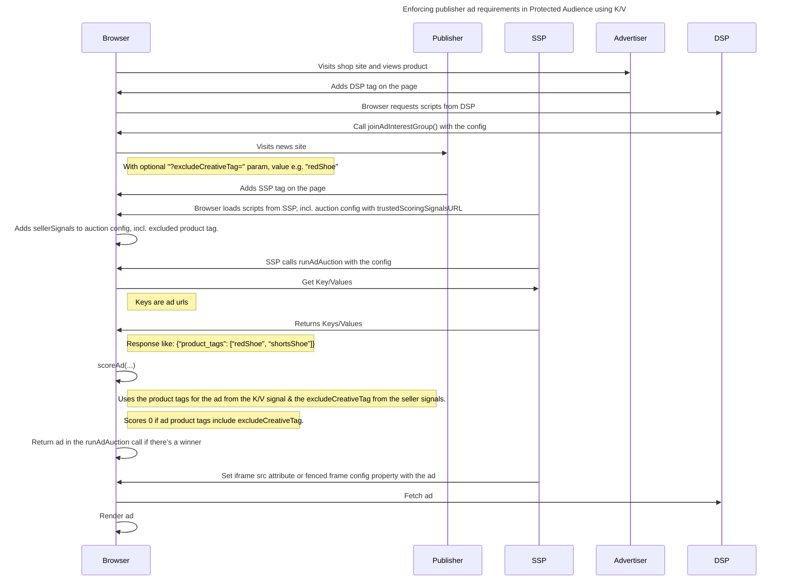

import Tabs from '@theme/Tabs'; import TabItem from '@theme/TabItem';

# Enforcing publisher ad requirements in Protected Audience using K/V

<Tabs>
<TabItem value="overview" label="Overview" default>

## Overview

### Description

Often publishers have requirements on the types of ads they’re willing to display for example:

- Excluding adult only ads.
- Including ads only for relevant product types SSPs can score ads based on quality metrics. During the Protected Audience auction, the SSP can
  implement this behavior either by ranking ads based on DSP supplied metadata, or sending ad URLs to the SSP’s Key/Value (K/V) server to retrieve
  ranking related metadata. This demo will focus on the K/V use case.

### Privacy Sandbox APIs

- [Protected Audience API](https://developers.google.com/privacy-sandbox/private-advertising/protected-audience)
- [Key/Value Service](https://developers.google.com/privacy-sandbox/private-advertising/protected-audience#key-value-service-detail)

### Related parties

- Publisher
- SSP
- Advertiser
- DSP

</TabItem>
<TabItem value="scope" label="Scope">

## Scope

### Goals

In this demo, we assume a publisher would like to exclude ads with certain product types. We’ll demonstrate a publisher page calling an SSP to perform
a Protected Audience auction, supplying product tags to exclude (e.g. “redShoe”). The SSP will exclude ads by calling their backend K/V server with
the ad urls, and receiving ad metadata as JSON (e.g. `{“product_tags”: [“redShoe”, “shortsShoe”]}`) which will be matched to the product tag to
exclude.

### Assumptions

- The SSP has a database relating ad URLs to ad metadata & this information is available in the K/V service.
- We assume the SSP has deployed a Key/Value service (BYOS or TEE).

### Key Exclusions

- Dynamic updates of K/V pairs coming from the SSP backend (we will use static data for this demo).
- Excluding ads based on DSP supplied meta-data.

### System Design

Using Protected Audience API, the user visits a shopping site, and gets added to an interest group. Later the same user visits a news site. Before the
auction, we establish tags used to exclude certain ads;

- In a real world use case, the publisher would set ad exclusion tags in an SSPs admin UI.
- In our demo, the user presses one of several buttons to set an exclusion tag through a url parameter.

The ad auction will receive key / value meta-data from the SSP, indicating the product tags of each ad. If they match the excluded product tag, the ad
will be excluded from the auction, and the user will see no ad.

#### User Journey

[Full-sized diagram](./img/publisher-ad-quality-req-flow.png)

</TabItem>
<TabItem value="demo" label="Demo">

## Demo

### Prerequisites

- Chrome > v128 (Open chrome://version to look up your current version)
- Enable Privacy Sandbox Protected Audience API (Open chrome://settings/adPrivacy and enable _Site-suggested ads_)

### User Journey

1. [Navigate to shop site](https://privacy-sandbox-demos-shop.dev/) (advertiser)
2. Click on a “shoe” product item on the shop site. The shop (advertiser) would assume the user is interested in this type of shoe, so they would
   leverage Protected Audience API and ask the browser to join an ad interest group for this product.
3. [Navigate to the news site](https://privacy-sandbox-demos-news.dev/publisher-ad-quality-req) (publisher)
4. Observe the ad served on the news site is for the shoe product you recently browsed.
5. Click on a button which matches your selected shoe:
   - Hide Red Shoes
   - Hide Blue Shoes
   - Hide Brown Shoes
   - Hide Sports Shoes

The page will refresh automatically and the shoe ad won’t display, this is because;

- The button added the excludeCreativeTag parameter to the page url.
- The auction requested the K/V value for the ad url from the SSP.
- The SSP returned a list of product tags for this ad including product tag you wanted to exclude.
- In the auction scoreAd function, the SSP marked this ad as having a score of 0 as it has a product tag which matches the one you wished to exclude
  from the auction.

### Implementation details

#### How is the user added to an Interest Group based on his browsing behavior ? (see step #2 of User Journey)

To add the user to an Interest Group, we reuse the implementation from the Retargeting / Remarketing use case, which is explained in
_[Retargeting / Remarketing](https://privacy-sandbox-demos.dev/docs/demos/retargeting-remarketing) > Demo > How is the user added to an Interest Group
based on his browsing behavior?_ Adding the browser to an interest group for a particular shoe allows us to render a winning ad in the shop site, or
hide that ad based on the excludeCreativeTag page parameter.

#### How do we serve an ad relevant to the user’s interest, or not if it was part of an excluded product tag? (see step #4 - #5 of User Journey)

It’s in this part of the use case differs from the Retargeting / Remarketing & it uses a different news page.

##### News page & SSP tag

The publisher-ad-quality-req news page
[(code link)](https://github.com/privacysandbox/privacy-sandbox-demos/blob/1f9c6448072d922aa191f5ea2182ec92ead2fada/services/news/src/views/publisher-ad-quality-req.ejs)
reads the excludeCreativeTag and includes it in the sellerSignalExcludeCreativeTag as part of its adUnits list
[(code link)](https://github.com/privacysandbox/privacy-sandbox-demos/blob/1f9c6448072d922aa191f5ea2182ec92ead2fada/services/news/src/views/publisher-ad-quality-req.ejs#L39).
The news page also includes the SSP tag
[(code link)](https://github.com/privacysandbox/privacy-sandbox-demos/blob/1f9c6448072d922aa191f5ea2182ec92ead2fada/services/ad-tech/src/public/js/ssp/ssp-tag.js)
this will;

- Create the auction iframe
  [(code link)](https://github.com/privacysandbox/privacy-sandbox-demos/blob/21e23fa81783a3e7d1fac9da3e77904e893a1aee/services/ad-tech/src/public/js/ssp/ssp-tag.js#L166-L175).
- Load run-sequential-ad-auction.html into it
  [(code link)](https://github.com/privacysandbox/privacy-sandbox-demos/blob/21e23fa81783a3e7d1fac9da3e77904e893a1aee/services/ad-tech/src/public/js/ssp/ssp-tag.js#L45).
- Send the adUnit (which contains the sellerSignals) to into the iframe using `iframeEl.contentWindow.postMessage`
  [(code link)](https://github.com/privacysandbox/privacy-sandbox-demos/blob/21e23fa81783a3e7d1fac9da3e77904e893a1aee/services/ad-tech/src/public/js/ssp/ssp-tag.js#L186).

##### Client side auction code

The html in the iframe (run-sequential-ad-auction.html) loads run-sequential-ad-auction.js
[(code link)](https://github.com/privacysandbox/privacy-sandbox-demos/blob/21e23fa81783a3e7d1fac9da3e77904e893a1aee/services/ad-tech/src/views/ssp/run-sequential-ad-auction.ejs#L43).
The run-sequential-ad-auction.js script
[(code link)](https://github.com/privacysandbox/privacy-sandbox-demos/blob/21e23fa81783a3e7d1fac9da3e77904e893a1aee/services/ad-tech/src/public/js/ssp/run-sequential-ad-auction.js)
prepares the auction config for this use case by;

- **Passing sellerSignalExcludeCreativeTag param**: getBidRequestUrlsWithContext
  [(code link)](https://github.com/privacysandbox/privacy-sandbox-demos/blob/21e23fa81783a3e7d1fac9da3e77904e893a1aee/services/ad-tech/src/public/js/ssp/run-sequential-ad-auction.js#L61-L76)
  creates URLs which contain the sellerSignalExcludeCreativeTag & call remote path /ssp/contextual-bid/ (see below). The response contains auction
  config, including the sellerSignalExcludeCreativeTag. These are later fed into executeSequentialAuction.
- **Getting trusted scoring signals:**: Creates URLs
  [(code link)](https://github.com/privacysandbox/privacy-sandbox-demos/blob/21e23fa81783a3e7d1fac9da3e77904e893a1aee/services/ad-tech/src/public/js/ssp/run-sequential-ad-auction.js#L119-L123)
  to call the remote path /ssp/realtime-signals/scoring-signal.json, (see below). These return JSON structured tags for each ad.

##### Server side auction code

The file seller-contextual-bidder-router.ts handles the path /ssp/contextual-bid/ & returns sellerSignalExcludeCreativeTag in the seller signals for
the auction config
[(code link)](https://github.com/privacysandbox/privacy-sandbox-demos/blob/21e23fa81783a3e7d1fac9da3e77904e893a1aee/services/ad-tech/src/routes/ssp/seller-contextual-bidder-router.ts#L46-L58).

The file scoring-signals-router.ts handles the path /ssp/realtime-signals/scoring-signal.json & returns ad tags from a predefined list
[(code link)](https://github.com/privacysandbox/privacy-sandbox-demos/blob/21e23fa81783a3e7d1fac9da3e77904e893a1aee/services/ad-tech/src/routes/ssp/scoring-signals-router.ts#L60-L72).

##### Making a decision on a creative

The auction-decision-logic.js script contains the scoreAd function. Its isCreativeBlocked function
[(code link)](https://github.com/privacysandbox/privacy-sandbox-demos/blob/21e23fa81783a3e7d1fac9da3e77904e893a1aee/services/ad-tech/src/public/js/ssp/default/auction-decision-logic.js#L82)
uses trusted scoring signals for each ad & sellerSignalExcludeCreativeTag to score matched ads as 0.

### Related API documentation

- [Protected Audience Key/Value Server APIs Explainer](https://github.com/WICG/turtledove/blob/main/FLEDGE_Key_Value_Server_API.md)
- [FLEDGE Key/Value service trust model](https://github.com/privacysandbox/protected-auction-services-docs/blob/main/key_value_service_trust_model.md)
- [Protected Audience API Overview](https://developers.google.com/privacy-sandbox/private-advertising/protected-audience)

- [Protected Audience API: developer guide](https://developers.google.com/privacy-sandbox/private-advertising/protected-audience-api)

</TabItem>
</Tabs>
