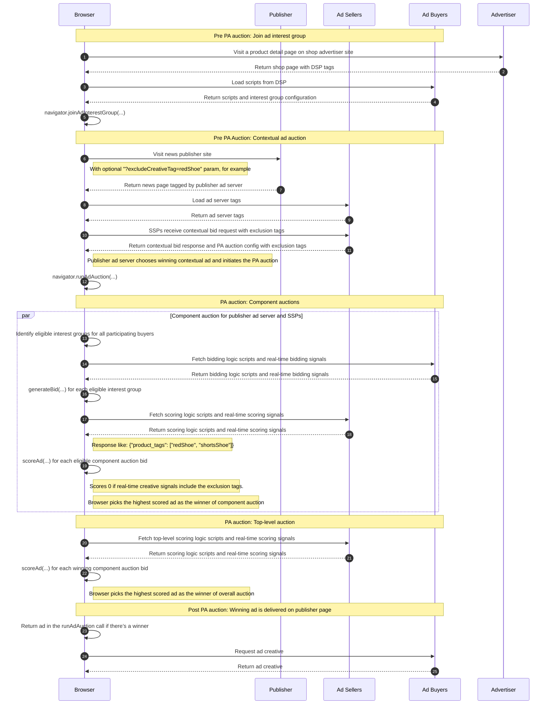

import Tabs from '@theme/Tabs'; import TabItem from '@theme/TabItem';

# Incorporating publisher ad quality requirements in Protected Audience

<Tabs>
<TabItem value="overview" label="Overview" default>

## Overview

### Description

Often publishers have requirements on the types of ads they’re willing to display for example:

- Excluding adult only ads
- Including ads only for relevant product types

During the Protected Audience auction, SSPs can implement this behavior by using a combination of DSP-supplied metadata with the bid and the SSP's own
creative metadata stored in its Key/Value (K/V) server that the SSP might have gathered from an out-of-band review process.

### Privacy Sandbox APIs

- [Protected Audience API](https://developers.google.com/privacy-sandbox/private-advertising/protected-audience)
- [Fenced Frames](https://developers.google.com/privacy-sandbox/private-advertising/fenced-frame)
- [Key/Value Service](https://developers.google.com/privacy-sandbox/private-advertising/protected-audience#key-value-service-detail)

### Related parties

- Publisher
- SSP
- Advertiser
- DSP

</TabItem>
<TabItem value="design" label="Design">

## Design

### Goals

In this demo, we explore the scenario where a publisher would like to exclude ads with certain creative tags. We’ll demonstrate the publisher page
relying on ad sellers -- a publisher ad-server and multiple SSPs -- to execute a Protected Audience auction, supplying tags to exclude _(e.g.
`"redShoe"`)_. The sellers will block some ads by retrieving ad metadata associated with the ad URLs from their K/V server _(e.g.
`{"product_tags": ["redShoe", "shortsShoe"]}`)_ and matching them against the exclusion tags.

### Assumptions

- We assume the SSP has deployed a Key/Value service, either in the Bring-Your-Own-Server (BYOS) mode or in a Trusted Execution Environment (TEE).
- The SSP has a database relating ad `renderURL`s to ad metadata and this information is available in the K/V service.

### Key Exclusions

- Dynamic updates of K/V pairs coming from the SSP backend (we will use static data for this demo).
- Excluding ads based on DSP supplied meta-data.

### System Design

Using Protected Audience API, the user visits a shopping site, and gets added to an interest group. Later the same user visits a news site. Before the
auction, we establish tags used to exclude certain ads;

- In a real world use case, the publisher would set ad exclusion tags in an SSPs admin UI.
- In our demo, the user presses one of several buttons to set an exclusion tag through a url parameter.

The ad auction will receive key / value meta-data from the SSP, indicating the product tags of each ad. If they match the excluded product tag, the ad
will be excluded from the auction, and the user will see no ad.

#### User Journey



[Full-sized diagram](./img/publisher-ad-quality-req-flow.png)

</TabItem>
<TabItem value="demo" label="Demo">

## Demo

### Prerequisites

- Latest stable version of Chrome (Open `chrome://version` to check your current version)
- Enable Privacy Sandbox APIs (Open `chrome://settings/adPrivacy` to enable _Site-suggested ads_)
- Clear your browsing history before you run one of the demo scenario below (Open `chrome://settings/clearBrowserData` to delete your browsing
  history)

### User Journey

1. [Navigate to shop site](https://privacy-sandbox-demos-shop.dev/) (advertiser)
2. Click on any "shoe" product item on the shop site. The shop (advertiser) would assume the user is interested in this type of shoe, so they would
   leverage Protected Audience API and ask the browser to join an ad interest group for this product.
3. [Navigate to this page on the news site](https://privacy-sandbox-demos-news.dev/publisher-ad-quality-req) (publisher)
4. Observe the ad served on the news site is for the shoe product you recently browsed.
5. Click on a button which matches your selected shoe:
   - Hide Red Shoes
   - Hide Blue Shoes
   - Hide Brown Shoes
   - Hide Sports Shoes

The page will refresh automatically and for the right combination of the shoe product you initially browsed and one of the above buttons clicked, the
shoe ad from Protected Audience will not be delivered. Instead, the ad from the contextual auction will be delivered. This is because:

- The button adds the `excludeCreativeTag` parameter to the page url, which in turn gets included in the publisher's ad slot configurations.
- The ad-server tag reads these ad slot configurations provided by the publisher and shares it with the SSPs so that these exclusion tags are included
  in `sellerSignals` of each of the component auction configurations.
- During the Protected Audience auction, the browser retrieves creative metadata from each of the seller's K/V server. In response, SSPs return a list
  of product tags associated with the ad referenced by the interest group `renderURL`.
- Finally in the `scoreAd()` function, the SSP assigns the bid a desirability score of 0 if the product tags matches any of the exclusion tags
  provided by the publisher.

### Implementation details

To add the user to an interest group, we reuse the implementation from the
[basic retargeting / remarketing ad campaign use-case demo](retargeting-remarketing). It’s in the second half -- the auction execution and ad delivery
-- where this use case differs from the regular retargeting / remarketing use-case. This is also why this use-case is on a different page on the news
site.

The news page lists the available ad slot on the page in the
[`window.PSDemo.PAGE_ADS_CONFIG`](https://github.com/privacysandbox/privacy-sandbox-demos/blob/67d4c6368ff422ad9e952961352b5ac74ee9f500/services/news/src/views/publisher-ad-quality-req.ejs#L29)
object. While doing so, publisher JavaScript reads the `excludeCreativeTag` URL query parameter and includes it in the ad slot configuration as
[`sellerSignalExcludeCreativeTag`](https://github.com/privacysandbox/privacy-sandbox-demos/blob/67d4c6368ff422ad9e952961352b5ac74ee9f500/services/news/src/views/publisher-ad-quality-req.ejs#L26).

```js title="Publisher configures ad slots on the page"
// Find creative tags to exclude on page, and include in seller signals.
const sellerSignalExcludeCreativeTag =
  window.PSDemo.getQueryAsString('excludeCreativeTag');
// Publishers configure the ad units available on the page.
window.PSDemo.PAGE_ADS_CONFIG = Object.freeze({
  otherSellers,
  // Ad units to request bids for.
  adUnits: [{
    code: 'displayFencedFrameAdUnit',
    auctionId: `PUB-${crypto.randomUUID()}`,
    divId: 'display-ad--fenced-frame',
    adType: 'DISPLAY',
    size: [300, 250],
    isFencedFrame: true,
    sellerSignalExcludeCreativeTag,
  }],
});
```

To deliver an ad for this ad slot, the news page also includes a third-party tag:
[ad-server-tag.js](https://github.com/privacysandbox/privacy-sandbox-demos/blob/67d4c6368ff422ad9e952961352b5ac74ee9f500/services/news/src/views/publisher-ad-quality-req.ejs#L43)
from the ad-server service. This ad server tag reads the ad slot configurations and proceeds to execute a sequential contextual + Protected Audience
auction as described in the [sequential setup of Protected Audience with contextual ad auction demo](sequential-auction-setup).

```html title="Ad-server tag on publisher page: https://privacy-sandbox-demos-news.dev"
<script
  async
  defer
  src="https://privacy-sandbox-demos-ad-server.dev/js/ssp/ad-server-tag.js"
></script>
```

The ad slot configurations with the exclusion tags are included in the contextual auction request to all ad sellers -- the publisher ad server and the
SSPs -- who in turn include these
[exclusion tags in the component auction configurations for Protected Audience](https://github.com/privacysandbox/privacy-sandbox-demos/blob/67d4c6368ff422ad9e952961352b5ac74ee9f500/services/ad-tech/src/routes/ssp/seller-contextual-bidder-router.ts).

After a buyer places a bid in the Protected Audience auction, the (component) sellers' Key/Value server is queried for signals keyed to the
`renderURL` returned along with the bid. This browser-constructed request URL for one of the ad sellers, as an example, looks like:
`https://privacy-sandbox-demos-ssp.dev/ssp/realtime-signals/scoring-signal.json?hostname=privacy-sandbox-demos-news.dev&renderUrls=...`. On the
server-side, the demo currently uses a BYOS implementation of the Key/Value server which already has some
[example tags associated with each of the products in the shopping demo site](https://github.com/privacysandbox/privacy-sandbox-demos/blob/67d4c6368ff422ad9e952961352b5ac74ee9f500/services/ad-tech/src/routes/ssp/scoring-signals-router.ts).

Finally, all of this comes together during the scoring phase of the Protected Audience auction. The following is the
[decision logic script](https://github.com/privacysandbox/privacy-sandbox-demos/blob/67d4c6368ff422ad9e952961352b5ac74ee9f500/services/ad-tech/src/public/js/ssp/default/auction-decision-logic.js)
provided by the seller.

```js title="Seller decision logic to take exclusion tags into account"
function scoreAd(
  adMetadata,
  bid,
  auctionConfig,
  trustedScoringSignals,
  browserSignals,
) {
  const scoringContext = {
    adMetadata,
    bid,
    auctionConfig,
    trustedScoringSignals,
    browserSignals,
  };
  // Initialize ad score defaulting to a first-price auction.
  const score = {
    desirability: bid,
    allowComponentAuction: true,
  };
  // Check if ad creative is blocked.
  if (isCreativeBlocked(scoringContext)) {
    score.desirability = 0;
    score.rejectReason = 'disapproved-by-exchange';
    return score;
  }
  return score;
}
```

### Related API documentation

- [Protected Audience Overview - Google Developers](https://developers.google.com/privacy-sandbox/private-advertising/protected-audience)
- [Protected Audience developer guide - Google Developers](https://developers.google.com/privacy-sandbox/private-advertising/protected-audience-api)
- [Key / Value Service Overview - Google Developers](https://developers.google.com/privacy-sandbox/blog/fledge-service-overview#key-value-service)
- [Fenced Frames Overview - Google Developers](https://developers.google.com/privacy-sandbox/private-advertising/fenced-frame)

</TabItem>
</Tabs>
