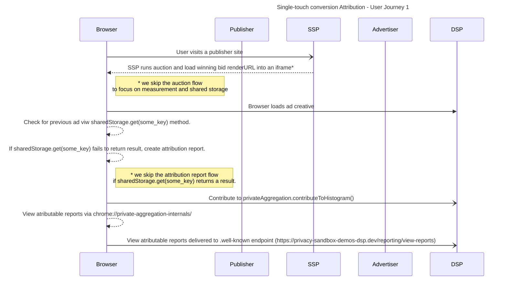

reach-measurement-with-shared-storage

import Tabs from '@theme/Tabs'; import TabItem from '@theme/TabItem';

# Reach Measurment with Shared Storage

<Tabs>
<TabItem value="overview" label="Overview" default>

## Overview

### Description

This demo is used to show that reach can be measured directly using the existing Shared Storage and Private Aggregation APIs – we call this approach a
direct method.

### Privacy Sandbox APIs and related documentation

- [Private Aggregation](https://developers.google.com/privacy-sandbox/private-advertising/private-aggregation)
- [Shared Storage](https://developers.google.com/privacy-sandbox/private-advertising/shared-storage)

### Related parties

- Advertiser
- DSP

</TabItem>
<TabItem value="Design" label="Design">

## Design

### Goals

In this demo, we assume an advertiser would like to measure the reach of marketing campaigns. By using a combination of Shares Storage and Private
Aggregation APIs, will demonstrate an effective method for reach measurement available within Privacy Sandbox.

### Assumptions

This use case assumes the advertiser has contracted with a publisher or won a bid to display their product ads on the publisher site (e.g. News site).
This use case does not cover ad-targeting specifics, so we assume the user would be presented with a relevant ad for which a reach measurement will be
attributed.

### Key Exclusions

The use case explores private aggregation reports before they are processed, aggrigated, or summarized. This use case does not intend to demonstrate
the Aggregation Service nor noised aggregation reports.

### System Design

- The user visits the [news site](https://privacy-sandbox-demos-news.dev/static-ad-with-reach) where an ad is rendered.
- Using the shares storage `sharedStorage.get(*some_key*)` method, the browser queries for privious views of the ad.
- If the browser has not previously displayed the ad, a private aggregatable report is generated and sent to the `.well-known` endpoint via the
  `privateAggregation.contributeToHistogram()` method.
- The browser shared storage value is set to a value indicating _viewed_ .

#### User Journey #1



</TabItem>
<TabItem value="demo" label="Demo">

## Demo

### Prerequisites

- Latest stable version of Chrome (Open `chrome://version` to check your current version)
- Enable Privacy Sandbox APIs (Open `chrome://settings/adPrivacy` to enable _Site-suggested ads_ and*Ad measurement*)
- Clear your browsing history before you run one of the demo scenario below (Open `chrome://settings/clearBrowserData` to delete your browsing
  history)
- Open chrome://attribution-internals and click "Clear all attribution data"

### User Journey #1

1. [Navigate to news site](https://privacy-sandbox-demos-news.dev/) (apublisherdvertiser)
2. Open Chrome DevToolsS
3. View Application > Shared storage - verify has-reported-content has a single entry 
4. Reload the page
5. View Application > Shared storage - verify has-reported-content has a single entry

6) View local Private Aggregation API Internals (Chrome generated) reports by pasting the following into your Chrome address box:
   `chrome://private-aggregation-internals/` verify a report has been generated by Chrome.
   

7) Click select the report and click "Send Selected Report"

8) Verify the report has been sent to the well-known endpoint: `https://privacy-sandbox-demos-dsp.dev/reporting/view-reports` verify a report has been
   generated by Chrome. 

9) Repeat steps 1 - 8 : Verify no additional reports are sent.

10) Delete Chrome shared storage via Chrome DevTools > Application > Shared storage 

Repeat steps 1 - 8 : Verify new reports are sent.

### Implementation details

#### Using Shared Storge to identify previously displayed ads.

The ad returned by the AD server contains will include reference to reach-measurement-worklet.js. This worklet provide code to read from Shared
Storage:

```javaScript
class ReachMeasurementOperation {
  async run(data) {
  . . .


 Read from Shared Storage
    const key = 'has-reported-content: ' + contentId;
    const hasReportedContent = (await sharedStorage.get(key)) === 'true';

    // Do not report if a report has been sent already
    if (hasReportedContent) {
      console.log('Content ID already seen:  ' + key);
      return;
    }

    . . .

```

The reach-measurement-worklet.js file also provides our method for delivering or Attributable Report:

```javaScript
class ReachMeasurementOperation {
  async run(data) {
  . . .

   // Send an aggregatable report via the Private Aggregation API
    console.log('contributeToHistogram:');
    privateAggregation.contributeToHistogram({bucket, value});

    . . .

```

Once the privateAggregation.contributeToHistogram is called we can set the Shared Storage value to indicate that the ad has been seen

```javaScript
class ReachMeasurementOperation {
  async run(data) {
  . . .

  // Set the report submission status flag
    console.log('Shared Storage key ' + key + ' stored');
    await sharedStorage.set(key, true);

  . . .

```

</TabItem>
</Tabs>
