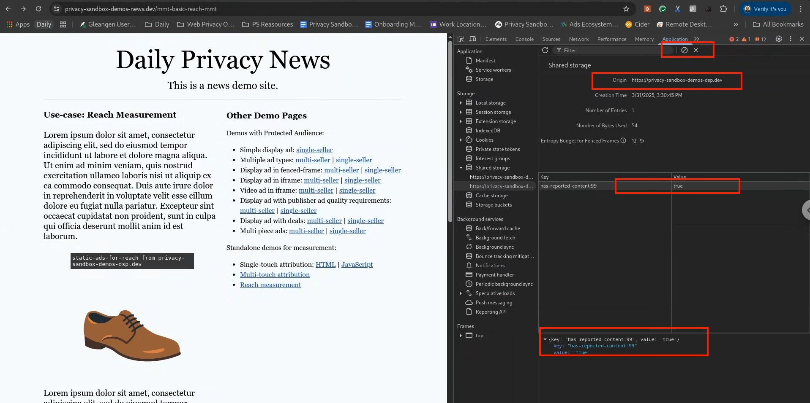

reach-measurement-with-shared-storage

import Tabs from '@theme/Tabs'; import TabItem from '@theme/TabItem';

# Reach Measurment with Shared Storage

<Tabs>
<TabItem value="overview" label="Overview" default>

## Overview

### Description

This demo is used to show that reach can be measured directly using the existing Shared Storage and Private Aggregation APIs – we call this approach a
direct method.

### Privacy Sandbox APIs and related documentation

- [Attribution Reporting API](https://developer.chrome.com/en/docs/privacy-sandbox/attribution-reporting/)

### Related parties

- Advertiser
- DSP

</TabItem>
<TabItem value="Design" label="Design">

## Design

### Goals

In this demo, we assume an advertiser would like to measure the reach of marketing campaigns. By using a combination of Shares Storage and Private
Aggrigation APIs, will will demonstrate an effective method for reach measurement availiable within Privecy Sandbox.

### Assumptions

This use case assumes the advertiser (e.g. EC site) has contracted with a publisher or won a bid to display their product ads on the publisher site
(e.g. News site). This use case does not cover ad-targeting specifics, so we assume the user would be presented with a relevant ad for which a reache
measurment will be be attributed.

### Key Exclusions

The use case explores prive aggrigation reports before they are processed or summerized and does not intent to demonstrate the Aggregation Service nor
noised aggregation reports.

### System Design

The user visits a news site where an ad is rendered.

- Using the shares storage `sharedStorage.get(*some_key*)` method, the browser queries for privious views of the ad.
- If the browser has not previously displayed the ad, a private aggregatable report is sent to the .well-known endpoint via the
  `privateAggregation.contributeToHistogram()` method.
- The shared storage value is set to a value indicating _viewed_

#### User Journey #1


</TabItem>
<TabItem value="demo" label="Demo">

## Demo

### Prerequisites

- Latest stable version of Chrome (Open `chrome://version` to check your current version)
- Enable Privacy Sandbox APIs (Open `chrome://settings/adPrivacy` to enable _Site-suggested ads_ and*Ad measurement*)
- Clear your browsing history before you run one of the demo scenario below (Open `chrome://settings/clearBrowserData` to delete your browsing
  history)
- Open chrome://attribution-internals and click "Clear all attribution data"

### User Journey #1

1. [Navigate to news site](https://privacy-sandbox-demos-news.dev/) (apublisherdvertiser)
2. Open Chrome DevToolsS
3. View Application > Shared storage - verify has-reported-content has a single entry 
4. Reload the page
5. View Application > Shared storage - verify has-reported-content has a single entry

6) View local Private Aggregation API Internals (Chrome generated) reports by pasting the following into your Chrome address box:
   `chrome://private-aggregation-internals/` verify a report has been generated by Chrome.
   

7) Click select the report and click "Send Selected Report"

8) Verify the report has been sent to the well-known endpoint: `https://privacy-sandbox-demos-dsp.dev/reporting/view-reports` verify a report has been
   generated by Chrome. 

9) Repeat steps 1 - 8 : Verify no addional reports are sent.

10) Delete Chrome shared storage via Chrome DevTools > Application > Shared storage 

Repeat steps 1 - 8 : Verify new reports are sent.

### Implementation details

#### how do we attribute the conversion to seeing an ad ? (see step #5 of User Journey)

First on the Attribution Source registration side. Look at the bidding logic
javascript[code](https://github.com/privacysandbox/privacy-sandbox-demos/blob/67d4c6368ff422ad9e952961352b5ac74ee9f500/services/ad-tech/src/public/js/dsp/default/auction-bidding-logic.js#L313)
below

```html
 registerAdBeacon({
    'impression': `${browserSignals.interestGroupOwner}/reporting?report=impression&${additionalQueryParams}`,
    'reserved.top_navigation_start': `${browserSignals.interestGroupOwner}/reporting?report=top_navigation_start&${additionalQueryParams}`,
    'reserved.top_navigation_commit': `${browserSignals.interestGroupOwner}/reporting?report=top_navigation_commit&${additionalQueryParams}`,
  });
```

The `impression` event will be triggered when the ad is rendered within the fenced frame and the `reserved.top_navigation_commit` will be triggered
when clicking the ad and navigating to the advertiser site. After clicking the ad, open the Chrome Developers Tools, look at the HTTP request starting
by `https:/<reporting-origin>/reporting?report=top_navigation_commit` you will see a new attribute added by the browser
`Attribution-Reporting-Eligible` with the value `navigation-source` In the HTTP response to this request, you will see a new header
`Attribution-Reporting-Register-Source:` with a value that contains the attribution source parameters.

```json
{
  "destination": "https://privacy-sandbox-demos-shop.dev",
  "source_event_id": "2510975139472269",
  "debug_key": "2978442217652084",
  "debug_reporting": true,
  "aggregation_keys": {
    "quantity": "0x0",
    "gross": "0x0"
  }
}
```

You can also refer to the
[source code](https://github.com/privacysandbox/privacy-sandbox-demos/blob/67d4c6368ff422ad9e952961352b5ac74ee9f500/services/ad-tech/src/lib/attribution-reporting-helper.ts#L89)
to see how the response header `Attribution-Reporting-Register-Source` was formed.

Second, on the Attribution Trigger side (=Conversion) The checkout page contains a 1 pixel image loaded from the code

```html

```

Now using the Developers Tools, look at the HTTP response to the `/attribution/register-trigger` request. You will see a new header
`Attribution-Reporting-Register-Trigger:` with a value that contains the attribution trigger parameters, including the values the advertiser would
like to see aggregated in the summary report (in this example gross and quantities)

```json
{
  "event_trigger_data": [
    {
      "trigger_data": "1",
      "priority": "100"
    }
  ],
  "aggregatable_trigger_data": [
    {
      "key_piece": "0x000000000000000032020000",
      "source_keys": [
        "quantity"
      ]
    },
    {
      "key_piece": "0x000000000000000032020000",
      "source_keys": [
        "gross"
      ]
    }
  ],
  "aggregatable_values": {
    "quantity": 1,
    "gross": 1120
  },
  "debug_key": "3092224669950736"
}
```

You can also refer to the
[source code](https://github.com/privacysandbox/privacy-sandbox-demos/blob/67d4c6368ff422ad9e952961352b5ac74ee9f500/services/ad-tech/src/lib/attribution-reporting-helper.ts#L47)
to see how the response header `aggregatable_trigger_data` was formed.

### Privacy Sandbox APIs and related documentation

- [Attribution Reporting for Web overview | Privacy Sandbox | Google for Developers](https://developers.google.com/privacy-sandbox/private-advertising/attribution-reporting)
- [Attribution Reporting API developer guide | Privacy Sandbox | Google for Developers](https://developers.google.com/privacy-sandbox/private-advertising/attribution-reporting/dev-guide)
- [Introduction to Attribution Reporting debug reports | Privacy Sandbox | Google for Developers](https://developers.google.com/privacy-sandbox/private-advertising/attribution-reporting/attribution-reporting-debugging)
- [Fenced_Frames_Ads_Reporting.md on GitHub](https://github.com/WICG/turtledove/blob/main/Fenced_Frames_Ads_Reporting.md)

</TabItem>
</Tabs>
