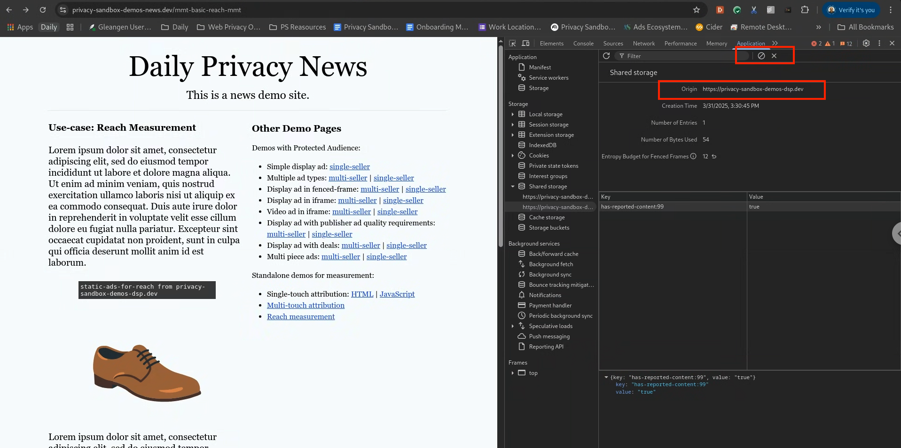

reach-measurement-with-shared-storage

import Tabs from '@theme/Tabs'; import TabItem from '@theme/TabItem';

# Reach Measurement with Shared Storage

<Tabs>
<TabItem value="overview" label="Overview" default>

## Overview

### Description

This demo is used to show that **ad reach** can be measured directly using the existing Shared Storage and Private Aggregation APIs – we call this
approach **Point in Time**.

:::info The use case demonstrated may be referred to as **Point in Time** We will demonstrate one aggregate contribution for the entire lifetime of
the flag in Shared Storage (~30 days). Whereas, the other approach may measure reach over some defined number of days `trailing-x-days reach`. :::

### Privacy Sandbox APIs and related documentation

- [Private Aggregation](https://developers.google.com/privacy-sandbox/private-advertising/private-aggregation)
- [Shared Storage](https://developers.google.com/privacy-sandbox/private-advertising/shared-storage)

### Related parties

- Advertiser
- DSP

</TabItem>
<TabItem value="Design" label="Design">

## Design

### Goals

In this demo, we assume an advertiser would like to measure the reach of marketing campaigns. By using a combination of Shared Storage and Private
Aggregation APIs, we will demonstrate an effective method for reach measurement available within Privacy Sandbox.

### Assumptions

This use case assumes the advertiser has contracted with a publisher or won a bid to display their ads on the publisher site (e.g. News site). This
use case does not cover ad-targeting specifics, so we assume the user would be presented with a relevant ad or campaign for which reach will be
measured.

### Key Exclusions

The use case covers Private Aggregation reports before they are processed, aggregated, or summarized. This use case does not intend to demonstrate the
Aggregation Service nor noised summary reports.

### System Design

- The user visits the [news site](https://privacy-sandbox-demos-news.dev/basic-reach-mmt) where an ad is rendered.
- The ad-tech loads a JavaScript module for reach measurement and creates a Shared Storage worklet to trigger reporting if necessary.
- The ad-tech maintains a flag in Shared Storage to note whether a report for reach measurement has been generated from this browser using the Shared
  Storage getter and setter methods.
- If a reach report has been sent previously, the ad-tech ends the Shared Storage worklet execution.
- If a reach report has not been sent previously, the ad-tech triggers reporting using the `privateAggregation.contributeToHistogram()` method and the
  corresponding aggregatable report is scheduled to be sent to the ad-tech’s `.well-known` endpoint
- The ad-tech updates the flag in Shared Storage to indicate that a report has been sent.

#### User Journey


</TabItem>
<TabItem value="demo" label="Demo">

## Demo

### Prerequisites

- Latest stable version of Chrome (Open `chrome://version` to check your current version)
- Enable Privacy Sandbox APIs (Open `chrome://settings/adPrivacy` to enable _Ad measurement_)
- Clear your browsing history before you run one of the demo scenario below (Open `chrome://settings/clearBrowserData` to delete your browsing
  history)
- Open `chrome://private-aggregation-internals/` and click "Clear all attribution data"

### User Journey

1. [Navigate to news site](https://privacy-sandbox-demos-news.dev/basic-reach-mmt) (a publisher)
2. Open Chrome DevTools
3. View Application > Shared Storage - verify has-reported-content has a single entry 
4. Reload the page
5. View Application > Shared Storage - verify has-reported-content has a single entry
6. View local Private Aggregation API Internals (Chrome generated) reports by pasting the following into your Chrome address box:
   `chrome://private-aggregation-internals/` verify a report has been generated by Chrome.
   

7. [Optional] Click select the report and click "Send Selected Report"

8. Verify the report has been sent to the well-known endpoint:
   [https://privacy-sandbox-demos-dsp.dev/reporting/view-reports](https://privacy-sandbox-demos-dsp.dev/reporting/view-reports)
   

9. Verify no additional reports are sent to the well-known endpoint by repeating stems 1-8.

10. Delete Chrome Shared Storage via Chrome DevTools > Application > Shared Storage 

11. Verify new reports are sent by repeating stems 1-8.

### Implementation details

#### Using Shared Storage to identify previously displayed ads.

:::info

_Key term_: a [worklet](https://developer.mozilla.org/docs/Web/API/Worklet) lets you run specific JavaScript functions and return information back to
the requester. There are different types of worklets, Shared Storage uses the
[SharedStorageWorklet](https://developer.mozilla.org/docs/Web/API/SharedStorageWorklet) . Within a SharedStorageWorklet, you can execute JavaScript
but you cannot interact or communicate with the outside page.

:::

The ad returned by the ad buyer will:

- Add a new Shared Storage module for reach measurement.
- Create a new worklet `reach-measurement-worklet.js` to invoke the module.
- include reference to the `reach-measurement-worklet.js` worklet.

**reach-measurement-worklet.js**

```javaScript
class ReachMeasurementOperation {
  async run(data) {
  . . .


 //Read from Shared Storage
    const key = 'has-reported-content: ' + contentId;
    const hasReportedContent = (await sharedStorage.get(key)) === 'true';

    // Do not report if a report has been sent already
    if (hasReportedContent) {
      console.log('Content ID already seen:  ' + key);
      return;
    }

    . . .

```

The `reach-measurement-worklet.js` file triggers aggregate reporting if no reports have been sent previously:

```javaScript
class ReachMeasurementOperation {
  async run(data) {
  . . .

    // Send an aggregatable report via the Private Aggregation API
    console.log('contributeToHistogram:');
    privateAggregation.contributeToHistogram({bucket, value});

    . . .

```

Once the `privateAggregation.contributeToHistogram` is called we can set the Shared Storage value to indicate that the ad has been seen using the
`sharedStorage.set(key, true)` method.

```javaScript
class ReachMeasurementOperation {
  async run(data) {
  . . .

  // Set the report submission status flag
    console.log('Shared Storage key ' + key + ' stored');
    await sharedStorage.set(key, true);

  . . .

```

</TabItem>
</Tabs>
