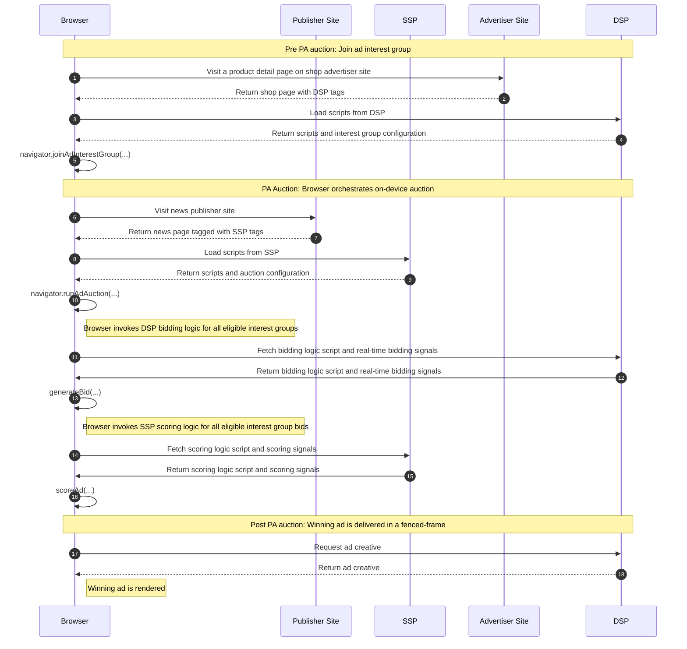

import Tabs from '@theme/Tabs'; import TabItem from '@theme/TabItem';

# Basic retargeting / remarketing ads

<Tabs>
<TabItem value="overview" label="Overview" default>

## Overview

### Description

Remarketing is a type of online advertising that allows you to show ads to people who have already visited your website. You can create custom
audiences based on different criteria, such as pages visited or products added to the cart. Remarketing can help you increase brand awareness, drive
traffic back to your website, and boost sales.

### Privacy Sandbox APIs and related documentation

- [Protected Audience Overview - Google Developers :arrow_upper_right:](https://developers.google.com/privacy-sandbox/private-advertising/protected-audience)
- [Protected Audience Developer Guide - Google Developers :arrow_upper_right:](https://developers.google.com/privacy-sandbox/private-advertising/protected-audience-api)
- [Fenced Frames Overview - Google Developers :arrow_upper_right:](https://developers.google.com/privacy-sandbox/private-advertising/fenced-frame)

### Related parties

- Publisher (News site)
- Supply Side Platform (SSP)
- Advertiser (Shop site)
- Demand Side Platform (DSP)

</TabItem>
<TabItem value="design" label="Design">

## Design

### Goals

In this demo, we assume an advertiser would like to drive traffic back to their website. Remarketing can help an advertiser to get people who have
already visited their website to come back for more or to complete a purchase. This can be done by showing them ads about the product they have
previously looked at, on other websites.

### Assumptions

This use case assumes the advertiser (shop site) can bid on the publisher (news site) inventory through an agreement between their respective DSP and
SSP platforms.

### Key Exclusions

The demo does not integrate existing auction mechanisms (such as header bidding or Prebid). It is only scoped to the on-device auction with Protected
Audience API. As a simple demonstration of the Protected Audience API, the auction only involves a single seller servicing a single ad slot for an
opportunity to deliver a display ad.

### System Design

When the user visits a shopping site, the browser joins an interest group using the Protected Audience API. Later the same user visits a news site. On
this site, the browser runs an on-device auction, with ad-tech-provided scripts selecting the winning ad which will be rendered in the ad slot on the
page.

#### Protected Audience Flow

Below is a general introduction of Remarketing using Privacy Sandbox Protected Audience API.


#### User Journey

<!--

-->



</TabItem>
<TabItem value="demo" label="Demo">

## Demo

### Prerequisites

- Latest stable version of Chrome (Open `chrome://version` to check your current version)
- Enable Privacy Sandbox APIs (Open `chrome://settings/adPrivacy` to enable _Site-suggested ads_)
- Clear your browsing history before you run one of the demo scenario below (Open `chrome://settings/clearBrowserData` to delete your browsing
  history)

### User Journey

1. [Navigate to shop site :arrow_upper_right:](https://privacy-sandbox-demos-shop.dev/) (advertiser)
2. Click on any "shoe" product item on the shop site.
   - The shop (advertiser) would assume the user is interested in this type of product, so they would leverage Protected Audience API and ask the
     browser to join an ad interest group for this product or this specific product category.
3. [Navigate to the news site :arrow_upper_right:](https://privacy-sandbox-demos-news.dev/) (publisher)
4. Observe the ad served on the news site
   - If you previously browsed the "shoe" product on the shop site, you will be shown an ad for the same product.
   - When the page was loaded, Protected Audience API allowed the SSP to run an ad auction on the publisher site.
   - The winning advertiser of this ad auction gets their ad creative to be displayed on the publisher site. In this case you have cleared the browser
     history and only browsed 1 advertiser site page so you are only seeing 1 ad creative from the same advertiser.

### Implementation details

#### How is the user added to an interest group based on their browsing behavior? (see step #2 of user journey)

The shop product page includes one or more third-party tags from the DSP services:
[`dsp-tag.js` :arrow_upper_right:](https://github.com/privacysandbox/privacy-sandbox-demos/blob/main/services/shop/src/views/item.ejs#L92).

```html title="DSP tag on advertiser page: https://privacy-sandbox-demos-shop.dev/items/1f45e"
<script
  src="https://privacy-sandbox-demos-dsp.dev/js/dsp/dsp-tag.js"
  class="dsp_tag"
  data-advertiser="privacy-sandbox-demos-shop.dev"
  data-item-id="1f45e"
></script>
```

The
[`dsp-tag.js` :arrow_upper_right:](https://github.com/privacysandbox/privacy-sandbox-demos/blob/main/services/ad-tech/src/public/js/dsp/dsp-tag.js#L97)
dynamically injects an iframe in the DSP's origin to the advertiser's page.

```html title="DSP iframe on advertiser page: https://privacy-sandbox-demos-shop.dev/items/1f45e"
<iframe
  width="1"
  height="1"
  src="https://privacy-sandbox-demos-dsp.dev/dsp/dsp-advertiser-iframe.html?advertiser=privacy-sandbox-demos-shop.dev&amp;id=1f45e"
  allow="join-ad-interest-group"
></iframe>
```

This third-party DSP iframe includes a script
[`join-ad-interest-group.js` :arrow_upper_right:](https://github.com/privacysandbox/privacy-sandbox-demos/blob/main/services/ad-tech/src/public/js/dsp/join-ad-interest-group.js)
to join an interest group using the Protected Audience API. To do so, the DSP tag retrieves the interest group configurations from its own server
from:
[`https://privacy-sandbox-demos-dsp.dev/dsp/interest-group.json` :arrow_upper_right:](https://github.com/privacysandbox/privacy-sandbox-demos/blob/main/services/ad-tech/src/routes/dsp/buyer-router.ts#L46).

```js title="Script loaded in DSP iframe: https://privacy-sandbox-demos-dsp.dev/dsp/dsp-advertiser-iframe.html"
/** Sends first-party context to server to retrieve interest group metadata. */
getInterestGroupFromServer = async () => {
  const currentUrl = new URL(location.href);
  const interestGroupUrl = new URL(location.origin);
  interestGroupUrl.pathname = '/dsp/interest-group.json';
  // Copy query params from current context.
  for (const [key, value] of currentUrl.searchParams) {
    interestGroupUrl.searchParams.append(key, value);
  }
  const res = await fetch(interestGroupUrl, {browsingTopics: true});
  if (res.ok) {
    return res.json();
  }
};

document.addEventListener('DOMContentLoaded', async () => {
  if (navigator.joinAdInterestGroup === undefined) {
    console.log('[PSDemo] Protected Audience API is not supported.');
    return;
  }
  const interestGroup = await getInterestGroupFromServer();
  console.log('[PSDemo] Joining interest group: ', {interestGroup});
  const kSecsPerDay = 3600 * 24 * 30;
  console.log(
    await navigator.joinAdInterestGroup(interestGroup, kSecsPerDay),
  );
});
```

#### How is the relevant ad delivered to the user? (see step #4 of user journey)

The news page lists the available ad slot on the page in the
[`window.PSDemo.PAGE_ADS_CONFIG` :arrow_upper_right:](https://github.com/privacysandbox/privacy-sandbox-demos/blob/main/services/news/src/views/index.ejs#L17)
object.

```js title="Publisher configures ad slots on page: https://privacy-sandbox-demos-news.dev"
window.PSDemo.PAGE_ADS_CONFIG = Object.freeze({
  adUnits: [{
    code: 'displayFencedFrameAdUnit',
    auctionId: `PUB-${crypto.randomUUID()}`,
    divId: 'display-ad--fenced-frame',
    adType: 'DISPLAY',
    size: [300, 250],
    isFencedFrame: true,
  }],
});
```

To deliver an ad for this ad slot, the news page also includes a third-party tag:
[`run-simple-ad-auction.js` :arrow_upper_right:](https://github.com/privacysandbox/privacy-sandbox-demos/blob/main/services/news/src/views/index.ejs#L60)
from the SSP service.

```html title="SSP tag on publisher page: https://privacy-sandbox-demos-news.dev"
<script
  async
  defer
  src="https://privacy-sandbox-demos-ssp.dev/js/ssp/run-simple-ad-auction.js"
></script>
```

This
[`run-simple-ad-auction.js` :arrow_upper_right:](https://github.com/privacysandbox/privacy-sandbox-demos/blob/main/services/ad-tech/src/public/js/ssp/run-simple-ad-auction.js)
script executes a Protected Audience auction using auction configurations retrieved from its server.

```js title="SSP script loaded on publisher page: https://privacy-sandbox-demos-news.dev"
document.addEventListener("DOMContentLoaded", async (e) => {
  // Read ad unit configurations provided by the publisher.
  const [adUnit] = window.PSDemo.PAGE_ADS_CONFIG.adUnits;
  // Retrieve auction configuration from its own server.
  const auctionConfig = await getAuctionConfig(adUnit);
  // Execute the Protected Audience auction.
  const adAuctionResult = await navigator.runAdAuction(auctionConfig);
  // Finally handle the auction result.
  if (!adAuctionResult) {
    document.getElementById(adUnit.divId).innerText = 'No eligible ads';
  } else {
    const adFrame = document.createElement('fencedframe');
    adFrame.config = adAuctionResult;
    [adFrame.width, adFrame.height] = adUnit.size;
    log('delivering ads in ', {
      adFrame,
      adUnit,
      auctionConfig,
      adAuctionResult,
    });
    document.getElementById(adUnit.divId).appendChild(adFrame);
  }
});
```

The Protected Audience auction is orchestrated by the browser, executing bidding and decision logic provided by the ad buyer and ad seller
respectively to arrive at the winning ad. The result of this ad auction is displayed within a Fenced Frame. This ad auction result represents the
winning
[`renderURL` :arrow_upper_right:](https://github.com/privacysandbox/privacy-sandbox-demos/blob/main/services/ad-tech/src/routes/common/ads-router.ts#L34)
included in the interest group.

```html title="Protected Audience auction result delivered in a fenced-frame"
<fencedframe width="300" height="250">
  #document (https://privacy-sandbox-demos-dsp.dev/ads/display-ads?advertiser=privacy-sandbox-demos-shop.dev&itemId=1f460)
  <html lang="en">
    …
  </html>
</fencedframe>
```

</TabItem>
</Tabs>
