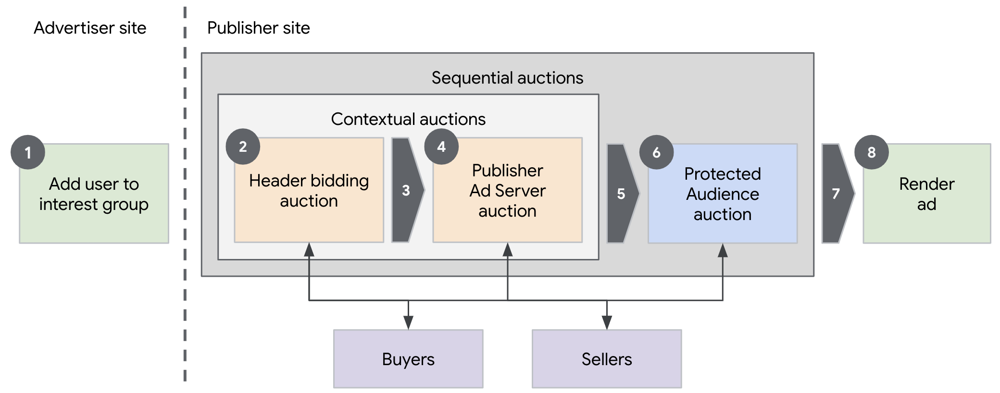
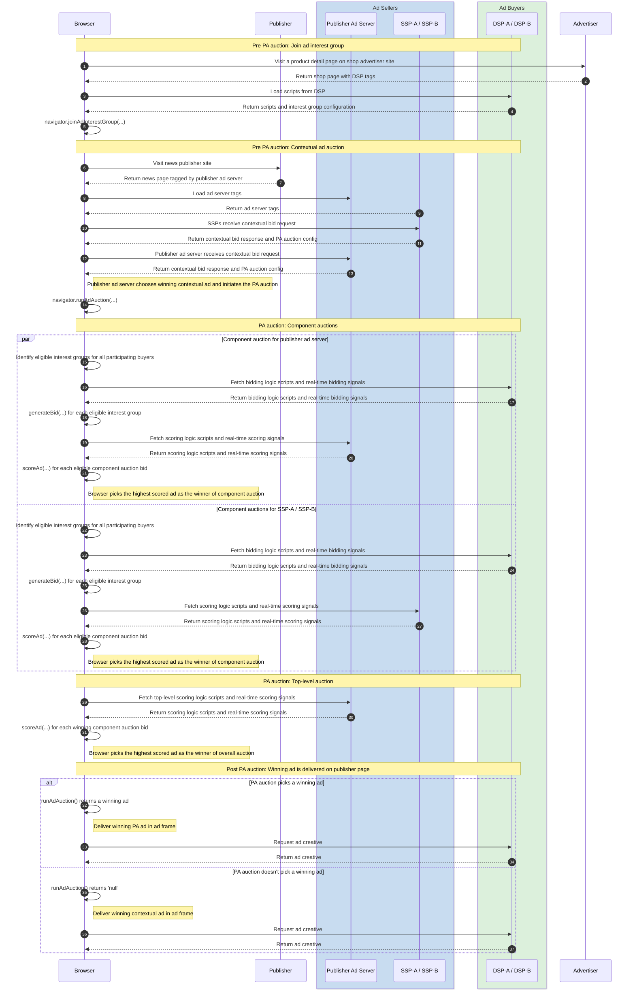

import Tabs from '@theme/Tabs'; import TabItem from '@theme/TabItem';

# Sequential setup of Protected Audience with contextual ad auction

<Tabs>
<TabItem value="overview" label="Overview" default>

## Overview

### Description

While Protected Audience enables the delivery of relevant ads by considering cross-site context without relying on tracking identifiers and
third-party cookies, publishers will continue to diversify their ad demand sources with an intention to optimize for revenue. Additionally, there is
always a possibility that the Protected Audience auction may not return a valid result due to multiple reasons such as: no interest groups were
eligible, all eligible ads were blocked, or a timeout was hit, etc. The publisher, regardless of the auction mechanism, would still want to fill the
ad slot with an ad. So, we anticipate that publishers will continue to rely on their current contextual auction setup while exploring Protected
Audience as an additional demand source that may or may not beat the contextual demand floor.

### Privacy Sandbox APIs and related documentation

- [Protected Audience Overview - Google Developers :arrow_upper_right:](https://privacysandbox.google.com/private-advertising/protected-audience)
- [Protected Audience Developer Guide - Google Developers :arrow_upper_right:](https://privacysandbox.google.com/private-advertising/protected-audience-api)
- [Sequential setup of Protected Audience with contextual ad auction - Google Developers :arrow_upper_right:](https://privacysandbox.google.com/private-advertising/auction/sequential-auction)
- [Fenced Frames Overview - Google Developers :arrow_upper_right:](https://privacysandbox.google.com/private-advertising/fenced-frame)

### Related parties

- Publisher (News site)
- Publisher Ad Server / Top-level Seller
- Supply Side Platform (SSP)
- Advertiser (Shop site)
- Demand Side Platform (DSP)

</TabItem>
<TabItem value="design" label="Design">

## Design

### Goals

In this demo, we aim to demonstrate a basic sequential auction setup with a focus on the data flow from the perspective of the Protected Audience
auction and abstract a lot of the technical nuance in the contextual auction. Building on the
[basic retargeting / remarketing ads demo](retargeting-remarketing), this demo shows a more realistic sequential setup with multiple buyers and
sellers participating in the ad delivery process. This demo will also demonstrate SSPs sourcing `buyerSignals` from DSPs and including them in the
Protected Audience auction configuration.

### Key Exclusions

This demo abstracts a lot of the complexity in the contextual auction. For starters, this demo doesn't integrate with any real header bidding library.
Additionally, this demo doesn't aim to replicate the existing integration patterns between the publisher ad server and other ad sellers or SSPs across
various ad delivery setups. This demo focuses on a few exemplary _'signals'_ as opposed to an industry spec such as OpenRTB.

### System Design

Identical to the [basic retargeting / remarketing ads demo](retargeting-remarketing), the user visiting an advertiser page is added to interest groups
by multiple DSPs. While the overall ad delvery flow on the publisher page is similar, the biggest difference in this demo is the involvement of
multiple ad sellers. The publisher ad server starts with a simplified contextual auction with other sellers also participating to arrive at a winning
contextual ad while also collating their auction configurations for the Protected Audience auction. The publisher ad server also initiates the
Protected Audience auction acting as the top-level seller with all sellers including the publisher ad server conducting their individual component
auctions.

#### Protected Audience Flow



#### User Journey



</TabItem>
<TabItem value="demo" label="Demo">

## Demo

### Prerequisites

- Latest stable version of Chrome (Open `chrome://version` to check your current version)
- Enable Privacy Sandbox APIs (Open `chrome://settings/adPrivacy` to enable _Site-suggested ads_)
- Clear your browsing history before you run one of the demo scenario below (Open `chrome://settings/clearBrowserData` to delete your browsing
  history)

### User Journey

1. [Navigate to shop site :arrow_upper_right:](https://privacy-sandbox-demos-shop.dev/) (advertiser)
2. Click on any "shoe" product item on the shop site.
   - The shop (advertiser) would assume the user is interested in this type of product, so they would leverage Protected Audience API and ask the
     browser to join an ad interest group for this product or this specific product category.
3. [Navigate to the news site :arrow_upper_right:](https://privacy-sandbox-demos-news.dev/pa-fenced-frame-display-ad) (publisher)
4. Observe the ad served on the news site
   - If you previously browsed the "shoe" product on the shop site, you will be shown an ad for the same product.
   - When the page was loaded, the publisher ad server leveraged the Protected Audience API to run an ad auction on the publisher site involving
     multiple sellers and buyers.

### Implementation details

The user is added to interest groups by DSPs using the same mechanism as described in the
[basic remarketing / retargeting use-case demo](retargeting-remarketing). The incremental difference in the implementation of this demo is on the
publisher page.

#### How does the publisher pass the ad unit configurations for a given page to the publisher ad server?

The news page lists the available ad slots on the page in the
[`window.PSDemo.PAGE_ADS_CONFIG` :arrow_upper_right:](https://github.com/privacysandbox/privacy-sandbox-demos/blob/67d4c6368ff422ad9e952961352b5ac74ee9f500/services/news/src/views/fenced-frame-display-ad.ejs#L16-38)
object.

```js title="Publisher configures ad slots on page: https://privacy-sandbox-demos-news.dev/fenced-frame-display-ad"
// List of additional sellers that the publisher ad server should include in the ad delivery process.
const otherSellers = window.PSDemo.getUrlQueryAsArray('otherSellers') || [
  'https://privacy-sandbox-demos-ssp.dev',
  'https://privacy-sandbox-demos-ssp-a.dev',
  'https://privacy-sandbox-demos-ssp-b.dev',
];
// Publishers configure the ad units available on the page.
window.PSDemo.PAGE_ADS_CONFIG = Object.freeze({
  otherSellers,
  // Ad units to request bids for.
  adUnits: [{
    code: 'displayFencedFrameAdUnit',
    auctionId: `PUB-${crypto.randomUUID()}`,
    divId: 'display-ad--fenced-frame',
    adType: 'DISPLAY',
    size: [300, 250],
    isFencedFrame: true,
  }],
});
```

To deliver an ad for this ad slot, the news page also includes a third-party tag:
[`ad-server-tag.js` :arrow_upper_right:](https://github.com/privacysandbox/privacy-sandbox-demos/blob/67d4c6368ff422ad9e952961352b5ac74ee9f500/services/news/src/views/fenced-frame-display-ad.ejs#L39-41)
from the publisher ad server.

```html title="Ad server tag on publisher page: https://privacy-sandbox-demos-news.dev/fenced-frame-display-ad"
<script async defer
        src="https://privacy-sandbox-demos-ad-server.dev/js/ssp/ad-server-tag.js"
></script>
```

#### How does the publisher ad server integrate the Protected Audience auction in a sequential manner?

The
[`ad-server-tag.js` :arrow_upper_right:](https://github.com/privacysandbox/privacy-sandbox-demos/blob/67d4c6368ff422ad9e952961352b5ac74ee9f500/services/ad-tech/src/public/js/ssp/ad-server-tag.js)
reads the ad unit configurations declared by the publisher and handles them individually.

```js title="ad-server-tag.js iterates over ad unit configurations"
const {adUnits, otherSellers} = window.PSDemo.PAGE_ADS_CONFIG;
deliverAds(adUnits, otherSellers);

const deliverAds = (adUnits, otherSellers) => {
  for (const adUnit of adUnits) {
    // ...
    // Deliver ad for adUnit.
    // ...
  }
};
```

More specifically, the `ad-server-tag.js` injects an iframe for each ad unit where each of theses iframe then executes a sequential contextual and
Protected Audience auction to choose an ad. This iframe loads:
[`https://privacy-sandbox-demos-ad-server.dev/ssp/run-sequential-ad-auction.html` :arrow_upper_right:](https://github.com/privacysandbox/privacy-sandbox-demos/blob/67d4c6368ff422ad9e952961352b5ac74ee9f500/services/ad-tech/src/views/ssp/run-sequential-ad-auction.ejs),
which contains a single script:
[`https://privacy-sandbox-demos-ad-server.dev/js/ssp/run-sequential-ad-auction.js` :arrow_upper_right:](https://github.com/privacysandbox/privacy-sandbox-demos/blob/ff68148e0987979ecdac2f0183b9ca2a1b847bcc/services/ad-tech/src/public/js/ssp/run-sequential-ad-auction.js).
This iframe expects a post-message from `ad-server-tag.js` containing the ad unit configuration as well as the list of other sellers involved in the
ad delivery process.

```js title="run-sequential-ad-auction.js integrates the contextual and the Protected Audience auction."
/** Executes the multi-seller ad auction for the given adUnit config. */
const runMultiSellerAdAuction = async (message) => {
  const [adUnit, otherSellers] = getValidatedAdUnitAndOtherSellers(message);
  const contextualBidResponses = await getAllContextualBidResponses(
    adUnit,
    [location.origin, ...otherSellers], // Explicitly include self.
  );
  const adAuctionResult = await executeSequentialAuction(
    adUnit,
    contextualBidResponses,
  );
  let adFrame;
  // ...
  // Construct ad frame from adAuctionResult.
  // ...
  document.body.appendChild(adFrame);
}
```

#### How does the simplified contextual auction work?

As stated earlier, this demo implements a minimalist version of the contextual auction. The ad unit configuration is identical across the contextual
and the Protected Audience auctions. While in real implementations, the contextual auction might consist of multiple independent auctions executed in
a mix of sequential and parallel setups, this demo combines the header bidding auction with the publisher ad server's contextual auction into a single
step.

```js title="Ad server sends contextual bid requests to all sellers including itself"
/** Fetches all the contextual bid responses with a timeout. */
const getAllContextualBidResponses = async (adUnit, sellers) => {
  const bidRequestUrls = getBidRequestUrlsWithContext(adUnit, sellers);
  const bidResponsePromises = bidRequestUrls.map(async (bidRequestUrl) => {
    const response = await fetch(bidRequestUrl);
    if (response.ok) {
      return await response.json();
    } else {
      return {bid: '0.0'};
    }
  });
  // Use Promise.race to implement the timeout.
  const bidResponses = await Promise.race([
    (await Promise.allSettled(bidResponsePromises))
      .filter((p) => p.status === 'fulfilled')
      .map((p) => p.value),
    new Promise((resolve) =>
      setTimeout(() => resolve([]), CONTEXTUAL_AUCTION_TIMEOUT_MS),
    ),
  ]);
  return bidResponses;
}
```

In the above code snippet from
[`run-sequential-ad-auction.js` :arrow_upper_right:](https://github.com/privacysandbox/privacy-sandbox-demos/blob/67d4c6368ff422ad9e952961352b5ac74ee9f500/services/ad-tech/src/public/js/ssp/run-sequential-ad-auction.js#L79-106),
the publisher ad server's JavaScript makes contextual bid requests to all the sellers involved in the ad delivery process.

```title="Contextual bid requests sent to ad sellers"
https://privacy-sandbox-demos-ad-server.dev/ssp/contextual-bid
https://privacy-sandbox-demos-ssp.dev/ssp/contextual-bid
https://privacy-sandbox-demos-ssp-a.dev/ssp/contextual-bid
https://privacy-sandbox-demos-ssp-b.dev/ssp/contextual-bid
```

To respond to these requests, the ad sellers in turn make requests to ad buyers that they integrate with. The above request to the ad seller stack is
handled by the
[`seller-contextual-bidder-router` :arrow_upper_right:](https://github.com/privacysandbox/privacy-sandbox-demos/blob/67d4c6368ff422ad9e952961352b5ac74ee9f500/services/ad-tech/src/routes/ssp/seller-contextual-bidder-router.ts)
module. The seller backend sends the contextual bid request to each of the ad buyers it integrates with, and assembles its final contextual bid
response with its highest contextual bid and its component auction configuration for the Protected Audience auction.

```js title="Seller backend responds to contextual bid request"
SellerContextualBidderRouter.get('/', async (req: Request, res: Response) => {
  const auctionSignals: {[key: string]: string} = {};
  const sellerSignals: {[key: string]: string} = {};
  // ...
  // Parse signals from request context.
  // ...
  // Run server-side contextual auction.
  const contextualBids = await getContextualBids(
    /* bidderHosts= */ BUYER_HOSTS_TO_INTEGRATE_BY_SELLER_HOST.get(HOSTNAME!)!,
    /* signals= */ auctionSignals,
  );
  const [winningContextualBid] = contextualBids
    .filter((bid) => Number(bid.bid) > 0)
    .sort((bid1, bid2) => Number(bid2.bid!) - Number(bid1.bid!));
  // Collect buyer signals from contextual bids.
  const perBuyerSignals: {[key: string]: any} = {};
  for (const contextualBid of contextualBids) {
    if (contextualBid.buyerSignals) {
      perBuyerSignals[contextualBid.bidderOrigin!] = contextualBid.buyerSignals;
    }
  }
  const response: ContextualBidResponse = {...};
  res.json(response);
}
```

#### How do the additional sellers or SSPs integrate with the publisher ad server's Protected Audience auction

The publisher ad servers collates the contextual bid responses from all the sellers before assembling the combined auction configuration for Protected
Audience. In the following code snippet from
[`run-sequential-ad-auction.js` :arrow_upper_right:](https://github.com/privacysandbox/privacy-sandbox-demos/blob/ff68148e0987979ecdac2f0183b9ca2a1b847bcc/services/ad-tech/src/public/js/ssp/run-sequential-ad-auction.js#L154),
the winning contextual bid is chosen purely on the bid price. Along with the contextual bid response, the additional sellers or SSPs also respond with
their Protected Audience component auction configuration. The publisher ad server also assembles the final Protected Audience auction configuration
which includes these component auction configurations from other sellers as well as its own component auction.

Since the `navigator.runAdAuction(...)` only returns the final result represented as a URN or a Fenced Frame config, the decision to choose between
the contextual ad and Protected Audience ad has to be made within the Protected Audience. Accordingly, the `navigator.runAdAuction(...)` method will
return a valid result when the Protected Audience ad wins the overall auction, or return `null` to indicate choosing the contextual ad.

```js
/** Executes the PAAPI auction in sequence and returns the overall result. */
const executeSequentialAuction = async (adUnit, contextualBidResponses) => {
  const [winningContextualBid] = contextualBidResponses
    .filter((bid) => Number(bid.bid) > 0)
    .sort((bid1, bid2) => Number(bid2.bid) - Number(bid1.bid));
  const componentAuctionConfigs = contextualBidResponses.map(
    (bidResponse) => bidResponse.componentAuctionConfig,
  );
  const auctionConfig = assembleAuctionConfig(
    adUnit,
    winningContextualBid,
    componentAuctionConfigs,
  );
  const adAuctionResult = await navigator.runAdAuction(auctionConfig);
  if (adAuctionResult) {
    return {
      type: 'PROTECTED_AUDIENCE',
      value: adAuctionResult,
    };
  } else if (winningContextualBid) {
    return {
      type: 'CONTEXTUAL',
      value: winningContextualBid.renderURL,
    };
  } else {
    document.getElementById('ad-label').innerText = 'No eligible ads found.';
    return {
      type: 'NONE',
    };
  }
};
```

</TabItem>
</Tabs>
```
