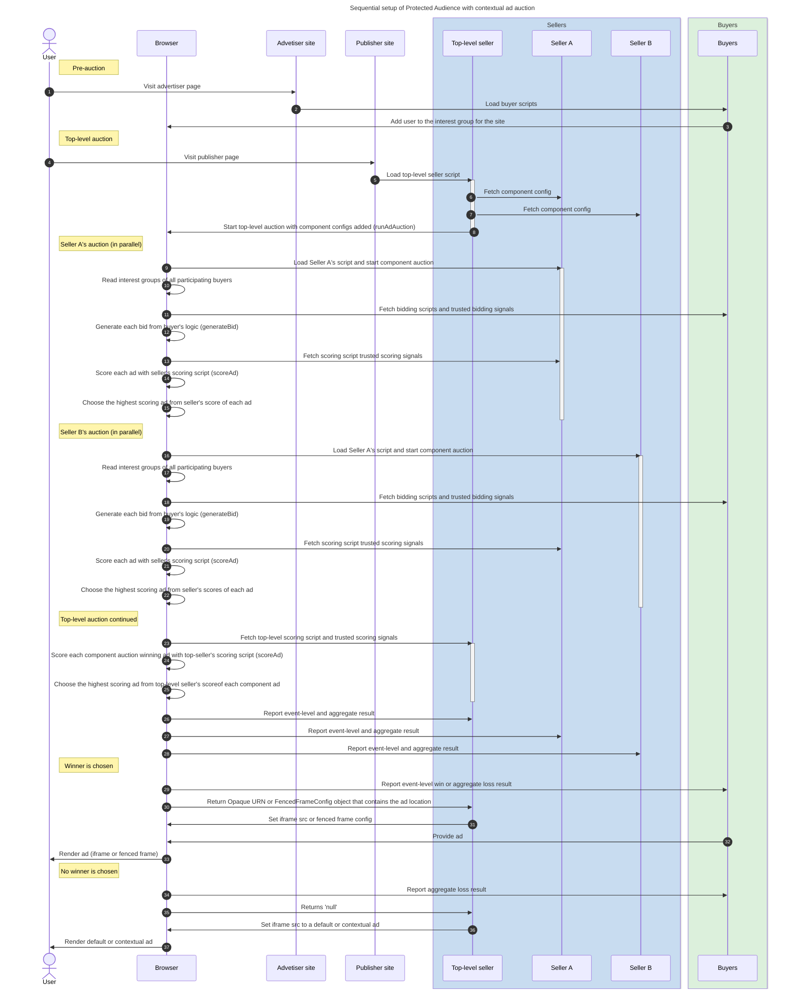

import Tabs from '@theme/Tabs'; import TabItem from '@theme/TabItem';

# Sequential setup of Protected Audience with contextual ad auction

<Tabs>
<TabItem value="overview" label="Overview" default>

## Overview

### Description

While Protected Audience may enable the delivery of more relevant ads by considering cross-site context without relying on tracking identifiers and
third-party cookies, publishers will continue to diversify their ad demand sources with an intention to optimize for revenue. Additionally, there is
always a possibility that the Protected Audience auction may not return a valid result because of multiple reasons such as: no interest groups were
eligible, all eligible ads were blocked, or a timeout was hit, etc. The publisher, regardless of the auction mechanism, would still want to fill the
ad slot with an ad. So, we anticipate that publishers will continue to rely on their current contextual auction setup while exploring Protected
Audience as an additional demand source that may or may not beat the contextual demand floor.

For a deeper walkthrough of this sequential auction setup, see:
[Sequential auction setup with contextual ad auction - Google Developers](https://developers.google.com/privacy-sandbox/private-advertising/auction/sequential-auction)

### Privacy Sandbox APIs

- [Protected Audience](https://developers.google.com/privacy-sandbox/private-advertising/protected-audience)
- [Fenced Frames](https://developers.google.com/privacy-sandbox/private-advertising/fenced-frame)

### Related parties

- Publisher
- Publisher Ad Server
- Supply Side Platform (SSP)
- Advertiser
- Demand Side Platform (DSP)

</TabItem>
<TabItem value="scope" label="Scope">

## Scope

### Goals

In this demo, we aim to demonstrate a basic sequential auction setup with a focus on the data flow from the perspective of the Protected Audience
auction and abstract a lot of the technical nuance of the contextual auction. Building on the
[basic retargeting / remarketing ad campaign use-case demo](retargeting-remarketing), this demo shows a more realistic sequential setup with multiple
buyers and sellers participating in the ad delivery process. This demo will also demonstrate SSPs sourcing `buyerSignals` from DSPs and including them
in the Protected Audience auction configuration.

### Key Exclusions

This demo abstracts a lot of the complexity in the contextual auction. For starters, this demo doesn't integrate with any real header bidding library.
Additionally, this demo doesn't aim to replicate the integration patterns between the publisher ad server and other ad sellers or SSPs across various
ad delivery setups. This demo focuses on a few exemplary 'signals' as opposed to an industry spec such as OpenRTB.

### System Design

// TODO: Building on the existing single seller auction, ...

#### Protected Audience Flow


#### User Journey



</TabItem>
<TabItem value="demo" label="Demo">

## Demo

### Prerequisites

- Latest stable version of Chrome (Open `chrome://version` to check your current version)
- Enable Privacy Sandbox APIs (Open `chrome://settings/adPrivacy` to enable _Site-suggested ads_)
- Clear your browsing history before you run one of the demo scenario below (Open `chrome://settings/clearBrowserData` to delete your browsing
  history)

### User Journey

1. [Navigate to shop site](https://privacy-sandbox-demos-shop.dev/) (advertiser)
2. Click on any "shoe" product item on the shop site.
   - The shop (advertiser) would assume the user is interested in this type of product, so they would leverage Protected Audience API and ask the
     browser to join an ad interest group for this product or this specific product category.
3. [Navigate to the news site](https://privacy-sandbox-demos-news.dev/) (publisher)
4. Observe the ad served on the news site
   - If you previously browsed the "shoe" product on the shop site, you will be shown an ad for the same product.
   - When the page was loaded, Protected Audience API allowed the SSP to run an ad auction on the publisher site.
   - The winning advertiser of this ad auction gets their ad creative to be displayed on the publisher site. In this case you have cleared the browser
     history and only browsed 1 advertiser site page so you are only seeing 1 ad creative from the same advertiser.

### Implementation details

#### How is the user added to an Interest Group based on their browsing behavior? (see step #2 of User Journey)

The shop product page includes one or more third-party tags from the DSP services:
[dsp-tag.js](https://github.com/privacysandbox/privacy-sandbox-demos/blob/main/services/shop/src/views/item.ejs#L92).

```html title="DSP tag on advertiser page: https://privacy-sandbox-demos-shop.dev/items/1f45e"
<script
  src="https://privacy-sandbox-demos-dsp.dev/js/dsp/dsp-tag.js"
  class="dsp_tag"
  data-advertiser="privacy-sandbox-demos-shop.dev"
  data-item-id="1f45e"
></script>
```

The [dsp-tag.js](https://github.com/privacysandbox/privacy-sandbox-demos/blob/main/services/ad-tech/src/public/js/dsp/dsp-tag.js#L97) dynamically
injects an iframe in the DSP's origin to the advertiser's page.

```html title="DSP iframe on advertiser page: https://privacy-sandbox-demos-shop.dev/items/1f45e"
<iframe
  width="1"
  height="1"
  src="https://privacy-sandbox-demos-dsp.dev/dsp/dsp-advertiser-iframe.html?advertiser=privacy-sandbox-demos-shop.dev&amp;id=1f45e"
  allow="join-ad-interest-group"
></iframe>
```

This third-party DSP iframe includes a script
[join-ad-interest-group.js](https://github.com/privacysandbox/privacy-sandbox-demos/blob/main/services/ad-tech/src/public/js/dsp/join-ad-interest-group.js)
to join an interest group using the Protected Audience API. To do so, the DSP tag retrieves the interest group object from its server from
[https://privacy-sandbox-demos-dsp.dev/dsp/interest-group.json](https://github.com/privacysandbox/privacy-sandbox-demos/blob/main/services/ad-tech/src/routes/dsp/buyer-router.ts#L46).

```js title="Script loaded in DSP iframe: https://privacy-sandbox-demos-dsp.dev/dsp/dsp-advertiser-iframe.html"
/** Sends first-party context to server to retrieve interest group metadata. */
getInterestGroupFromServer = async () => {
  const currentUrl = new URL(location.href);
  const interestGroupUrl = new URL(location.origin);
  interestGroupUrl.pathname = '/dsp/interest-group.json';
  // Copy query params from current context.
  for (const [key, value] of currentUrl.searchParams) {
    interestGroupUrl.searchParams.append(key, value);
  }
  const res = await fetch(interestGroupUrl, {browsingTopics: true});
  if (res.ok) {
    return res.json();
  }
};

document.addEventListener('DOMContentLoaded', async () => {
  if (navigator.joinAdInterestGroup === undefined) {
    console.log('[PSDemo] Protected Audience API is not supported.');
    return;
  }
  const interestGroup = await getInterestGroupFromServer();
  console.log('[PSDemo] Joining interest group: ', {interestGroup});
  const kSecsPerDay = 3600 * 24 * 30;
  console.log(
    await navigator.joinAdInterestGroup(interestGroup, kSecsPerDay),
  );
});
```

#### How is the relevant ad delivered to the user? (see step #4 of User Journey)

The news page lists the available ad slot on the page in the
[`window.PSDemo.PAGE_ADS_CONFIG`](https://github.com/privacysandbox/privacy-sandbox-demos/blob/main/services/news/src/views/index.ejs#L17) object.

```js title="Publisher configures ad slots on page: https://privacy-sandbox-demos-news.dev"
window.PSDemo.PAGE_ADS_CONFIG = Object.freeze({
  adUnits: [{
    code: 'displayFencedFrameAdUnit',
    auctionId: `PUB-${crypto.randomUUID()}`,
    divId: 'display-ad--fenced-frame',
    adType: 'DISPLAY',
    size: [300, 250],
    isFencedFrame: true,
  }],
});
```

To deliver an ad for this ad slot, the news page also includes a third-party tag:
[run-simple-ad-auction.js](https://github.com/privacysandbox/privacy-sandbox-demos/blob/main/services/news/src/views/index.ejs#L60) from the SSP
service.

```html title="SSP tag on publisher page: https://privacy-sandbox-demos-news.dev"
<script
  async
  defer
  src="https://privacy-sandbox-demos-ssp.dev/js/ssp/run-simple-ad-auction.js"
></script>
```

This
[run-simple-ad-auction.js](https://github.com/privacysandbox/privacy-sandbox-demos/blob/main/services/ad-tech/src/public/js/ssp/run-simple-ad-auction.js)
script executes a Protected Audience auction using auction configurations retrieved from its server.

```js title="SSP script loaded on publisher page: https://privacy-sandbox-demos-news.dev"
document.addEventListener("DOMContentLoaded", async (e) => {
  // Retrieve auction configuration from its own server.
  const auctionConfig = await getAuctionConfig(adUnit);
  // Execute the Protected Audience auction.
  const adAuctionResult = await navigator.runAdAuction(auctionConfig);
  // Finally handle the auction result.
  if (!adAuctionResult) {
    document.getElementById(adUnit.divId).innerText = 'No eligible ads';
  } else {
    const adFrame = document.createElement('fencedframe');
    adFrame.config = adAuctionResult;
    [adFrame.width, adFrame.height] = adUnit.size;
    log('delivering ads in ', {
      adFrame,
      adUnit,
      auctionConfig,
      adAuctionResult,
    });
    document.getElementById(adUnit.divId).appendChild(adFrame);
  }
});
```

The Protected Audience auction is orchestrated by the browser, executing bidding and decision logic provided by the ad buyer and ad seller
respectively to arrive at the winning ad. The result of this ad auction is displayed within a Fenced Frame. This ad auction result represents the
winning [`renderURL`](https://github.com/privacysandbox/privacy-sandbox-demos/blob/main/services/ad-tech/src/routes/common/ads-router.ts#L34) included
in the interest group.

```html title="Protected Audience auction result delivered in a fenced-frame"
<fencedframe width="300" height="250">
  #document (https://privacy-sandbox-demos-dsp.dev/ads/display-ads?advertiser=privacy-sandbox-demos-shop.dev&itemId=1f460)
  <html lang="en">
    …
  </html>
</fencedframe>
```

## Related API documentation

- [Protected Audience Overview - Google Developers](https://developers.google.com/privacy-sandbox/private-advertising/protected-audience)
- [Protected Audience Developer Guide - Google Developers](https://developers.google.com/privacy-sandbox/private-advertising/protected-audience-api)
- [Sequential setup with contextual ad auction - Google Developers](https://developers.google.com/privacy-sandbox/private-advertising/auction/sequential-auction)
- [Fenced Frames Overview - Google Developers](https://developers.google.com/privacy-sandbox/private-advertising/fenced-frame)

</TabItem>
</Tabs>
