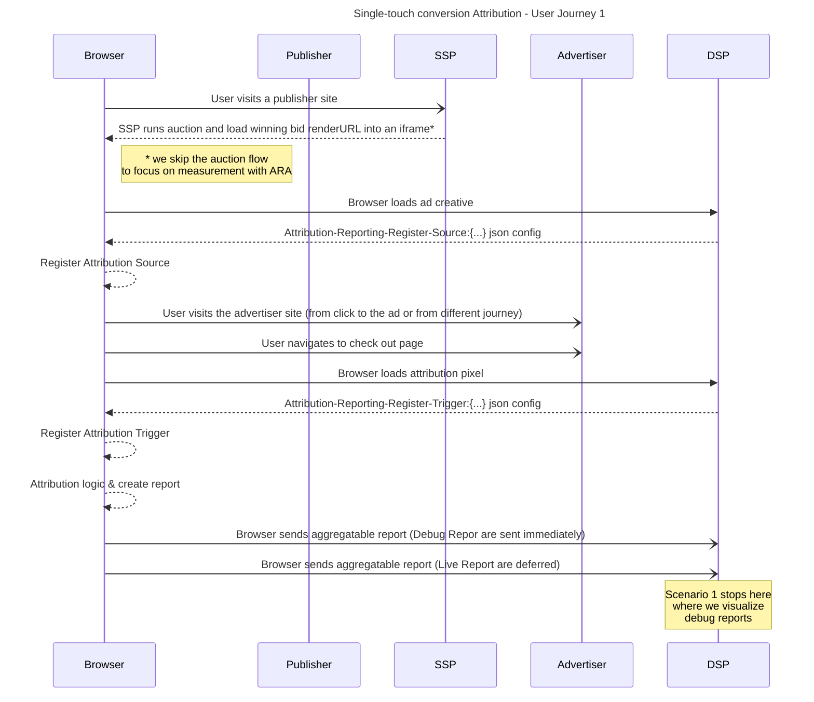

import Tabs from '@theme/Tabs'; import TabItem from '@theme/TabItem';

# Single-touch Conversion Attribution

<Tabs>
<TabItem value="overview" label="Overview" default>

## Overview

### Description

This type of measurement tracks conversions that occur directly as a result of seeing an ad, such as when a user clicks on an ad and then makes a
purchase on the advertiser's website. Single-touch attribution models are easy to understand and implement, and they can be a good option for
businesses with limited data or resources. However, they can also be inaccurate, as they do not account for the influence of other touch points on a
conversion.

### Privacy Sandbox APIs and related documentation

- [Attribution Reporting API](https://privacysandbox.google.com/private-advertising/attribution-reporting)

### Related parties

- Publisher
- SSP
- Advertiser
- DSP

</TabItem>
<TabItem value="design" label="Design">

## Design

### Goals

In this demo, we assume an advertiser would like to measure the effectiveness of marketing campaigns. Single-touch attribution can help by tracking
the number of conversions as well as the purchased value that can be attributed to each touch point (viewing or clicking an ad). This information can
be used to improve the advertiser’s marketing campaigns and get more value from their marketing budget.

### Assumptions

This use case assumes the advertiser (e.g. EC site) has contracted with a publisher or won a bid to display their product ads on the publisher site
(e.g. News site). This use case does not cover ad-targeting specifics, so we assume the user would be presented with a relevant ad leading to a
conversion (purchase of a product).

### Key Exclusions

The demo does not show Aggregation Service and noised aggregation reports. The current demo shows the aggregatable reports (debug report
non-encrypted) before it is sent to the aggregation service (encrypted).

### System Design

The user visits a news site where an ad is rendered. Using Attribution Reporting API & Summary Reports, a view-through conversion source event is
registered. The user clicks on the ads, a click-through conversion source is registered. Then the user navigates to the advertiser page (shopping
site), clicks "Add to cart" then on the `cart` page, clicks on the payment button. The browser registers a conversion trigger event and a summary
report (debug report) is sent to the advertiser.

#### Attribution Reporting Flow

Below is a general introduction of Single-Touch conversion Attribution using Privacy Sandbox Attribution Reporting API. For further information see
[Attribution Reporting - Chrome Developers](https://privacysandbox.google.com/private-advertising/attribution-reporting/) .


#### User Journey #1



</TabItem>
<TabItem value="demo" label="Demo">

## Demo

### Prerequisites

- Latest stable version of Chrome (Open `chrome://version` to check your current version)
- Enable Privacy Sandbox APIs (Open `chrome://settings/adPrivacy` to enable _Site-suggested ads_ and*Ad measurement*)
- Clear your browsing history before you run one of the demo scenario below (Open `chrome://settings/clearBrowserData` to delete your browsing
  history)
- Open chrome://attribution-internals and click "Clear all attribution data"

### User Journey #1

1. [Navigate to shop site](https://privacy-sandbox-demos-shop.dev/) (advertiser)
2. Click on a "shoe" product item on the shop site.

- The shop (advertiser) would assume the user is interested in this type of product, so they would leverage Protected Audience API and ask the browser
  to join an ad interest group for this product or this specific product category.

3. [Navigate to the news site](https://privacy-sandbox-demos-news.dev/) (publisher)
4. Observe the ad served on the news site

- If you previously browsed the "shoe" product on the shop site, you will be shown an ad for the same product.
- Displaying the ad will also register an attribution **source** of type **event** into your browser using the **Attribution Reporting API** (used for
  view-through conversion measurement)

5. Click on the ad served on the news site

- your browser will open a new window with the product page
- Clicking the ad will also register an attribution **source** of type **navigation** into your browser using the **Attribution Reporting API** (used
  for click-through conversion measurement)

6. Navigate to chrome://attribution-internals/ and click the `Active Sources` tab

- At the bottom of the page, you will see 2 **sources** with the status `Attributable`, the `source origin` is the **news** site, the `destination` is
  the **shop** site and the `reporting origin` is one of the **DSP** services (dsp-a, dsp-b etc.). One of the `source type` is **event** (for
  view-through) and the other one is **navigation** (for click-through) This reference will be used later to attribute (match) the conversion (here
  the. purchase of an item on the **shop** site) to a previous event (here. The user saw/clicked an ad on the **news** site)

7. On the product page, click "Add to cart"
8. On the `cart` page, click on the payment button.

- In this scenario the "purchase" event is the conversion event the advertiser wants to measure to evaluate the performance of their ad campaign.
- The `checkout` page **triggers** the conversion attribution for the `source` whose eTLD+1 matches the eTLD+1 of the site provided in `destination`
  (here privacy-sandbox-demos-shop.dev) . The **Attribution Reporting API** logic will then process the event.

9. Navigate to chrome://attribution-internals/ and click the `Trigger Registration` tab

- You will see multiple **triggers**. Their `destination` is the **shop** site and the `reporting origin` is set to one of the **DSP** services.
  Observe that only the trigger(s) whose `reporting origin` matches the `reporting origin` of the previously registered **source** has a status
  `Success: Report stored` in the column `Event-Level/Aggregatable Result`. The `Registration JSON` contains information about the conversion event.
  In this scenario the advertiser chose to report the gross price and the quantity of the product item purchased. the `Aggregatable Status` indicates
  **Success: Report stored**, it means Attribution Reporting API has now stored this report in the browser. It will then be scheduled for sending to
  the `reporting origin` at a later time.

10. Navigate to the DSP service report visualization page `https://<reporting-origin>/reporting/view-reports` (replace the url with the reporting
    origin of the **DSP** service)

- on this page you can see the aggregatable report sent by the browser to the DSP. In a production environment, the aggregatable report is encrypted
  by the browser and sent to the DSP. There, they will be batched and sent to the Aggregation Service where they will be aggregated and noised to
  preserve privacy. However for development and testing purposes, you can also send an unencrypted version called **debug report**. This is what you
  are seeing now.
- The report shows aggregation data in 2 dimensions : 1. gross price with a value of 1120. 2.quantity with a value of 1.

### Implementation details

#### how do we attribute the conversion to seeing an ad ? (see step #5 of User Journey)

First on the Attribution Source registration side. Look at the bidding logic
javascript[code](https://github.com/privacysandbox/privacy-sandbox-demos/blob/67d4c6368ff422ad9e952961352b5ac74ee9f500/services/ad-tech/src/public/js/dsp/default/auction-bidding-logic.js#L313)
below

```html
 registerAdBeacon({
    'impression': `${browserSignals.interestGroupOwner}/reporting?report=impression&${additionalQueryParams}`,
    'reserved.top_navigation_start': `${browserSignals.interestGroupOwner}/reporting?report=top_navigation_start&${additionalQueryParams}`,
    'reserved.top_navigation_commit': `${browserSignals.interestGroupOwner}/reporting?report=top_navigation_commit&${additionalQueryParams}`,
  });
```

The `impression` event will be triggered when the ad is rendered within the fenced frame and the `reserved.top_navigation_commit` will be triggered
when clicking the ad and navigating to the advertiser site. After clicking the ad, open the Chrome Developers Tools, look at the HTTP request starting
by `https:/<reporting-origin>/reporting?report=top_navigation_commit` you will see a new attribute added by the browser
`Attribution-Reporting-Eligible` with the value `navigation-source` In the HTTP response to this request, you will see a new header
`Attribution-Reporting-Register-Source:` with a value that contains the attribution source parameters.

```json
{
  "destination": "https://privacy-sandbox-demos-shop.dev",
  "source_event_id": "2510975139472269",
  "debug_key": "2978442217652084",
  "debug_reporting": true,
  "aggregation_keys": {
    "quantity": "0x0",
    "gross": "0x0"
  }
}
```

You can also refer to the
[source code](https://github.com/privacysandbox/privacy-sandbox-demos/blob/67d4c6368ff422ad9e952961352b5ac74ee9f500/services/ad-tech/src/lib/attribution-reporting-helper.ts#L89)
to see how the response header `Attribution-Reporting-Register-Source` was formed.

Second, on the Attribution Trigger side (=Conversion) The checkout page contains a 1 pixel image loaded from the code

```html

```

Now using the Developers Tools, look at the HTTP response to the `/attribution/register-trigger` request. You will see a new header
`Attribution-Reporting-Register-Trigger:` with a value that contains the attribution trigger parameters, including the values the advertiser would
like to see aggregated in the summary report (in this example gross and quantities)

```json
{
  "event_trigger_data": [
    {
      "trigger_data": "1",
      "priority": "100"
    }
  ],
  "aggregatable_trigger_data": [
    {
      "key_piece": "0x000000000000000032020000",
      "source_keys": [
        "quantity"
      ]
    },
    {
      "key_piece": "0x000000000000000032020000",
      "source_keys": [
        "gross"
      ]
    }
  ],
  "aggregatable_values": {
    "quantity": 1,
    "gross": 1120
  },
  "debug_key": "3092224669950736"
}
```

You can also refer to the
[source code](https://github.com/privacysandbox/privacy-sandbox-demos/blob/67d4c6368ff422ad9e952961352b5ac74ee9f500/services/ad-tech/src/lib/attribution-reporting-helper.ts#L47)
to see how the response header `aggregatable_trigger_data` was formed.

### API Reference

- [Attribution Reporting for Web overview | Privacy Sandbox | Google for Developers](https://privacysandbox.google.com/private-advertising/attribution-reporting)
- [Attribution Reporting API developer guide | Privacy Sandbox | Google for Developers](https://privacysandbox.google.com/private-advertising/attribution-reporting/dev-guide)
- [Introduction to Attribution Reporting debug reports | Privacy Sandbox | Google for Developers](https://privacysandbox.google.com/private-advertising/attribution-reporting/attribution-reporting-debugging)
- [Fenced_Frames_Ads_Reporting.md on GitHub](https://github.com/WICG/turtledove/blob/main/Fenced_Frames_Ads_Reporting.md)

</TabItem>
</Tabs>
