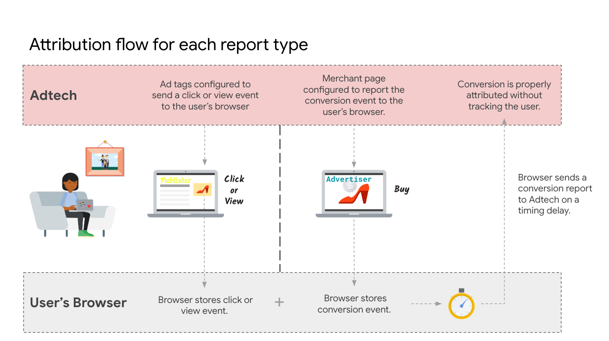
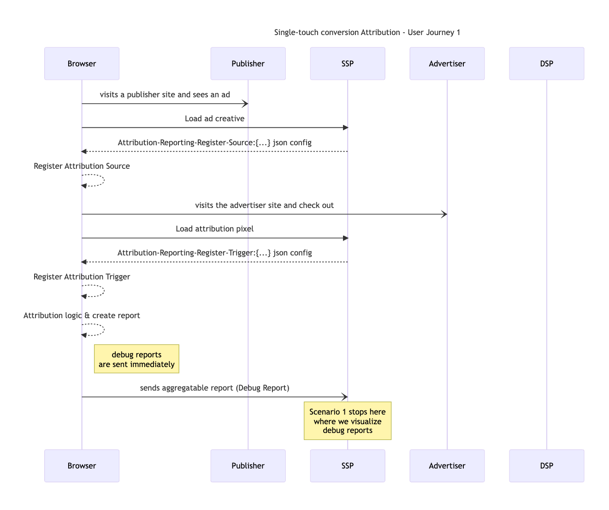
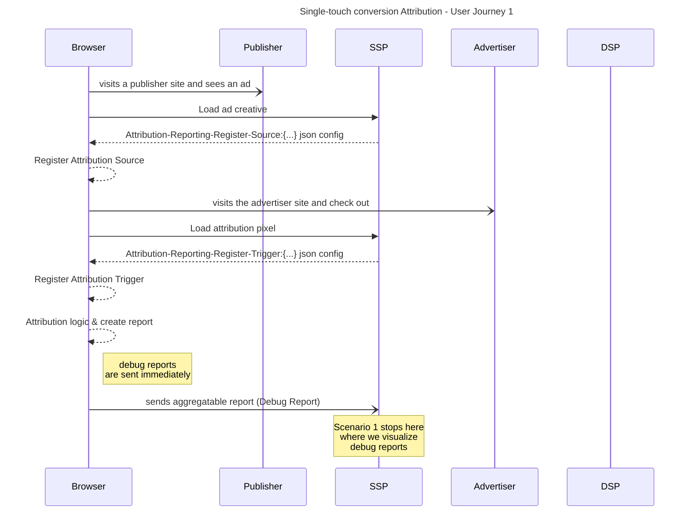

import Tabs from '@theme/Tabs';
import TabItem from '@theme/TabItem';

# Single-touch conversion Attribution

<Tabs>
<TabItem value="overview" label="Overview" default>

## Overview

### Description

This type of measurement tracks conversions that occur directly as a result of seeing an ad, such as when a user clicks on an ad and then makes a purchase on the advertiser's website.
Single-touch attribution models are easy to understand and implement, and they can be a good option for businesses with limited data or resources. However, they can also be inaccurate, as they do not account for the influence of other touch points on a conversion.

### Privacy Sandbox APIs

- [Attribution Reporting API](https://developer.chrome.com/en/docs/privacy-sandbox/attribution-reporting/)
- [Aggregation Service](https://developer.chrome.com/docs/privacy-sandbox/aggregation-service/)

### Related parties

- Publisher
- SSP
- Advertiser
- DSP

</TabItem>
<TabItem value="scope" label="Scope">

## Scope

### Goals

In this demo, we assume an advertiser would like to measure the effectiveness of marketing campaigns. Single-touch attribution can help by tracking the number of conversions as well as the purchased value that can be attributed to each touch point (viewing or clicking an ad). This information can be used to improve the advertiser’s marketing campaigns and get more value from their marketing budget.

### Assumptions

This use case assumes the advertiser (e.g. EC site) has contracted with a publisher or won a bid to display their product ads on the publisher site (e.g. News site). This use case does not cover ad-targeting specifics, so we assume the user would be presented with a relevant ad leading to a conversion (purchase of a product).

### Key Exclusions

The demo does not show Aggregation Service and noised aggregation reports. The current demo shows the aggregatable reports (debug report non-encrypted) before it is sent to the aggregation service (encrypted).

### System Design

The user visits a news site where an ad is rendered. Using Attribution Reporting API & Summary Reports, a view-through conversion source event is registered. The user clicks on the ads, a click-through conversion source is registered. Then the user navigates to the advertiser page (shopping site), clicks “Add to cart” then “Checkout”. The browser registers a conversion trigger event and a summary report (debug report) is sent to the advertiser.

#### Attribution Reporting Flow

Below is a general introduction of Single-Touch conversion Attribution using Privacy Sandbox Attribution Reporting API. For further information see [Attribution Reporting - Chrome Developers](https://developer.chrome.com/docs/privacy-sandbox/attribution-reporting/) .



#### User Journey #1

<!--

-->



</TabItem>
<TabItem value="demo" label="Demo">

## Demo

### Prerequisites

- Chrome > v107
- Enable Privacy Sandbox APIs
- Clear your browsing history before you run one of the demo scenario below
- Open chrome://attribution-internals/ and click “Clear all attribution data”

### User Journey #1

1. [Navigate to shop site](https://privacy-sandbox-demos-shop.dev/) (advertiser)
2. Click on a “shoe” product item on the shop site.

- The shop (advertiser) would assume the user is interested in this type of product, so they would leverage Protected Audience API and ask the browser to join an ad interest group for this product or this specific product category.

3. [Navigate to the news site](https://privacy-sandbox-demos-news.dev/) (publisher)
4. Observe the ad served on the news site

- If you previously browsed the “shoe” product on the shop site, you will be shown an ad for the same product.
- Displaying the ad will also register a view-through conversion **source** event into your browser using the **Attribution Reporting API**.

5. Click on the ad served on the news site

- your browser will open a new window with the product page
- Clicking the ad will also register a click-through conversion **source** event into your browser using the **Attribution Reporting API**.

6. Navigate to chrome://attribution-internals/ and click the `Active Sources` tab

- At the bottom of the page, you will see 2 **sources** with the status `Attributable`, the `source origin` is the **news** site, the `destination` is the **shop** site and the `reporting origin` is the **SSP** service. One of the `source type` is **event** (for view-through) and the other one is **navigation** (for click-through) This reference will be used later to attribute (match) the conversion (here the. purchase of an item on the **shop** site) to a previous event (here. The user saw/clicked an ad on the **news** site)

7. On the product page, click “Add to cart”
8. On the cart page, click “Checkout”

- In this scenario the “checkout” event is the conversion event the advertiser wants to measure to evaluate the performance of their ad campaign,
- The checkout page registers a conversion attribution **trigger** event in the browser. The **Attribution Reporting API** logic will then process the event.

9. Navigate to chrome://attribution-internals/ and click the `Trigger Registration` tab

- At the bottom of the page, you will see 1 **trigger** . the `destination` is the **shop** site and the `reporting origin` is the **SSP** service. The `Registration JSON` contains information about the conversion event. In this scenario the advertiser chose to report the gross price and the quantity of the product item purchased. the `Aggregatable Status` indicates **Success: Report stored**, it means Attribution Reporting API has now stored this report in the browser. It will then be scheduled for sending to the `reporting origin` at a later time.

10. Navigate to [SSP service report visualization page](https://privacy-sandbox-demos-ssp.dev/reports)

- on this page you can see the aggregatable report sent by the browser to the SSP. In a production environment, the aggregatable report is encrypted by the browser and sent to the SSP. There, they will be batched and sent to the Aggregation Service where they will be aggregated and noised to preserve privacy. However for development and testing purposes, you can also send an unencrypted version called **debug report**. This is what you are seeing now.
- The report shows aggregation data on 2 dimensions : gross with a value of 180 and quantity with a value of 1.

### Implementation details

#### In (5) how do we attribute the conversion to seeing an ad ?

First on the Attribution Source registration side.
Look at the [code](https://github.com/privacysandbox/privacy-sandbox-demos/blob/main/services/ssp/src/views/ads.html.ejs) displaying the ad creative

```html
<a
  width="300"
  height="250"
  target="_blank"
  attributionsrc=""
  href="https://privacy-sandbox-demos-ssp.dev/move?advertiser=privacy-sandbox-demos-shop.dev&amp;id=1f45e"
>
  
</a>
```

The `img` tag also specifies the `attributionsrc` attribute. It means that showing this ad will register a view-through attribution source event in the browser.
Now using Developers Tools, look at the HTTP request you will see a new attribute added by the browser `Attribution-Reporting-Eligible` with the value `Attribution-Reporting-Eligible`
In the HTTP response to the `/creative` request, you will see a new header `Attribution-Reporting-Register-Source:` with a value that contains the attribution source parameters.

```json
{
  "destination": "https://privacy-sandbox-demos-shop.dev",
  "source_event_id": "18446744073709551615",
  "debug_key": "18446744073709551614",
  "aggregation_keys": { "quantity": "0xc001f45e000000000000000000000000", "gross": "0xc101f45e000000000000000000000000" }
}
```

You can also refer to the [source code](https://github.com/privacysandbox/privacy-sandbox-demos/blob/8a33afb7433ed70e639047316c5bff30d61be58b/services/ssp/src/index.js#L177) to see how the response header `Attribution-Reporting-Register-Source` was formed.

Second, on the Attribution Trigger side (=Conversion)
The checkout page contains a 1 pixel image loaded from the code

```html

```

Now using the Developers Tools, look at the HTTP response to the `/register-trigger` request. You will see a new header `Attribution-Reporting-Register-Trigger:` with a value that contains the attribution trigger parameters, including the values the advertiser would like to see aggregated in the summary report (in this example gross and quantities)

```json
{
  "aggregatable_trigger_data": [
    { "key_piece": "0x00000000000000008001f45e32010000", "source_keys": ["quantity"] },
    { "key_piece": "0x0000000000000000c001f45e32010000", "source_keys": ["gross"] }
  ],
  "aggregatable_values": { "quantity": 2, "gross": 180 },
  "debug_key": "18446744073709551614"
}
```

You can also refer to the [source code](https://github.com/privacysandbox/privacy-sandbox-demos/blob/8a33afb7433ed70e639047316c5bff30d61be58b/services/ssp/src/index.js#L185) to see how the response header `aggregatable_trigger_data` was formed.

### Related API documentation

- [Attribution Reporting - Chrome Developers](https://developer.chrome.com/docs/privacy-sandbox/attribution-reporting/)
- [Handbook (Experiment with Attribution Reporting)](https://docs.google.com/document/d/1BXchEk-UMgcr2fpjfXrQ3D8VhTR-COGYS1cwK_nyLfg/view)
- [Set up debug reports - Chrome Developers](https://developer.chrome.com/docs/privacy-sandbox/attribution-reporting-debugging/part-2/)

</TabItem>
</Tabs>
