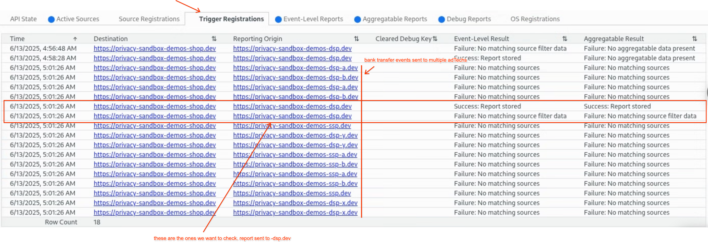

import Tabs from '@theme/Tabs';
import TabItem from '@theme/TabItem';

# Filtering attributions for single-touch conversion attribution
<Tabs>
<TabItem value="overview" label="Overview" default>

## Overview

### Description
#### Problem Statement
Advertisers often face challenges in accurately attributing conversions, especially when user journeys involve interactions with multiple items or actions that aren't directly linked to a specific ad exposure. This complexity can lead to inaccurate measurement of ad effectiveness, making it difficult to determine the true return on investment (ROI) for advertising campaigns. The inability to filter out irrelevant engagements results in inefficient campaign optimization, as resources might be misallocated based on misleading conversion data.
#### Solution Overview
This use case demonstrates how advertisers can leverage the Privacy Sandbox Attribution Reporting API's filtering capabilities to achieve precise conversion measurement. The core challenge addressed is attributing conversions solely to user actions that are directly related to an advertised item, effectively filtering out any irrelevant engagements. In this demo, the process involves configuring specific filters during the initial ad interaction (source) registration. This ensures that only subsequent user actions—such as 'add to cart' or 'purchase' events—that involve the specific advertised items will trigger attribution reports. This granular filtering enables advertisers to gain a more accurate understanding of ad effectiveness by directly linking ad exposure to user engagement with particular products. The ultimate outcome is improved campaign optimization, enabling more efficient allocation of ad spend and a clearer view of campaign ROI.

### Privacy Sandbox APIs
- [Attribution Reporting API](https://privacysandbox.google.com/private-advertising/attribution-reporting)
- [Get started with Attribution Reporting](https://privacysandbox.google.com/private-advertising/attribution-reporting/getting-started)

### Related parties
- Publisher: Hosts ads
- Advertiser: Hosts conversion pages, tracks conversions
- Ad Tech: Implements API, receives cross-site reports
</TabItem>

<TabItem value="design" label="Design">

## Design

### Goals
The primary goal of this use case is to demonstrate the effective application of filter data within the Attribution Reporting API. This demonstration will show how to ensure that only specific item-related events—namely, 'add to cart' and 'purchase' actions that are directly tied to advertised items—are recognized as conversions. By doing so, these filtered conversions will accurately trigger both event-level and summary reports. This precise filtering mechanism allows advertisers to measure the true effectiveness of their ads in driving meaningful engagement and conversions for particular products, thereby providing more accurate insights into campaign return on investment (ROI) and overall performance.
### Assumptions
- The ad tech platform has integrated with the Privacy Sandbox Attribution Reporting API for source and trigger registration and event level, summary report endpoints.
- The advertiser's website can identify the specific item by itemId.
- The ad tech platform can associate specific item identifiers with ad interactions during source registration.
### Key Exclusions
- This demo will focus solely on the filtering mechanism for event-level reports and summary reports. Other features of the Attribution Reporting API are out of scope.
- Complex filter logic beyond exact `item_id` matching will not be covered in this basic demo.
- Only shows click through conversion events as a showcase.
### System Design
#### User Journey
1. **Navigation**: The user navigates to the publisher’s website.
2. **Source Registration (Ad Tech)**: The ad tech platform registers an attribution source via the `Attribution-Reporting-Register-Source` header when the ad is clicked. This registration includes `filter_data` containing the `item_id` (or a list of `item_id`s) relevant to the ad.
3. **Navigation**: The user navigates to the advertiser's website.
4. **Add Items to the cart**: The user adds a specific item to the cart.
5. **Trigger Registration (Advertiser)**: The advertiser's website registers an attribution trigger via the `Attribution-Reporting-Register-Trigger` header. This registration includes `filters`, containing the `item_id` of the added item.
6. **Attribution (Browser)**: The browser matches the source and trigger registration based on multiple criteria and then source and trigger filters are compared for matching (and other criteria). If the `item_id` in the source's `filter_data` matches the `item_id` in the trigger's `filters`, attribution may occur.
7. **Event-Level Report Generation (Browser)**: If attribution occurs and matches the filter data, the browser schedules an event-level report to be sent to the reporting origins.
8. **Purchase the item**: The user proceeds to buy the item from the cart.
9. **Trigger Registration (Advertiser)**: The advertiser's website registers an attribution trigger the same way as event level reports with `aggregation_keys` and `aggregatable_values`.
10. **Aggregatable Report Generation (Browser)**: If attribution occurs and the trigger includes` aggregatable_trigger_data`, the browser generates an aggregatable report.
    - The browser combines the `aggregation_keys` from the attributed source with the `aggregatable_trigger_data` from the trigger to form an encrypted payload.
    - This payload represents contributions to various aggregate measurements (e.g., total purchases or total quantity).
    - The browser encrypts this payload and schedules it to be sent to a designated adtech reporting endpoint. The timing of sending these reports is also delayed and randomized to enhance privacy.


</TabItem>

<TabItem value="demo" label="Demo">

## Demo
### Prerequisites
- Latest stable version of Chrome (Open chrome://version to check).
- Enable Privacy Sandbox APIs (Open chrome://settings/adPrivacy and ensure "Ad measurement" is enabled).
### Steps
#### Part 1: Set Up the Environment and Initial Interaction
1. Clear attribution data in `chrome://attribution-internals/`
2. [Navigate to news site](https://privacy-sandbox-demos-news.dev/mmt-single-touch-attribution-js)
   - a static ad will be displayed
3. Click the ad and navigate to the item detail page of the shop.

#### Part 2: Test Items Not Shown in Ads
4. Open the [shop site](https://privacy-sandbox-demos-shop.dev/) from a new tab and click the item not shown in the ads.
   - E.g. [Women’s Sandal](https://privacy-sandbox-demos-shop.dev/items/1f461)
   - You can check the item ID from the URL `...shop.dev/items/{ItemId}`
5. Click the “ADD TO CART” button.
6. Review “Trigger Registration” and "Event-Level Reports" tab in `chrome://attribution-internals`
   - The trigger is registered but there won’t be any Event-Level Reports


#### Part 3: Test Items Shown in Ads
7. Go back to the shop site opened from step 3 and click “ADD TO CART” button
8. Review “Trigger Registration” and "Event-Level Reports" tab in `chrome://attribution-internals`
   - Both trigger and Event-Level Reports are created


#### Part 4: Checking summary report (Optional)
9. Go to the DSP [report page](https://privacy-sandbox-demos-dsp.dev/reporting/view-reports) and click the “Clear Report Cache” button at the bottom.
10. Go back to the shop site and click “BANK TRANSFER” button
11. Review “Trigger Registration” and “Aggregatable Reports” tab in `chrome://attribution-internals`
   - Only item ID 1f45e trigger is reported



12. Go back to the DSP [report page](https://privacy-sandbox-demos-dsp.dev/reporting/view-reports) and refresh the page.
13. Check the summary report from [report page](https://privacy-sandbox-demos-dsp.dev/reporting/view-reports).


### Implementation details
#### Register a source
The ad tech platform is responsible for ensuring that the correct `item_id` is dynamically included in the `filter_data` during source registration. This `item_id` must correspond precisely to the specific product featured in the ad that the user interacted with, ensuring that only relevant conversions are attributed.

```javascript
// Initiate the source registration


// Complete the source registration
// Attribution-Reporting-Register-Source header
res.set(
  "Attribution-Reporting-Register-Source",
  JSON.stringify({
    source_event_id: "EVENT_ID_123",
    destination: "[https://privacy-sandbox-demos-shop.dev](https://privacy-sandbox-demos-shop.dev)",
    filter_data: {
      item_id: ["1f45e"]
    }
    // ... other source registration parameters
  })
);
```

#### Register a trigger
The  advertiser's website needs to ensure the item_id of the selected product is included during trigger registration.
```javascript
// Trigger registration when add to cart button is clicked
<button type="submit" ... onclick="addToCart({params})">ADD TO CART</button>

// Initiate event level report trigger registration
function addToCart({params}) {
      const registerSourceUrl = "https://privacy-sandbox-demos-dsp.dev/attribution/register-event-level-trigger?itemId=1f45e"
	// ...
      window.fetch(registerSourceUrl, {
        mode: "no-cors",
        keepalive: true,
        attributionReporting: {
          eventSourceEligible: false,
          triggerEligible: true,
        },
      })
    }

// Attribution-Reporting-Register-Trigger
res.set(
  "Attribution-Reporting-Register-Trigger",
  JSON.stringify({
    attribution_destination: "https://adtech.example",
    trigger_data: [
      {
        filters: {
          item_id: ["1f45e"]
        },
// ... other source registration parameters
      }
    ]
  })
);
```

</TabItem>
</Tabs>


