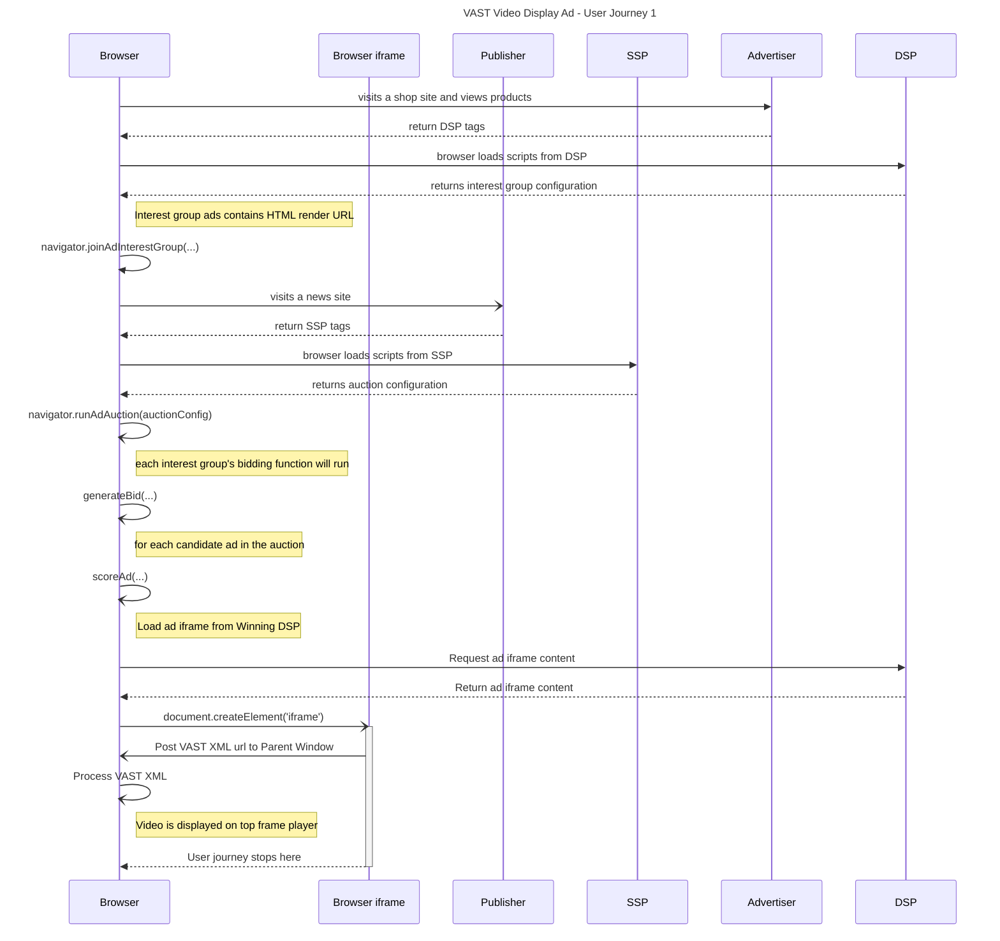

import Tabs from '@theme/Tabs'; import TabItem from '@theme/TabItem';

# VAST Video Protected Audience

<Tabs>
<TabItem value="overview" label="Overview" default>

## Overview

### Description

VAST (Video Ad Serving Template) is a template for structuring ad tags that serve video and audio ads to media players. Using an XML schema, VAST
transfers important metadata about an ad from the ad server to a media player. In the context of Protected Audience API the VAST XML response is
provided within the iFrame for a winning DSP. The following demo provides details on a temporary solution allowing Top Level embedded video players
access to the VAST XML URL.

### Privacy Sandbox APIs

- [Protected Audience API](https://developer.chrome.com/docs/privacy-sandbox/protected-audience/)

### Related parties

- SSP
- DSP

</TabItem>
<TabItem value="scope" label="Scope">

## Scope

### Goals

In this demo, we assume an advertiser would like to display VAST XML URL’s from the winning auction and provide that back to the Top Level embedded
video player resident on the publisher's website. This workaround facilitates this until future fenced frame requirements are enforced.

### Assumptions

This use case assumes the publisher (news site) has one of the many standard VAST XML compliant video players embedded on their site at the top level
and also has an SSP supplying advertisements in the VAST XML format back to said player.

### Key Exclusions

The demo does not integrate existing auction mechanisms (prebid or header bidding…). it is only scoped to on-device auction with Protected Audience
API. The ad selection is very straightforward (only 1 bidder).

### System Design

Using Protected Audience API, the user visits a shopping site, and gets added to an interest group. Later the same user visits a news site. There the
browser runs an on-device Auction, bidding logic will select the winning interest group, and relevant VAST XML video ads will be dynamically rendered
on the publisher page.

#### Protected Audience Flow

Below is a visual overview of the method to pass the VAST XML URL from the Protected Audience API to an embedded video player.


#### User Journey #1 (subset of Retargeting / Remarketing)



</TabItem>
<TabItem value="demo" label="Demo">

## Demo

### Prerequisites

- Chrome >= v115 (Open chrome://version to look up your current version)
- Enable Privacy Sandbox APIs (Open chrome://settings/privacySandbox to enable this setting)
- Clear your browsing history before you run one of the demo scenario below (Open chrome://settings/clearBrowserData to delete your browsing history)

### User Journey #1

1. [Navigate to shop site](https://privacy-sandbox-demos-shop.dev/) (advertiser)
2. Click on a "shoe" product item on the shop site. Append ?adType=video to the product page url and refresh the page.
   - The shop (advertiser) would assume the user is interested in this type of product, so they would leverage Protected Audience API and ask the
     browser to join an ad interest group for this product or this specific product category.
3. [Navigate to the news site video page](https://privacy-sandbox-demos-news.dev/video-ad) (publisher)
4. Scroll to the embedded video player and click ‘Play Content’. Observe the video ad pre-roll served on the news sites embedded player.
   - When the page was loaded, Protected Audience API allowed the SSP to run an ad auction on the publisher site.
   - The winning advertiser of this ad auction gets their video ad creative displayed on the publisher site within the embedded video player.

### Implementation details

#### How is the user added to an Interest Group with video ads based on his browsing behavior? (see step #2 of User Journey)

The shop product page
[includes dsp-tag.js](https://github.com/privacysandbox/privacy-sandbox-demos/blob/939dd4928ec9cb4628b3f9424081bbd912346bcf/services/shop/src/index.ts#L93)
from the DSP service. This is a third-party tag from the DSP service.

```html
<script
  src="https://privacy-sandbox-demos-dsp.dev/dsp-tag.js"
  class="dsp_tag"
  data-advertiser="privacy-sandbox-demos-shop.dev"
  data-id="1f45f"
  data-nscript="afterInteractive"
></script>
```

The
[dsp-tags.js](https://github.com/privacysandbox/privacy-sandbox-demos/blob/939dd4928ec9cb4628b3f9424081bbd912346bcf/services/dsp/src/public/dsp-tag.js#L17)
dynamically embeds an iframe

```html
<iframe
  width="1"
  height="1"
  src="https://privacy-sandbox-demos-dsp.dev/join-ad-interest-group.html?advertiser=privacy-sandbox-demos-shop.dev&amp;id=1f45f&amp;adType=video"
  allow="join-ad-interest-group"
>
</iframe>
```

The iframe calls a third-party script
[join-ad-interest-group.js](https://github.com/privacysandbox/privacy-sandbox-demos/blob/939dd4928ec9cb4628b3f9424081bbd912346bcf/services/dsp/src/public/js/join-ad-interest-group.js#L18)
to join interest group using Protected Audience API

```js title="https://github.com/privacysandbox/privacy-sandbox-demos/blob/f0c3f879c5883a2b3e528e08bccfdd65adbf5c04/services/dsp/src/public/js/join-ad-interest-group.js"
// Protected Audience API
async function getInterestGroupFromServer() {
  const currentUrl = new URL(location.href)
  const interestGroupUrl = new URL(location.origin)
  interestGroupUrl.pathname = "/interest-group.json"
  for (const searchParam of currentUrl.searchParams) {
    interestGroupUrl.searchParams.append(searchParam[0], searchParam[1])
  }
  const res = await fetch(interestGroupUrl)
  if (res.ok) {
    return res.json()
  }
}

document.addEventListener("DOMContentLoaded", async (e) => {
  if (navigator.joinAdInterestGroup === undefined) {
    return console.log("[DEMO] Protected Audience API is not supported")
  }
  const interestGroup = await getInterestGroupFromServer()
  console.log(`[DEMO] ${{ interestGroup }}`)
  const kSecsPerDay = 3600 * 24 * 30
  console.log(await navigator.joinAdInterestGroup(interestGroup, kSecsPerDay))
})
```

This code sets up the interest groups options. Those options are fetched dynamically from
[interest-group.json](https://github.com/privacysandbox/privacy-sandbox-demos/blob/939dd4928ec9cb4628b3f9424081bbd912346bcf/services/dsp/src/index.ts#L50).
For the purpose of this demo the previously utilized adType=video query parameter is passed along with the interestGroupUrl to deliver a video
specific interest group back to the browser.

Finally the code requests the browser to
[join the interest group](https://github.com/privacysandbox/privacy-sandbox-demos/blob/939dd4928ec9cb4628b3f9424081bbd912346bcf/services/dsp/src/public/js/join-ad-interest-group.js#L38)

#### How do we serve a video ad relevant to the user’s interest ? (see step #4 of User Journey)

The [news video page](https://privacy-sandbox-demos-news.dev/video-ad) includes an embedded video player and related video scripts. It also
[includes video-ad-tag.js](https://github.com/privacysandbox/privacy-sandbox-demos/blob/f0c3f879c5883a2b3e528e08bccfdd65adbf5c04/services/ssp/src/public/js/video-ad-tag.js)
from the SSP service. This is a third-party tag from the SSP service.

```html
<div id="mainContainer">
  <div id="content">
    <video id="videoContent">
      <source src="https://storage.googleapis.com/gvabox/media/samples/stock.mp4"></source>
    </video>
  </div>
  <div id="adContainer"></div>
</div>
<button id="playButton">Play Content</button>
<span class="font-mono text-sm">In-stream ADS BY Protected Audience API</span>
<ins class="ads">
  <!-- 3P SSP Ad Tag -->
  <script defer class="ssp_tag" src="<%= `https://${SSP_HOST}:${EXTERNAL_PORT}/js/video-ad-tag.js` %>"></script>
  <!-- Video Content Helper Scripts / SDKs --->
  <script defer src="//imasdk.googleapis.com/js/sdkloader/ima3.js"></script>
  <script defer src="/js/video-ad-helper.js"></script>
</ins>
```

[Video-ad-tag.js](https://github.com/privacysandbox/privacy-sandbox-demos/blob/f0c3f879c5883a2b3e528e08bccfdd65adbf5c04/services/ssp/src/public/js/video-ad-tag.js#L27)
will inject an iframe containing
[video-ad-tag.html](https://github.com/privacysandbox/privacy-sandbox-demos/blob/f0c3f879c5883a2b3e528e08bccfdd65adbf5c04/services/ssp/src/views/video-ad-tag.html.ejs)
and setup an
[event listener to receive the adVastUrl](https://github.com/privacysandbox/privacy-sandbox-demos/blob/939dd4928ec9cb4628b3f9424081bbd912346bcf/services/ssp/src/public/js/video-ad-tag.js#L31)
broadcast.

```js
;(async () => {
  const ins = document.querySelector("ins.ads")
  const script = document.querySelector(".ssp_tag")
  const src = new URL(script.src)
  src.pathname = "/video-ad-tag.html"
  const iframe = document.createElement("iframe")
  iframe.width = 0
  iframe.height = 0
  iframe.src = src
  iframe.setAttribute("allow", "attribution-reporting; run-ad-auction")
  ins.appendChild(iframe)
})()

window.addEventListener("message", (event) => {
  if (!event.origin.startsWith("https://privacy-sandbox-demos-dsp")) return
  if (typeof event.data !== "string") return
  const { adVastUrl } = JSON.parse(event.data)
  setUpIMA(adVastUrl)
})
```

The injected
[video-ad-tag.html](https://github.com/privacysandbox/privacy-sandbox-demos/blob/f0c3f879c5883a2b3e528e08bccfdd65adbf5c04/services/ssp/src/views/video-ad-tag.html.ejs)
iframe contains
[run-video-ad-auction.js](https://github.com/privacysandbox/privacy-sandbox-demos/blob/f0c3f879c5883a2b3e528e08bccfdd65adbf5c04/services/ssp/src/public/js/run-video-ad-auction.js)
which executes the auction and
[injects the video ad result as an iframe](https://github.com/privacysandbox/privacy-sandbox-demos/blob/f0c3f879c5883a2b3e528e08bccfdd65adbf5c04/services/ssp/src/public/js/run-video-ad-auction.js#L37)
to the page.

```html
<!-- Video Ad HTML Returned From Protected Audience Auction --->
<!DOCTYPE html>
<html lang="en">
  <head>
    <meta charset="utf-8" />
    <script src="/js/video-ad-creative.js"></script>
  </head>
</html>
```

The video-ad-creative.js script contains the DSP Video Ad Creative URL and adVastURL. Using post message this will be broadcast back out to the
original event listener found in
[video-ad-tag.html](https://github.com/privacysandbox/privacy-sandbox-demos/blob/f0c3f879c5883a2b3e528e08bccfdd65adbf5c04/services/ssp/src/views/video-ad-tag.html.ejs)
provided by the SSP and
[setUpIMA(adVastUrl)](https://github.com/privacysandbox/privacy-sandbox-demos/blob/939dd4928ec9cb4628b3f9424081bbd912346bcf/services/ssp/src/public/js/video-ad-tag.js#L35)
is executed.

```javascript
;(async () => {
  const data = {
    adVastUrl:
      "https://pubads.g.doubleclick.net/gampad/ads?" +
      "iu=/21775744923/external/single_ad_samples&amp;sz=640x480&" +
      "cust_params=sample_ct%3Dlinear&ciu_szs=300x250%2C728x90&" +
      "gdfp_req=1&output=vast&unviewed_position_start=1&env=vp&" +
      "impl=s&correlator="
  }
  window.top.postMessage(JSON.stringify(data), "*")
})()
```

The
[video-ad-helper.js](https://github.com/privacysandbox/privacy-sandbox-demos/blob/939dd4928ec9cb4628b3f9424081bbd912346bcf/services/news/src/public/js/video-ad-helper.js)
and IMA SDK both assist in the local video player environment using the passed in adTagUrl from
[video-ad-tag.js](https://github.com/privacysandbox/privacy-sandbox-demos/blob/939dd4928ec9cb4628b3f9424081bbd912346bcf/services/ssp/src/public/js/video-ad-tag.js#L35C5-L35C24)
resulting in the sample pre-roll video being loaded and shown when the user clicks play.

### Related API documentation

- [Protected Audience API - Chrome Developers](https://developer.chrome.com/docs/privacy-sandbox/protected-audience/)
- [Protected Audience API: developer guide](https://developer.chrome.com/docs/privacy-sandbox/protected-audience-api/)
- [IMA HTML5 Video Suite Inspector](https://googleads.github.io/googleads-ima-html5/vsi/)
- [Sample Pre-roll Vast Tag](https://pubads.g.doubleclick.net/gampad/ads?iu=/21775744923/external/single_preroll_skippable&sz=640x480&ciu_szs=300x250%2C728x90&gdfp_req=1&output=vast&unviewed_position_start=1&env=vp&impl=s&correlator=)

</TabItem>
</Tabs>
