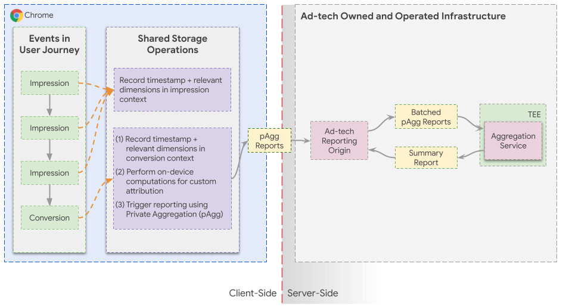
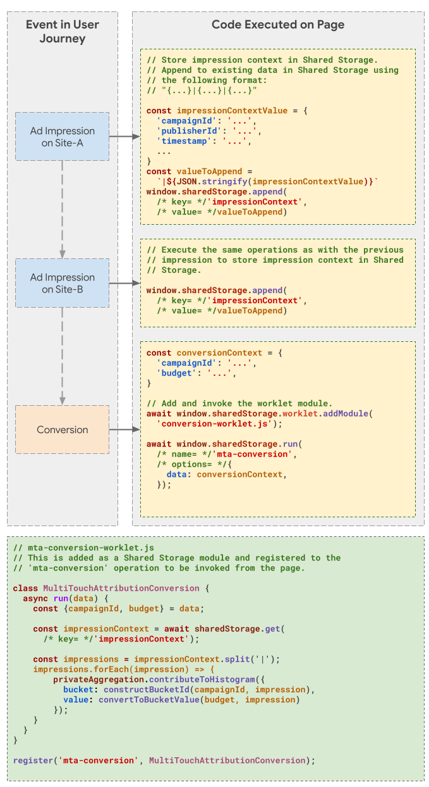

import Tabs from '@theme/Tabs'; import TabItem from '@theme/TabItem';

# Multi-touch conversion Attribution

<Tabs>
<TabItem value="overview" label="Overview" default>

## Overview

### Description

Marketing attribution is a method used by advertisers to determine the contribution of marketing tactics and subsequent ad interactions to sales or
conversions.

There are various types of attribution models, including first-touch and last-touch attribution, which are single-touch attribution models.
Single-touch attribution models assign 100% of the conversion credit to a single touchpoint in the customer journey. In first-touch attribution, the
credit is assigned to the first touchpoint. While in last-touch attribution, the credit is assigned to the last touchpoint before the conversion.
Attribution can also be shared across multiple touchpoints in the customer journey, where credit is distributed among the different touchpoints. This
is called multi-touch attribution.

### Privacy Sandbox APIs

- [Private Aggregation](https://developers.google.com/privacy-sandbox/relevance/private-aggregation)
- [Shared Storage](https://developers.google.com/privacy-sandbox/relevance/shared-storage)
- [Aggregation Service](https://developers.google.com/privacy-sandbox/relevance/aggregation-service)

### Related parties

- Publishers
- Advertiser
- DSP

</TabItem>
<TabItem value="scope" label="Scope">

## Scope

### Goals

In this demo, we assume that the AdTech wants to calculate multi-touch attribution based on nodes (separate aggregate contributions for each
impression touch point). Which means that on a per conversion basis, the AdTech (DSP) is capturing the purchase amount and a credit fraction for the
publisher (e.g. $100: 50% to "publisher 1", 25% to "publisher 2" and 25% to "publisher 3"). With this information, AdTech can optimize their campaign
by bidding more frequently and/or with a higher amount for a specific publisher in the future.

To keep this example simple, during the conversion, we will divide the purchase amount (budget) equally between all sites that displayed this
ad/campaign. However, you can also use a similar implementation if you want to calculate it based on path. In this
[Multi-Touch Attribution article](https://developers.google.com/privacy-sandbox/private-advertising/private-aggregation/multi-touch-attribution), you
can learn more about these two different strategies and decide which one is the best for you.

This demo uses the Shared Storage and Private Aggregation APIs, as they enable the data capture and aggregated measurement of multiple touchpoints on
a single browser.

### Key Exclusions

To focus on the measurement aspect of the multi-touch attribution use-case, we will be simplifying the setup by rendering an ad directly without
integrating the delivery via the Protected Audience API.

The custom logic for multi-attribution touch calculates the budget based on nodes but the user can change it to use path or any other strategy based
on their needs.

### System Design

1. User sees an ad on "news site" → Adtech stores context from the ad view in Shared Storage along with other dimensions for the user including the
   impression timestamp.

2. User sees another ad on "travel site" → Adtech stores context from the ad view in Shared Storage as earlier.


3. User converts by making a purchase on the "shop site" → Adtech can reference the context stored in Shared Storage to generate a custom attribution
   report using the Private Aggregation API.

   - In this demo, the AdTech chooses to represent the impression touch points as singular nodes and each node will be represented in the 128-bit
     aggregation key (aka bucket) along with a campaignId and a Publisher ID.
   - So, the AdTech can reference the impression context in Shared Storage to distribute credit across the impressions. For example, 50% to the most
     recent impression and 50% divided equally for all other impressions.

4. AdTech batches the received aggregatable reports and processes them with the Aggregation Service which returns a summary report.



#### User Journey #1

```mermaid
sequenceDiagram
Title: Multi-touch Attribution with Private Aggregation & Shared Storage - User Journey 1

participant Browser
participant DSP
participant Publisher1
participant Publisher2
participant Advertiser

Browser->>Publisher1:Visit a news site
Browser->>DSP:Browser loads ad creative
DSP-->>Browser:Write this impression to Shared Storage
Browser->>Publisher2:Visit a travel site
Browser->>DSP:Browser loads ad creative
DSP-->>Browser:Write this impression to Shared Storage

Browser-->>Advertiser:User visits the advertiser site (from click to the ad or from different journey)

Browser->>DSP: Browser loads attribution pixel (conversion)
Advertiser-->>Browser:Return the purchase amount to be distributed between the sources and the attribution logic

Browser-->>Browser:Read all impressions from Shared Storage
Browser-->>Browser:Calculate the attribution credit for each source using attribution logic
Browser-->>Browser:Create a report using Private Aggregation

Browser-)DSP:Browser sends aggregatable report (Debug Report is sent immediately)
Browser-)DSP:Browser sends aggregatable report (Live Report is deferred)

```

</TabItem>
<TabItem value="demo" label="Demo">

## Demo

### Prerequisites

- Chrome > v129 (Open chrome://version to look up your current version)
- Clear your browsing history before you run one of the demo scenario below (Open chrome://settings/clearBrowserData to delete your browsing history)

### User Journey #1

1. [Navigate to news site](https://privacy-sandbox-demos-news.dev/display-mta-ad) (Publisher 1) and observe the ad served on the news site

2. [Navigate to the soccer site](https://soccer.privacy-sandbox-demos-news.dev/display-mta-ad) (Publisher 2) and observe the ad served on the soccer
   site

3. [Navigate to shop site](https://privacy-sandbox-demos-shop.dev/) (Advertiser), select a shoe, add to cart and click on the checkout button

4. Navigate to [DSP service report visualization page](https://privacy-sandbox-demos-dsp.dev/reports)
   - On this page you can see the aggregatable report sent by the browser to the DSP. In a production environment, the aggregatable report is
     encrypted by the browser and sent to the DSP. There, they will be batched and sent to the Aggregation Service where they will be aggregated and
     noised to preserve privacy. However for development and testing purposes, you can also send an unencrypted version called **debug report**. This
     is what you are seeing now.
   - The report shows aggregation data in 1 dimension : purchase amount divided between each publisher in each campaign.

### Implementation details



```html
<script src="https://privacy-sandbox-demos-dsp.dev/js/mta-conversion-tag.js" ></script>
```

### Related API documentation

- [Shared Storage - Chrome Developers](https://developers.google.com/privacy-sandbox/relevance/shared-storage)
- [Private Aggregation - Chrome Developers](https://developers.google.com/privacy-sandbox/relevance/private-aggregation)
- [Aggregation Service - Chrome Developers](https://developers.google.com/privacy-sandbox/relevance/aggregation-service)
- [Multi-Touch Attribution article](https://developers.google.com/privacy-sandbox/private-advertising/private-aggregation/multi-touch-attribution)

</TabItem>
</Tabs>
